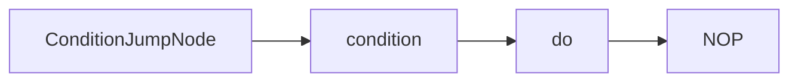
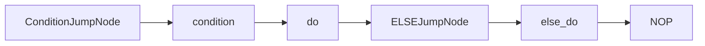
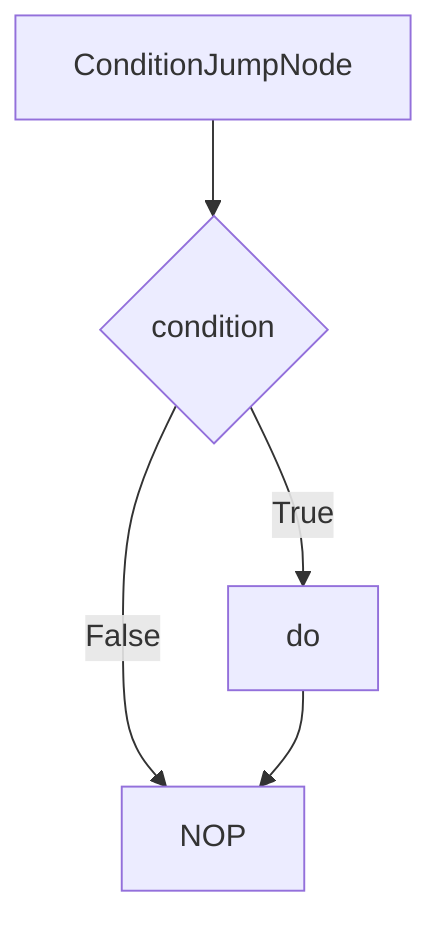
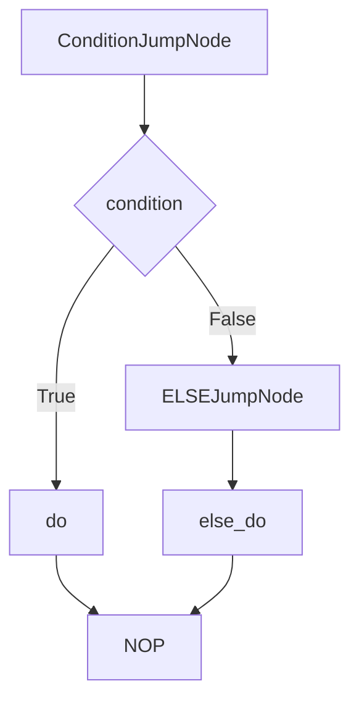
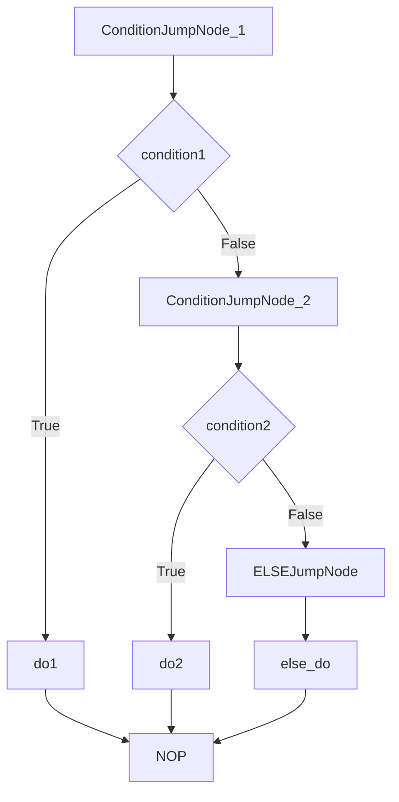

# IF / ELIF / ELSE Conditional Chains

AmritaSense’s conditional branch instructions fully replicate Python’s `elif` chain syntax and provide a flexible, powerful conditional control mechanism. All conditional branches complete static address jump calculation at compile time, so runtime only uses pointer vector arithmetic.

## Underlying implementation mechanism

### Core class structure

Conditional branching is implemented through these core classes:

- **`IFClause`**: base IF statement implementation
- **`ELIFClause`**: ELIF branch implementation
- **`ELSEClause`**: ELSE branch implementation
- **`ConditionJumpNode`**: conditional evaluation and jump node

### Compile-time address calculation

All jump addresses are computed during the `render()` stage:

- **Simple IF-ELSE**: uses relative addressing to point to a NOP placeholder.
- **Complex IF-ELIF-ELSE**: uses absolute addressing to point to the final NOP in the entire scope.

## Runtime execution flow

Although the expansion is a compile-time layout, understanding runtime flow is still important.

### Simple IF execution flow

1. Execute `ConditionJumpNode`.
2. Run the `condition` node to obtain a boolean value.
3. If the result is `False`, jump to `NOP` (skipping `do`).
4. If the result is `True`, continue to execute the `do` node.

### IF-ELSE execution flow

1. Execute `ConditionJumpNode`.
2. Run the `condition` node.
3. If the result is `False`, jump to `ELSEJumpNode`.
4. `ELSEJumpNode` jumps directly to `else_do`.
5. If the result is `True`, execute `do` and then skip `else_do` to `NOP`.

### IF-ELIF-ELSE execution flow

For nested conditional chains, absolute addressing ensures correct jumps:

1. Execute each `ConditionJumpNode` in order.
2. Execute the first branch whose condition is `True`.
3. If all conditions are `False`, execute the `ELSE` branch if present.
4. After any branch completes, jump to the final `NOP`.

## Expanded layout structure

### Simple IF expanded space

During workflow rendering, the `IF` instruction expands to this structure:

```text
[ConditionJumpNode, condition, do, NOP]
```

Corresponding Mermaid diagram:



### IF-ELSE expanded space

```text
[ConditionJumpNode, condition, do, ELSEJumpNode, else_do, NOP]
```



### IF-ELIF-ELSE expanded space

```text
[ConditionJumpNode(condition1), condition1, do1,
 ConditionJumpNode(condition2), condition2, do2,
 ELSEJumpNode, else_do, NOP]
```


## Expansion illustration

### Simple IF expansion



### IF-ELSE expansion



### IF-ELIF-ELSE expansion



## Syntax features

### Flexible syntax composition

```python
# basic IF (ELSE not required)
IF(condition, do)

# IF-ELSE branch
IF(condition, do).ELSE(else_do)

# IF-ELIF chain
IF(condition, do).ELIF(condition2, do2)

# full IF-ELIF-ELSE chain
IF(condition, do).ELIF(condition2, do2).ELSE(else_do)
```

### Condition node features

- **Unified underlying type**: all conditions are `Node[bool]`.
- **Sync/async mixing**: conditions can be synchronous functions or asynchronous coroutines, and the engine normalizes them automatically.
- **Complex condition support**: condition nodes can contain dependency injection and complex logic.

## Best practices

### Condition optimization

- **Short-circuit evaluation**: put the most likely true conditions first.
- **Simple conditions first**: place complex conditions after simpler ones.
- **Avoid side effects**: condition nodes should not have side effects.

### Performance considerations

- **Compile-time optimization**: all jump addresses are determined during rendering, so runtime overhead is zero.
- **Memory efficiency**: no extra data structures are created; execution uses pointer arithmetic only.
- **Thread safety**: conditional execution is fully thread-safe.

### Error handling

- **Type safety**: conditions must return a boolean, or a type error is thrown.
- **Exception propagation**: exceptions thrown by condition nodes propagate normally to the outer flow.
- **Resource cleanup**: use TRY/FINALLY to ensure cleanup during condition execution.

With this design, AmritaSense conditionals maintain strong alignment with Python syntax while delivering compile-time optimized high-performance execution.
