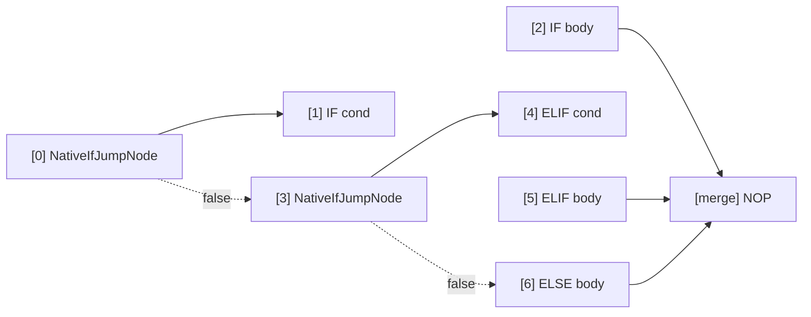

# Native Instructions (NATIVE_IF / NATIVE_WHILE / NATIVE_DO / BREAK_LOOP / CONTINUE)

The native control flow instruction set introduced in AmritaSense v0.5.1 is based on the `PUSH / JMP / CONTINUE / BREAK_LOOP` pointer operation pattern — an **orthogonal extension** to the traditional `call_sub` instructions. Since v0.6.0, loop bodies are always wrapped as `NodeCompose(body, CONTINUE())` and `RET_FAR` is no longer involved in native loops.

## Overview

Traditional instructions (`IF` / `WHILE` / `DO`) use `call_sub` to enter branch bodies — an extra nested call layer. Native instructions replace this with lightweight pointer jumps:

```
call_sub path:      call_sub → execute → auto-return
native loop path:   push → jump → execute → CONTINUE → pop → jump loop head
```

Loop bodies always end with `CONTINUE()` (auto-appended by the compiler) which pops the stack and jumps back to the loop head for the next iteration.

> **DI & middleware are interpreter-level** — both paths execute every node through `_call()`, so dependency injection and the middleware hook apply identically. Native instructions only save the `call_sub` nesting layer; they do **not** bypass DI or middleware.

### CONTINUE vs BREAK_LOOP

| Instruction    | Purpose                                           | Auto-inserted?       |
| -------------- | ------------------------------------------------- | -------------------- |
| `CONTINUE()`   | End current iteration, jump to loop head          | ✅ compiler fallback |
| `BREAK_LOOP()` | Terminate the loop (pop stack + jump to sentinel) | ❌ manual only       |

The key difference: `CONTINUE()` pops the stack and jumps back to the loop head (the loop continues with the next iteration), while `BREAK_LOOP()` pops the stack and jumps directly to the loop's sentinel `NOP`, cleanly ending the loop. Both target positions are configured at compile time by the enclosing loop's `extract()` via the DFS scanner `_configure_loop_control_nodes()` — never by hand.

> **`RET_FAR` is not part of native loops anymore** (since v0.6.0). It uses `rebase_ptr` + natural `advance_pointer` and is meant for manual stack-return patterns (`PUSH_AND_GOTO` / `PUSH_STACK`). `CONTINUE()` / `BREAK_LOOP()` are direct `jump_far_ptr` operations that set the jump flag.

### Compile-Time Body Classification

`_classify_body` distinguishes payload types:

| payload type                             | `NATIVE_IF` path                              | `NATIVE_WHILE` / `NATIVE_DO` path            |
| ---------------------------------------- | --------------------------------------------- | ------------------------------------------- |
| `BaseNode`                               | `call_offset` (auto-return)                   | Auto-wrapped `NodeCompose(body, CONTINUE())` |
| `NodeCompose` / `SelfCompileInstruction` | Wrap in bubble (natural flow-back, no return instruction) | Wrap as `NodeCompose(*body._graph, CONTINUE())` |

## NATIVE_IF

### Import

```python
from amrita_sense.instructions.native import NATIVE_IF
```

### Signature

```python
NATIVE_IF(
    condition: Node[bool],
    body: BaseNode | NodeCompose | SelfCompileInstruction,
) -> NativeIfClause
```

### Methods

| Method                   | Signature | Description                      |
| ------------------------ | --------- | -------------------------------- |
| `.ELIF(condition, body)` | → `Self`  | Append ELIF branch; chainable    |
| `.ELSE(body)`            | → `Self`  | Append ELSE branch; at most once |

### Compiled Layout

#### Single IF (bubble body)


#### IF-ELIF-ELSE Chain



Every branch (IF, ELIF, ELSE) is a plain nested container with **no return instruction** — each flows naturally to the merge point via `advance_pointer`, matching Python's `if`/`elif`/`else` semantics (since v0.6.0).

### Underlying Nodes

- `NativeIfJumpNode` (`_core.py`): Condition jump node for IF/ELIF. The `_is_single` flag determines the single-node (`call_offset`) vs bubble (`jump_far_ptr` only — no PUSH / no RET_FAR) path.

## NATIVE_WHILE

### Import

```python
from amrita_sense.instructions.native import NATIVE_WHILE
```

### Signature

```python
NATIVE_WHILE(
    condition: Node[bool],
) -> NativeWhileClause
```

### Methods

| Method          | Signature | Description                        |
| --------------- | --------- | ---------------------------------- |
| `.ACTION(body)` | → `Self`  | Set loop body; required, once only |

### Compiled Layout


### Underlying Nodes

- `NativeWhileNode` (`_core.py`): Condition evaluation + dispatch node. Pure jump: condition true → `PUSH [0]` (its own address) → `jump_far_ptr` into body; condition false → `jump_near(3)` to exit. The body's trailing `CONTINUE()` pops and jumps back to `[0]`.

## NATIVE_DO

### Import

```python
from amrita_sense.instructions.native import NATIVE_DO
```

### Signature

```python
NATIVE_DO(
    body: BaseNode | NodeCompose | SelfCompileInstruction,
) -> NativeDoClause
```

### Methods

| Method              | Signature | Description                             |
| ------------------- | --------- | --------------------------------------- |
| `.WHILE(condition)` | → `Self`  | Set loop condition; required, once only |

### Compiled Layout


Single-node bodies are auto-wrapped the same way (`NodeCompose(body, CONTINUE())`).

### Underlying Nodes

- `NativeDoWhileNode` (`_core.py`): DO-WHILE back-edge node. When condition is true, `jump_near(loop_pos)` back to body entry (`NativeBubbleEnterNode` handles re-entry); when false, `jump_near(exit_pos)` to exit.
- `NativeBubbleEnterNode` (`_core.py`): Bubble entry helper. Always `PUSH`es a sentinel (its own address) then `jump_far_ptr`s into the body, so `CONTINUE()` / `BREAK_LOOP()` can pop it. Constructor takes only `body_pos` (the `ret_pos` parameter was removed in v0.6.0).

## BREAK_LOOP

### Import

```python
from amrita_sense.instructions.native import BREAK_LOOP
```

### Signature

```python
BREAK_LOOP() -> _BreakLoopNode  # factory function (v0.6.0+)
```

Since v0.6.0, `BREAK_LOOP` is a **factory function** — call it: `BREAK_LOOP()`. The old module-level singleton was removed.

### How It Works

1. `pc._ret_addr_stack.pop()` clean up the return address pushed on loop entry
2. Derive the enclosing bubble's parent address from the popped `PointerVector`
3. `pc.jump_far_ptr([*parent, break_pos])` jump to the sentinel NOP — `break_pos` was configured at compile time by the enclosing loop's `extract()` (DFS scanner)

### Constraints

- **Must be inside a native loop body**: a node not configured by any enclosing loop raises `RuntimeError` at runtime
- **One level per call**: pops one stack entry and exits the innermost enclosing native loop
- **Nesting**: each loop level configures only its own body's control nodes (the DFS scanner stops at inner native-loop boundaries)
- **Normal execution continues after break**: the next node after the loop executes as usual

### Example

```python
from amrita_sense.instructions.native import BREAK_LOOP, NATIVE_WHILE

NATIVE_WHILE(cond).ACTION(
    process_item
    >> BREAK_LOOP()
    >> log_item
)
```

## CONTINUE

### Import

```python
from amrita_sense.instructions.native import CONTINUE
```

### Signature

```python
CONTINUE() -> _ContinueNode  # factory function
```

### How It Works

Identical mechanics to `BREAK_LOOP()`, but the target is the **loop head** instead of the sentinel: for `NATIVE_WHILE` it jumps to `[0]` (re-evaluate condition); for `NATIVE_DO` it jumps to `[2]` (the do-while node, re-check condition).

### Constraints

- **Must be inside a native loop body**: same runtime `RuntimeError` if unconfigured
- **Auto-appended**: every loop body already ends with `CONTINUE()` — you only write it manually to skip the rest of the current iteration
- **Not an exception**: it is a synchronous pointer operation (`wrap_to_async=False`) and does not trigger exception handling

### Example

```python
from amrita_sense.instructions.native import CONTINUE, NATIVE_DO

NATIVE_DO(
    step_a
    >> CONTINUE()   # skip step_b, re-check condition
    >> step_b
).WHILE(cond)
```

## Comparison with Traditional Instructions

|               | `IF`              | `NATIVE_IF`                         | `WHILE`           | `NATIVE_WHILE`                      | `DO`              | `NATIVE_DO`                         |
| ------------- | ----------------- | ----------------------------------- | ----------------- | ----------------------------------- | ----------------- | ----------------------------------- |
| Entry         | `call_sub`        | `jump_far_ptr` or `call_offset`     | `call_sub`        | `PUSH+JMP`                         | `call_sub`        | `PUSH+JMP`                         |
| Return        | auto (`call_sub`) | natural flow-back (bubble) / auto (single) | auto (`call_sub`) | `CONTINUE()` (auto)                | auto (`call_sub`) | `CONTINUE()` (auto)                |
| Break         | `raise BreakLoop` | `BREAK_LOOP()`                      | `raise BreakLoop` | `BREAK_LOOP()`                     | `raise BreakLoop` | `BREAK_LOOP()`                     |
| Continue      | —                | —                                   | —                 | `CONTINUE()`                       | —                 | `CONTINUE()`                       |
| Middleware    | invoked           | invoked (interpreter-level)         | invoked           | invoked (interpreter-level)        | invoked           | invoked (interpreter-level)        |
| DI resolution | invoked           | invoked (interpreter-level)         | invoked           | invoked (interpreter-level)        | invoked           | invoked (interpreter-level)        |

## Notes

1. **Loop bodies always end with CONTINUE()**: the compiler auto-appends `CONTINUE()`. If you manually construct a `NodeCompose` as a loop body, place `CONTINUE()` at the end (or rely on auto-wrapping).
2. **BREAK_LOOP / CONTINUE are not exceptions**: they are synchronous pointer operations (`wrap_to_async=False`) and do not trigger exception handling
3. **Native instructions are composable**: fully interoperable with `>>`, `NodeCompose`, and traditional instructions
4. **Branches flow back naturally**: since v0.6.0, `NATIVE_IF` / `ELIF` / `ELSE` bubbles carry no return instruction — they are plain nested containers that flow back to the merge point via `advance_pointer`, exactly like Python `if`/`elif`/`else` blocks. There is **no early-return** mechanism (no manual `RET_FAR` inside a branch body).
