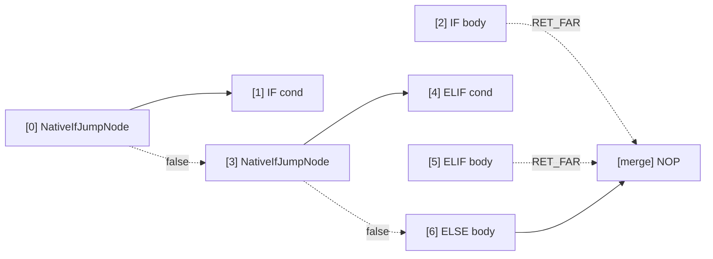

# Native Instructions (NATIVE_IF / NATIVE_WHILE / NATIVE_DO / BREAK_LOOP)

The native control flow instruction set introduced in AmritaSense v0.5.1 is based on the `PUSH / JMP / RET_FAR` pointer operation pattern — an **orthogonal extension** to the traditional `call_sub` instructions.

## Overview

Traditional instructions (`IF` / `WHILE` / `DO`) use `call_sub` to enter branch bodies, which involves lock acquisition, middleware invocation, and DI resolution. Native instructions replace this with lightweight pointer jumps:

```
call_sub path:   lock → middleware → DI → execute → return
PUSH/JMP path:   push → jump → execute → RET_FAR → pop
```

`RET_FAR` inside a bubble body pops the stack and returns to the address recorded by `PUSH`. The compiler **always** auto-appends a `RET_FAR` at the end of every bubble body as a fallback — you never need to write it yourself. Use `RET_FAR` mid-body only for early exit.

### RET_FAR vs BREAK_LOOP

| Instruction  | Purpose                                         | Auto-inserted?       |
| ------------ | ----------------------------------------------- | -------------------- |
| `RET_FAR`    | End bubble execution (normal or early)          | ✅ compiler fallback |
| `BREAK_LOOP` | Terminate a loop (pop stack + jump to sentinel) | ❌ manual only       |

The key difference: `RET_FAR` pops the stack and returns to the address recorded by `PUSH` (for loops, that's the condition node — the loop continues), while `BREAK_LOOP` pops the stack and jumps directly to the parent bubble's last sentinel `NOP`, cleanly ending the loop.

### Compile-Time Optimization: \_is_single Dispatch

The compiler distinguishes payload types via `_classify_body`:

| payload type                             | `_is_single` | Mechanism                                |
| ---------------------------------------- | ------------ | ---------------------------------------- |
| `BaseNode`                               | `True`       | `call_offset` (auto-return)              |
| `NodeCompose` / `SelfCompileInstruction` | `False`      | Wrap in bubble (compiler auto-`RET_FAR`) |

## NATIVE_IF

### Import

```python
from amrita_sense.instructions.native import NATIVE_IF
```

### Signature

```python
NATIVE_IF(
    condition: Node[bool],
    body: BaseNode | NodeCompose | SelfCompileInstruction,
) -> NativeIfClause
```

### Methods

| Method                   | Signature | Description                      |
| ------------------------ | --------- | -------------------------------- |
| `.ELIF(condition, body)` | → `Self`  | Append ELIF branch; chainable    |
| `.ELSE(body)`            | → `Self`  | Append ELSE branch; at most once |

### Compiled Layout

#### Single IF (bubble body)


#### IF-ELIF-ELSE Chain



The ELSE branch body does not append `RET_FAR`; it flows naturally to the merge point.

### Underlying Nodes

- **`NativeIfJumpNode`** (`_core.py`): Condition jump node for IF/ELIF. The `_is_single` flag determines the single-node (`call_offset`) vs bubble (`PUSH + jump_far_ptr`) path.

## NATIVE_WHILE

### Import

```python
from amrita_sense.instructions.native import NATIVE_WHILE
```

### Signature

```python
NATIVE_WHILE(
    condition: Node[bool],
) -> NativeWhileClause
```

### Methods

| Method          | Signature | Description                        |
| --------------- | --------- | ---------------------------------- |
| `.ACTION(body)` | → `Self`  | Set loop body; required, once only |

### Compiled Layout


### Underlying Nodes

- **`NativeWhileNode`** (`_core.py`): Condition evaluation + dispatch node. When `_is_single=True`, `call_offset` body then `jump_near(self_pos)` back to itself; when `_is_single=False`, `PUSH self_pos` then `jump_far_ptr` into bubble, with `RET_FAR` popping back.

## NATIVE_DO

### Import

```python
from amrita_sense.instructions.native import NATIVE_DO
```

### Signature

```python
NATIVE_DO(
    body: BaseNode | NodeCompose | SelfCompileInstruction,
) -> NativeDoClause
```

### Methods

| Method              | Signature | Description                             |
| ------------------- | --------- | --------------------------------------- |
| `.WHILE(condition)` | → `Self`  | Set loop condition; required, once only |

### Compiled Layout

#### Single Node


#### Bubble Body


### Underlying Nodes

- **`NativeDoWhileNode`** (`_core.py`): DO-WHILE back-edge node. When condition is true, `jump_near(loop_pos)` back to body entry (`NativeBubbleEnterNode` handles re-entry); when false, `jump_near(exit_pos)` to exit.
- **`NativeBubbleEnterNode`** (`_core.py`): Bubble entry helper. If constructed with `ret_pos`, `PUSH ret_pos` before `JMP` into bubble; otherwise just `JMP` (ELSE scenario).

## BREAK_LOOP

### Import

```python
from amrita_sense.instructions.native import BREAK_LOOP
```

### Signature

```python
BREAK_LOOP: _BreakLoopNode  # singleton
```

### How It Works

1. Get current address `[a, b, c]` from `pc._pointer.base_addr`
2. `pc.get_graph().calc.find_addr([a])` resolve parent bubble → `NodeComposeRendered`
3. Compute target: `len(parent_bubble) - 1` (last sentinel NOP)
4. `pc._ret_addr_stack.pop()` clean up return address pushed on loop entry
5. `pc.jump_far_ptr([a, target])` jump to exit

### Constraints

- **Bubble body only**: single-node bodies exit naturally via `return`
- **Must be inside a native loop body**: insufficient address depth raises `RuntimeError`
- **Normal execution continues after break**: the next node after the loop executes as usual

### Example

```python
from amrita_sense.instructions.native import BREAK_LOOP, NATIVE_WHILE

NATIVE_WHILE(cond).ACTION(
    process_item
    >> BREAK_LOOP
    >> log_item
)
```

## Comparison with Traditional Instructions

|               | `IF`              | `NATIVE_IF`                         | `WHILE`           | `NATIVE_WHILE`                      | `DO`              | `NATIVE_DO`                         |
| ------------- | ----------------- | ----------------------------------- | ----------------- | ----------------------------------- | ----------------- | ----------------------------------- |
| Entry         | `call_sub`        | `PUSH+JMP` or `call_offset`         | `call_sub`        | `PUSH+JMP` or `call_offset`         | `call_sub`        | `PUSH+JMP` or `call_offset`         |
| Return        | auto (`call_sub`) | `RET_FAR` (bubble) or auto (single) | auto (`call_sub`) | `RET_FAR` (bubble) or auto (single) | auto (`call_sub`) | `RET_FAR` (bubble) or auto (single) |
| Break         | `raise BreakLoop` | `BREAK_LOOP`                        | `raise BreakLoop` | `BREAK_LOOP`                        | `raise BreakLoop` | `BREAK_LOOP`                        |
| Middleware    | invoked           | not invoked                         | invoked           | not invoked                         | invoked           | not invoked                         |
| DI resolution | invoked           | not invoked                         | invoked           | not invoked                         | invoked           | not invoked                         |

## Notes

1. **Bubble bodies must end with RET_FAR**: the compiler auto-appends `RET_FAR`, but if you manually construct `NodeCompose` as a branch body, ensure `RET_FAR` is at the end
2. **BREAK_LOOP is not an exception**: it's a synchronous pointer operation (`wrap_to_async=False`) and does not trigger exception handling
3. **Native instructions are composable**: fully interoperable with `>>`, `NodeCompose`, and traditional instructions
4. **ELSE does not push**: `NATIVE_IF`'s ELSE branch naturally flows in via `NativeBubbleEnterNode` without pushing a return address (no return needed)
