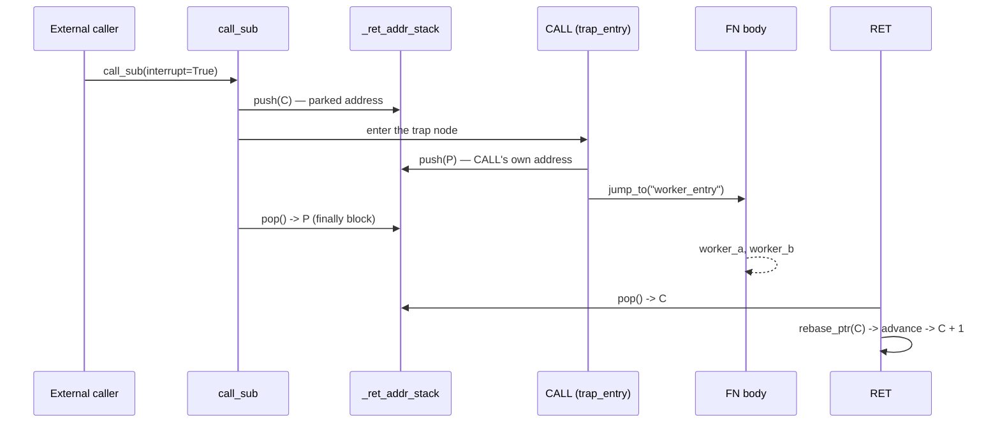

# 4.4 External Interrupt Calls

AmritaSense provides a safe external invocation mechanism that allows **external systems to inject subroutines at node boundaries**, enabling flexible debugging, monitoring, and dynamic control. The core of this mechanism is the interpreter lock and `call_sub(interrupt=True)`, which turns "interrupts" from hardware-level preemption into controllable, programmable "safe external calls."

> **Distinction: Flow Suspend vs. External Call**
> The flow suspension (Suspend) introduced in Section 3.4 pauses the execution flow via `SuspendObjectStream`, waiting for external `resume()` before continuing. This section discusses **actively injecting a complete subroutine from the outside** during the suspend window or at node boundaries, which automatically returns after execution. The two can be combined, but they belong to different capability dimensions.

## 4.4.1 Interpreter Lock and Safe External Call Principles

The core of external injection operations is `aiologic.Lock` (the interpreter lock), which ensures atomicity of the injection and avoids race conditions with the normal execution flow.

### Why is a lock needed?

The interpreter's main loop acquires the lock to execute a node on each iteration and releases it after the node completes. Between two iterations, the lock is idle, allowing external systems to safely call `call_sub(interrupt=True)` to inject a subroutine. This call re-acquires the lock, guaranteeing:

- The injected subroutine will not execute concurrently with normal nodes
- Workflow internal state will not be concurrently tampered with
- Multiple external injection requests are serialized

### Safe external call interface

External systems call directly through the interpreter object:

```python
# Assuming interpreter is a WorkflowInterpreter instance
await interpreter.call_sub(
    interpreter.get_graph().calc.resolve_alias("my_handler"),
    interrupt=True,
    some_arg="value",
)
```

The key is `interrupt=True`, which tells the interpreter to acquire the interpreter lock during the call, achieving safe injection.

### Inside workflow vs. outside workflow

- Calls to `call_sub` from **within a node** must use `interrupt=False` (default), otherwise `aiologic` will detect and raise an exception because the same coroutine tries to re-acquire the same non-reentrant lock.
- **External systems** (such as another coroutine, debugger, or HTTP interface) must use `interrupt=True` because they do not hold the lock.

This design allows the same `call_sub` API to serve both internal reuse and external injection, distinguished by a single boolean parameter.

## 4.4.2 Interrupt Program Storage Structure

To facilitate external calls, we need to pre-place dedicated node sequences in the workflow that respond to interrupts. These sequences are packaged as "interrupt programs" and stored in the workflow — normal flow skips them. AmritaSense provides `ARCHIVED_NODES` to construct such storage areas.

### `ARCHIVED_NODES` structure

`ARCHIVED_NODES` is a self-compiling instruction that takes a series of nodes (usually marked with `ALIAS` to support `INVOKE` addressing) and automatically generates the following structure:

```text
SubprogramJumpNode -> ALIAS(node1, "name1") -> ALIAS(node2, "name2") -> ... -> NOP
```

- `SubprogramJumpNode` unconditionally jumps to the trailing `NOP`, so the entire storage area is skipped during normal execution.
- Each node can be addressed by alias, allowing any one of them to be called on demand.

### Example

```python
from amrita_sense.instructions.subprogram import ARCHIVED_NODES
from amrita_sense.instructions.alias import ALIAS
from amrita_sense.node import Node


@Node()
def on_error(pc: WorkflowInterpreter):
    print("Handling error...")


@Node()
def cleanup(pc: WorkflowInterpreter):
    print("Cleaning up...")


interrupt_handlers = ARCHIVED_NODES(
    ALIAS(on_error, "on_error"), ALIAS(cleanup, "cleanup")
)
```

Place `interrupt_handlers` at the end or in a suitable position within the workflow composition.

> **ARCHIVED_NODES vs ARCHIVED_SEGMENT**: `ARCHIVED_NODES` archives a flat list of individual nodes (each alias-addressable, ideal for handler libraries). `ARCHIVED_SEGMENT` archives a whole `NodeCompose` (`[JMP 2, Payload, NOP]`) as one unit — the building block for `FN` / `INTER_FN` function blocks. Use the former for handler libraries, the latter for full routines.

## 4.4.3 SubprogramJumpNode Execution Logic

`SubprogramJumpNode` is a lightweight node specifically designed to skip the subsequent storage area. Its implementation is very simple:

- Holds a target jump address `_target_near`, typically pointing to the `NOP` at the end of the storage area.
- When executed, calls `pc.jump_near(self._target_near)`, making the interpreter jump directly to the target without executing the intermediate `ALIAS` nodes.

It has `address_able=True` and can be aliased (though usually not needed). This design makes the storage area completely transparent to the normal execution flow but fully open to address resolution (via alias lookup).

### Why not use JMP?

`SubprogramJumpNode` is specifically designed for skipping storage areas, with clearer semantics. `JMP` is a general-purpose jump instruction that could be misused. Using a dedicated jump node reduces the risk of developer confusion.

## 4.4.4 Building a Safe Injectable Node Library

Using the mechanisms described above, developers can build an "injectable node library" for debugging, health checks, error recovery, and more. These library nodes must follow certain safety constraints.

### Node design principles

1. **No shared state**: Nodes should be pure functions, or only depend on dependency-injected context, without modifying global state.
2. **Idempotency**: External calls may occur at any time; node logic should be as idempotent as possible, producing consistent results across multiple invocations.
3. **Fast execution**: Injected nodes are typically lightweight — avoid holding the interpreter lock for long periods, which would block the normal flow.
4. **Explicit exception handling**: Catch and handle possible exceptions within the node to prevent the injection operation itself from crashing the workflow. For fatal errors, terminate the workflow via `InterruptNotice`.

### Example: Health check node

```python
@Node()
async def health_check(pc: WorkflowInterpreter):
    # Read-only operation, inspect internal state
    graph = pc.get_graph()
    addr = pc._pointer.copy()
    print(f"Current pointer: {addr}, graph size: {len(graph._graph)}")
    # No state modified — safe
```

### External invocation pattern

An external system (such as a debugger) can inject like this:

```python
# First ensure the workflow is suspended at a checkpoint or node boundary
await pc.object_io.wait_to_suspend(PC_CHECKPOINT)
# Now the lock is free — safe to inject
await pc.call_sub(pc.get_graph().calc.resolve_alias("health_check"), interrupt=True)
# After injection completes, resume the workflow
pc.object_io.resume()
```

Or, while the workflow is running, call `call_sub(interrupt=True)` from another coroutine. As long as the lock is free (i.e., not during node execution), the call will wait for the lock, then execute the injection.

### Concurrency safety

`aiologic.Lock` ensures only one injection executes at a time. Multiple external callers will queue without nested injection. The interpreter's internal state remains stable under lock protection.

Through this mechanism, AmritaSense transforms external intervention from "disruptive interrupts" into "safe function calls," providing a solid foundation for building full-featured debuggers, monitoring systems, and dynamic flow control.

## 4.4.5 Trap: Entering `CALL` / `INT` from Outside

A **trap** is what happens when an external `call_sub(interrupt=True)` lands on a `CALL` or `INT` node instead of on an ordinary handler node.

`call_sub` pushes the parked address `C` and enters the target node. When that target is itself a `CALL`, the `CALL` pushes **its own address** `P` and jumps on — so the return-address stack ends up holding `[C, P]`. `call_sub`'s `finally` block pops `P` back off (it is the address the entered node pushed), leaving `[C]`. From there the `FN` block runs to its trailing `RET`, which pops `C` and resumes the main flow at `C + 1`.

The net effect: **the trap consumes the cycle the interpreter was parked on, and execution resumes at parked address + 1.**



### Why the aliased node must be the `CALL` itself

The trap target has to be a node that actually performs the trap. `ALIAS` is transparent: it forwards both `__call__` and `_post_compile` to the wrapped node, so `ALIAS(CALL("worker_entry"), "trap_entry")` behaves exactly like the bare `CALL` while giving it a name the external caller can resolve.

### Full example

```python
import asyncio

from amrita_sense import ALIAS, Node, WorkflowInterpreter
from amrita_sense.instructions import CALL, FN
from amrita_sense.instructions.subprogram import ARCHIVED_NODES
from amrita_sense.runtime.workflow import PC_CHECKPOINT


@Node()
async def trap_point() -> None:
    print("[main] trap_point  <- parked here; the trap consumes this cycle")


@Node()
async def main_step() -> None:
    print("[main] main_step")


@Node()
async def worker_a() -> None:
    print("  [worker] a")


async def main() -> None:
    # FN block: [_fn_escape, ALIAS(NOP, "worker_entry"), worker_a, RET()]
    worker = FN("worker_entry", worker_a)

    # Trap library: skipped by normal flow, entered only via call_sub(interrupt=True)
    traps = ARCHIVED_NODES(ALIAS(CALL("worker_entry"), "trap_entry"))

    comp = trap_point >> main_step >> traps >> worker
    pc = WorkflowInterpreter(comp.render())

    task = asyncio.create_task(pc.run())
    await pc.object_io.wait_to_suspend(PC_CHECKPOINT)  # park; the lock is now free
    await pc.call_sub(
        pc.get_graph().calc.resolve_alias("trap_entry"), interrupt=True
    )
    pc.object_io.resume()
    await task


asyncio.run(main())
```

The runnable version is `demos/10_call_trap.py`; its output is:

```text
=== external trap: CALL -> FN -> RET ===

[ext]  parked at PointerVector([0]), is_running = True
  [worker] a
  [worker] b
[main] main_step
[main] main_tail

[ext]  done — the parked node was consumed, flow resumed at parked + 1
```

`INT` works the same way: `ALIAS(INT("isr_entry"), "trap_entry")` snapshots the context with the parked address as the return address and dispatches into the `INTER_FN` block, whose `IRET` restores the snapshot and resumes at `C + 1`. The only difference is the channel — `INT` / `IRET` travel through the context stack, `CALL` / `RET` through the return-address stack.

### Trap vs. plain injection

| Injection target         | Return-address stack                                             | Resumes at                                           |
| ------------------------ | ---------------------------------------------------------------- | ---------------------------------------------------- |
| Ordinary handler node    | `[C]`, popped by `call_sub`'s `finally`                          | `C` — the parked node still runs after the injection |
| `CALL` / `INT` trap node | `[C, P]`; `P` popped by `call_sub`, `C` popped by `RET` / `IRET` | `C + 1` — the parked node is consumed by the trap    |

### Trap targets must not touch the stack

`call_sub` pops unconditionally, without checking what it popped. A trap target therefore has to leave the return-address stack balanced: `CALL` and `INT` do exactly that, but a node that pushes or pops on its own would desynchronize the stack. Keep trap targets to `CALL` / `INT` nodes.

## 4.4.6 Interrupt Routines & Context Snapshots

AmritaSense provides built-in instructions for interrupt-style control transfer **within** a workflow: `INT` / `IRET`. Unlike `call_sub(interrupt=True)` which injects code from **outside** the interpreter, these instructions are placed directly in the `>>` chain and perform:

1. Save complete interpreter state → `InterpreterContext`
2. Jump to a handler routine (e.g., stored in `ARCHIVED_NODES`)
3. Restore state and return

This is useful for:

- Error recovery subroutines that need full context
- Debugging breakpoints with state inspection
- Nested interrupt handling (LIFO context stack)

**External vs Internal**: `call_sub(interrupt=True)` is externally driven (debugger, HTTP endpoint); `INT`/`IRET` are internally orchestrated in the `>>` chain. Both mechanisms are complementary and can be composed.

For complete examples and patterns, see [Interrupt Routine & Return](/guide/practice/interrupt-routine).

::: tip REPL Debugger
Building on the external invocation mechanism and interrupt infrastructure, AmritaSense provides a complete REPL debugger module `amrita_sense.debugger`, wrapping step execution, breakpoint management, and state inspection into synchronous functions — no manual `run_step_by()` loops required. See [REPL Debugging](/guide/practice/repl-debugging) for details.
:::
