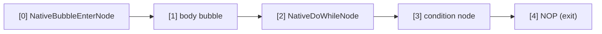

# Native Control Flow

The **native control flow instruction set** introduced in AmritaSense v0.5.1 — `NATIVE_IF`, `NATIVE_WHILE`, `NATIVE_DO`, and `BREAK_LOOP` — is an **orthogonal extension** to the traditional `IF`/`WHILE`/`DO` control flow primitives.

## Design Philosophy

Native instructions are **not** performance replacements for traditional ones — they are **orthogonal extensions**. The core difference lies in the underlying implementation pattern:

|                   | Traditional (`IF`/`WHILE`/`DO`)                | Native (`NATIVE_IF`/`NATIVE_WHILE`/`NATIVE_DO`)               |
| ----------------- | ---------------------------------------------- | ------------------------------------------------------------- |
| Mechanism         | `call_sub` (lock + middleware + DI resolution) | `PUSH / JMP / RET_FAR` (pure pointer ops)                     |
| Branch entry      | Interpreter auto-manages call stack            | Developer explicitly controls jumps and returns               |
| Bubble return     | Automatic (`call_sub` has built-in return)     | Compiler auto-appends `RET_FAR` as fallback                   |
| Loop break        | Raise `BreakLoop` exception                    | `BREAK_LOOP` instruction (pop stack + jump to sentinel)       |
| Early bubble exit | N/A                                            | Manual `RET_FAR` (compiler always inserts fallback, optional) |
| Use case          | General control flow, works out of box         | Precise pointer control, bypass middleware/DI                 |

> **RET_FAR vs BREAK_LOOP**:
>
> - **`RET_FAR`** marks the end of bubble execution. The compiler **always** auto-appends a `RET_FAR` at the end of every bubble body as a fallback — you never need to write it yourself. Insert `RET_FAR` mid-body only for early exit (skip subsequent nodes).
> - **`BREAK_LOOP`** is specifically for terminating a loop. It pops the return address pushed on loop entry, then jumps to the parent bubble's sentinel (`NOP`), cleanly ending the loop.
>
> Without `BREAK_LOOP`, a `RET_FAR` inside a loop body merely returns to the loop condition node — it cannot terminate the loop.

## NATIVE_IF

`NATIVE_IF` has an API identical to traditional `IF`, supporting `ELIF` / `ELSE` chaining:

```python
NATIVE_IF(cond, body)                          # plain IF
NATIVE_IF(cond, body).ELSE(else_body)          # IF-ELSE
NATIVE_IF(cond, body).ELIF(cond2, body2)       # IF-ELIF chain
NATIVE_IF(cond, body).ELIF(cond2, body2).ELSE(else_body)  # full chain
```

### Single-Node Branch Body

When `body` is a single `BaseNode`, the compiler recognizes `_is_single=True` and the branch body is called via `call_offset` — zero extra overhead, behaving identically to traditional instructions:

```python
NATIVE_IF(check_condition, my_action).ELSE(my_fallback)
```

Compiled layout (single IF):


### Bubble Branch Body

When `body` is a `NodeCompose`, the compiler wraps it as a **bubble** and auto-appends `RET_FAR` as a fallback (you never need to write it):

```python
NATIVE_IF(cond, step_a >> step_b).ELSE(fallback_a >> fallback_b)
```

Compiled layout:


Execution: condition true → `PUSH` merge address → `JMP` into bubble → after execution `RET_FAR` pops stack back to merge.

### ELIF / ELSE Chain Expansion

Each `ELIF` appends a `[NativeIfJumpNode, cond, body_slot]` triplet at compile time. The `ELSE` branch body enters via `NativeBubbleEnterNode` (without `ret_pos`, no stack push) and flows naturally to the merge point.

## NATIVE_WHILE

`NATIVE_WHILE` shares the same semantics as traditional `WHILE` — **evaluate condition first, then execute body**:

```python
NATIVE_WHILE(condition).ACTION(body)
```

### Single-Node Loop Body

```python
NATIVE_WHILE(check_alive).ACTION(heartbeat)
```

Compiled layout:


`call_offset` evaluates condition → true: `call_offset` body → `jump_near(0)` back to while node → false: `jump_near(3)` to exit.

### Bubble Loop Body

```python
NATIVE_WHILE(cond).ACTION(step_a >> step_b)
```

The compiler appends `RET_FAR` at the end of the bubble. At runtime, `NativeWhileNode` `PUSH`es its own address `[0]` before entering the bubble, so `RET_FAR` pops back to re-evaluate the condition.

### Breaking Out: BREAK_LOOP

Inside a `WHILE` bubble body you cannot throw `BreakLoop` like the traditional `WHILE` — native instructions have no try/except wrapping. Instead use the **`BREAK_LOOP` instruction**:

```python
NATIVE_WHILE(cond).ACTION(
    step_a
    >> BREAK_LOOP
    >> step_b
)
```

How `BREAK_LOOP` works:

1. Get current pointer address `[a, b, c]`
2. Resolve parent bubble at `[a]` → `NodeComposeRendered`
3. Compute target: `len(parent_bubble) - 1` (last sentinel `NOP`)
4. `_ret_addr_stack.pop()` to clean up the return address pushed by `NativeWhileNode`
5. `jump_far_ptr` to the exit

> Single-node loop bodies don't need `BREAK_LOOP` — simply `return` from the body function to end the current iteration naturally; exit when the condition is false.

## NATIVE_DO

`NATIVE_DO` guarantees the **body executes at least once**, then checks the condition:

```python
NATIVE_DO(body).WHILE(condition)
```

### Single-Node Loop Body

```python
NATIVE_DO(send_request).WHILE(should_retry)
```

Compiled layout:


`NativeDoWhileNode` constructor params: `condi_offset=1, loop_pos=0, exit_pos=3`.

Body executes first → `call_offset` condition → true: `jump_near(0)` back to body → false: `jump_near(3)` exit.

### Bubble Loop Body

```python
NATIVE_DO(step_a >> step_b).WHILE(cond)
```

Compiled layout:



First entry: `NativeBubbleEnterNode` PUSHes `[2]` (do-while node address), JMP into body bubble.
Loop re-entry: condition true → `NativeDoWhileNode` unconditionally `jump_near(0)`, triggering `NativeBubbleEnterNode` again to PUSH + JMP.
Loop exit: condition false → `jump_near(4)` to NOP exit. Or `BREAK_LOOP` for active break.

> **Semantic alignment**: As of v0.5.1, DO and WHILE bubble bodies behave identically — both require `PUSH` + `RET_FAR`, and `BREAK_LOOP` handles both uniformly.

## Selection Guide

| Scenario                                         | Recommendation                                        |
| ------------------------------------------------ | ----------------------------------------------------- |
| General control flow, need DI/middleware         | Traditional `IF` / `WHILE` / `DO`                     |
| Performance-sensitive paths, skip overhead       | `NATIVE_*` single-node mode                           |
| Need precise pointer jump control                | `NATIVE_*` bubble mode                                |
| Need exception penetration (`exception_ignored`) | Traditional instructions                              |
| Conditional break inside loop                    | Traditional: `raise BreakLoop` / Native: `BREAK_LOOP` |

Native and traditional instructions can be **freely mixed** within the same workflow — they operate on the same pointer vector and call stack system at different abstraction levels.

```

```
