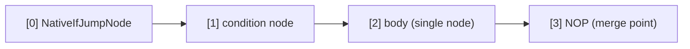

# Native Control Flow

The **native control flow instruction set** introduced in AmritaSense v0.5.1 — `NATIVE_IF`, `NATIVE_WHILE`, `NATIVE_DO`, `BREAK_LOOP`, and `CONTINUE` — is an **orthogonal extension** to the traditional `IF`/`WHILE`/`DO` control flow primitives.

Since v0.6.0, the loop mechanics were redesigned: loop bodies always end with the `CONTINUE()` instruction (factory), `BREAK_LOOP()` became a factory function, and `RET_FAR` is **no longer involved** in native loops.

## Design Philosophy

Native instructions are **not** performance replacements for traditional ones — they are **orthogonal extensions**. The core difference lies in the underlying implementation pattern:

|                   | Traditional (`IF`/`WHILE`/`DO`)                | Native (`NATIVE_IF`/`NATIVE_WHILE`/`NATIVE_DO`)               |
| ----------------- | ---------------------------------------------- | ------------------------------------------------------------- |
| Mechanism         | `call_sub` (nested call + auto stack manage)   | `PUSH / JMP / CONTINUE / BREAK_LOOP` (pointer ops)             |
| Branch entry      | Interpreter auto-manages call stack            | Developer explicitly controls jumps and returns               |
| Bubble return     | Automatic (`call_sub` has built-in return)     | Natural flow-back via `advance_pointer` (IF/ELSE) / `CONTINUE` (loops) |
| Loop break        | Raise `BreakLoop` exception                    | `BREAK_LOOP()` instruction (pop stack + jump to sentinel)     |
| Skip to next iter | N/A                                            | `CONTINUE()` instruction (pop stack + jump to loop head)      |
| Use case          | General control flow, works out of box         | Precise pointer control, fewer call-sub nesting layers         |

> **DI & middleware are interpreter-level** — they are **not** bypassed by native instructions. Every node — whether reached via `call_sub` or a native pointer jump — is executed through `_call()`, so dependency injection and the middleware hook apply identically in both paths. What native instructions save is the *extra `call_sub` nesting layer* (lock/stack bookkeeping), not DI or middleware.

> **CONTINUE vs BREAK_LOOP**:
>
> - `CONTINUE()` ends the current iteration. The compiler **always** auto-appends a `CONTINUE()` at the end of every loop body — you never need to write it yourself. Insert `CONTINUE()` mid-body to skip the remaining nodes and start the next iteration.
> - `BREAK_LOOP()` terminates the loop. It pops the return address pushed on loop entry, then jumps to the loop's sentinel (`NOP`), cleanly ending the loop.
>
> Both pop the `_ret_addr_stack` and `jump_far_ptr` to a compile-time-configured target position inside the enclosing loop bubble. Their targets are configured by the enclosing loop's `extract()` via a DFS scanner — you never specify addresses manually.

## NATIVE_IF

`NATIVE_IF` has an API identical to traditional `IF`, supporting `ELIF` / `ELSE` chaining:

```python
NATIVE_IF(cond, body)                          # plain IF
NATIVE_IF(cond, body).ELSE(else_body)          # IF-ELSE
NATIVE_IF(cond, body).ELIF(cond2, body2)       # IF-ELIF chain
NATIVE_IF(cond, body).ELIF(cond2, body2).ELSE(else_body)  # full chain
```

### Single-Node Branch Body

When `body` is a single `BaseNode`, the compiler recognizes `_is_single=True` and the branch body is called via `call_offset` — zero extra overhead, behaving identically to traditional instructions:

```python
NATIVE_IF(check_condition, my_action).ELSE(my_fallback)
```

Compiled layout (single IF):



### Bubble Branch Body

When `body` is a `NodeCompose`, the compiler wraps it as a **bubble** (a nested container). Since v0.6.0 the bubble has **no `RET_FAR`** — it flows back to the merge point naturally via `advance_pointer`, exactly like a Python `if`/`else` block (no early-return semantics):

```python
NATIVE_IF(cond, step_a >> step_b).ELSE(fallback_a >> fallback_b)
```

Compiled layout:


Execution: condition true → `JMP` into the bubble → the bubble runs to completion → `advance_pointer` pops back to the merge point (`[3]` NOP).

### ELIF / ELSE Chain Expansion

Each `ELIF` appends a `[NativeIfJumpNode, cond, body_slot]` triplet at compile time. Both IF/ELIF bubbles and the `ELSE` bubble are plain nested containers with no return instruction — every branch flows naturally to the merge point, matching Python's `if`/`elif`/`else` semantics.

## NATIVE_WHILE

`NATIVE_WHILE` shares the same semantics as traditional `WHILE` — **evaluate condition first, then execute body**:

```python
NATIVE_WHILE(condition).ACTION(body)
```

### Loop Body (single node or bubble — same path)

```python
NATIVE_WHILE(check_alive).ACTION(heartbeat)          # single node
NATIVE_WHILE(cond).ACTION(step_a >> step_b)          # bubble
```

Since v0.6.0, single-node and bubble bodies take the **same code path**: the body is always wrapped as `NodeCompose(body, CONTINUE())`, and the loop iterates via the trailing `CONTINUE()`.

Compiled layout:


At runtime, `NativeWhileNode` is a pure jump: condition true → `PUSH` its own address `[0]` → `jump_far_ptr` into the body; condition false → `jump_near(3)` to exit. The body's trailing `CONTINUE()` pops `[0]` and `jump_far_ptr`s back to `[0]`, re-evaluating the condition.

### Breaking Out: BREAK_LOOP()

Inside a `WHILE` loop body you cannot throw `BreakLoop` like the traditional `WHILE` — native instructions have no try/except wrapping. Instead use the **`BREAK_LOOP()` instruction**:

```python
NATIVE_WHILE(cond).ACTION(
    step_a
    >> BREAK_LOOP()
    >> step_b
)
```

How `BREAK_LOOP()` works:

1. `_ret_addr_stack.pop()` to clean up the return address pushed by `NativeWhileNode`
2. Derive the enclosing bubble's parent address from the popped `PointerVector`
3. `jump_far_ptr([*parent, break_pos])` to the sentinel `NOP` — `break_pos` was configured at compile time by the enclosing loop's `extract()` (DFS scanner)

### Continuing: CONTINUE()

To skip the rest of the current iteration and jump straight to the loop head (re-evaluating the condition), use `CONTINUE()`:

```python
NATIVE_WHILE(cond).ACTION(
    step_a
    >> CONTINUE()   # skip step_b, start next iteration
    >> step_b
)
```

`CONTINUE()` pops the stack and `jump_far_ptr`s to the loop head (`[0]` for `NATIVE_WHILE`, `[2]` for `NATIVE_DO`). Unlike `RET_FAR` — which uses `rebase_ptr` and relies on the natural `advance_pointer` step — `CONTINUE` is a direct jump that sets the jump flag, so the target executes immediately.

## NATIVE_DO

`NATIVE_DO` guarantees the **body executes at least once**, then checks the condition:

```python
NATIVE_DO(body).WHILE(condition)
```

### Loop Body (single node or bubble — same path)

```python
NATIVE_DO(send_request).WHILE(should_retry)         # single node
NATIVE_DO(step_a >> step_b).WHILE(cond)             # bubble
```

As with `NATIVE_WHILE`, the body is always wrapped as `NodeCompose(body, CONTINUE())`.

Compiled layout:


First entry: `NativeBubbleEnterNode` PUSHes `[0]` (its own address), JMP into body.
Loop re-entry: the body's trailing `CONTINUE()` pops the stack and `jump_far_ptr`s to `[2]` (the do-while node); condition true → `NativeDoWhileNode` `jump_near(0)`, triggering `NativeBubbleEnterNode` again to PUSH + JMP into the body.
Loop exit: condition false → `jump_near(4)` to NOP exit. Or `BREAK_LOOP()` for active break.

> **Semantic alignment**: As of v0.6.0, DO and WHILE loop bodies behave identically — both always end with `CONTINUE()`, and `BREAK_LOOP()` / `CONTINUE()` handle both uniformly.

## Selection Guide

| Scenario                                         | Recommendation                                        |
| ------------------------------------------------ | ----------------------------------------------------- |
| General control flow, works out of box           | Traditional `IF` / `WHILE` / `DO`                     |
| Performance-sensitive paths, fewer nesting layers | `NATIVE_WHILE` / `NATIVE_DO` / `NATIVE_IF`            |
| Need precise pointer jump control                | `NATIVE_*` (pure jump model)                          |
| Need exception penetration (`exception_ignored`) | Traditional instructions                              |
| Conditional break inside loop                    | Traditional: `raise BreakLoop` / Native: `BREAK_LOOP()`|
| Skip to next iteration                           | Native: `CONTINUE()` (no traditional equivalent)      |

Native and traditional instructions can be **freely mixed** within the same workflow — they operate on the same pointer vector and call stack system at different abstraction levels.

```

```
