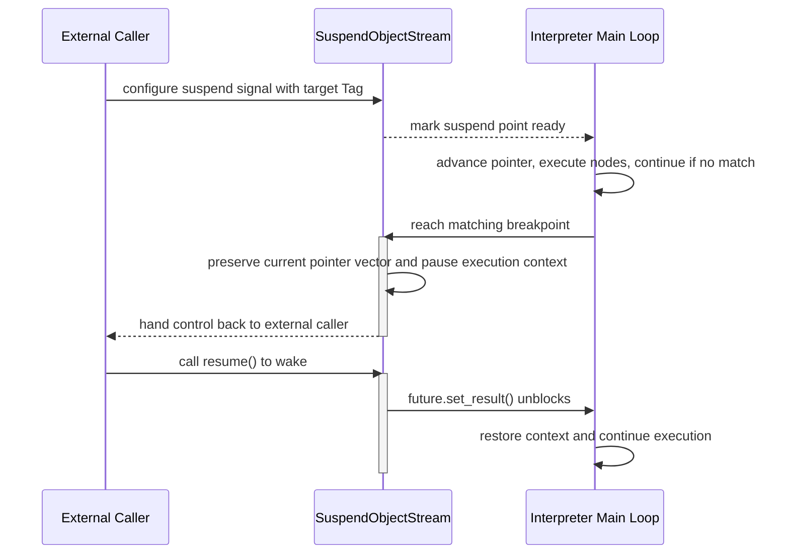

# Execution & Interrupt

In complex workflow scenarios, execution alone is not enough. We need the ability to pause the execution flow when necessary, allow external inspection or intervention, and then continue running. AmritaSense builds this capability into the core of the interpreter.

---

## 3.4.1 Interrupt mechanism overview

AmritaSense provides the ability for **external requests to pause the internal execution flow at specified points**. We call this capability **flow interruption**.

Unlike OS-level preemptive interrupts, AmritaSense interruptions are **cooperative**: the execution flow runs until it reaches a preset suspension point (tag marker), then voluntarily yields control and waits for external resumption.

The workflow interpreter provides two types of native suspension points:

1. **Between-node breakpoint** (`WorkflowInterpreter::each_node` global hook): occurs after each node finishes and before the next node begins.
2. **Pre-execution breakpoint** (`NodeSuspend::{node name}` or a custom tag string): occurs after a specific node is loaded but before its function body executes.

These two breakpoint designs have completely different locations and capabilities, and we will unpack them one by one.

---

## 3.4.2 Interaction model for suspension

The suspension model divides the participants into two roles:

- **Waiter (internal execution flow)**: listens for externally supplied suspend instructions and, when reaching a matching marker, suspends, yields control, and waits to be resumed.
- **Operator (external caller)**: proactively sends suspend requests, waits for the execution flow to pause at a matching marker, then inspects or manipulates state before resuming.

The underlying capability is provided by the `SuspendObjectStream` base class, which is also the shared flow-control foundation for AmritaCore and AmritaSense. The interaction relies on two core mechanisms:

1. **Waiter logic**
   The interpreter continually checks whether an external suspend signal is ready. If the current marker matches the specified tag or global hook, it creates a dedicated waiting future, preserves the current execution context (including pointer vector and call stack), and blocks the execution flow until an external resume signal arrives.

2. **Operator logic**
   The external caller preconfigures suspend signals on a `SuspendObjectStream` instance (specifying one or more target tags) and then enters a waiting state. When the internal flow reaches a matching marker and yields control, the operator is awakened. At that point, the operator can safely inspect workflow state, modify values or pointers, and call `resume()` to unblock the waiting future and wake the execution flow.

---

### Full suspension interaction sequence diagram

---

## 3.4.3 Between-node breakpoint

**Trigger timing:** after each node completes, as the interpreter enters the next loop iteration, after advancing the pointer and resolving the next location, but before executing the next node.

**Identifier:** `WorkflowInterpreter::each_node`.

This is the most general, global suspension point. Because it exists between nodes and does not depend on any specific node identifier, external callers can implement “pause after every step” single-step debugging without knowing the workflow’s internal structure.

When suspended here, developers can:

- view or modify the current pointer vector to decide which node executes next
- redirect the subsequent execution target

At this point, the interpreter is in a stable “between nodes” state: the previous node has fully finished, and the next node has not started yet. All internal state is consistent.

::: warning
If you redirect the target at this point, you must **operate directly on the pointer**. Do not use standard jump APIs, or you may corrupt interpreter state.
:::

---

## 3.4.4 Pre-execution breakpoint

**Trigger timing:** after a specific node is loaded by the address resolver, but before its function body executes.

**Identifier:** defaults to `NodeSuspend::{node name}`, or can be defined by a custom tag string.

This is a **node-specific pre-execution breakpoint**. Unlike the between-node breakpoint, it triggers when the execution flow has already located a concrete node but has not yet run its logic.

When suspended here, the following are true:

- a full address snapshot has already been preserved, so the external caller can see the exact node about to execute
- the recorded address is the address of the node that will run next, not the one that just finished
- because the node body has not yet executed, forcing the pointer to advance directly here may break interpreter consistency and cause out-of-bounds or resolution errors

::: warning
Therefore, any jump or modification at this breakpoint must strictly use official interpreter APIs such as `jump_to` or `jump_near`, allowing the interpreter to update internal state through its standard process instead of directly manipulating the pointer vector.
:::

---

## 3.4.5 Forced flow interruption

In addition to the cooperative suspension mechanism, AmritaSense provides an emergency termination mechanism: `InterruptNotice`.

When `InterruptNotice` is raised, it has the following effects:

- **It ignores the current condition, nesting depth, and loop context**: no matter how many Bubbles are nested or which loop is executing, it penetrates immediately.
- **It is globally caught by the workflow interpreter**: the interpreter’s main loop has a top-level catch for this notice and enters cleanup.
- **It terminates the entire execution chain unconditionally**: all nested call stacks are cleared, the pointer vector is reset, and the workflow exits cleanly.

There are two ways to use it:

1. **Raise it externally**: the external caller can `raise InterruptNotice()` from any async context. The interpreter catches it at the next node boundary and terminates the workflow.
2. **Insert an `INTERRUPT` node in the workflow**: when the workflow executes the `INTERRUPT` node, it automatically raises `InterruptNotice`. This allows developers to embed emergency stop points in the workflow logic, such as in an error handling branch.

> **Difference from suspend**
> Suspend is recoverable — the execution flow pauses and can continue with `resume()`. `InterruptNotice` is an **irreversible termination** — once triggered, the current workflow is completely finished and cannot resume from the termination point. If you need to run again, you must re-render the workflow and create a new interpreter instance.

---

## 3.4.6 Summary

AmritaSense’s interruption system, from lightweight cooperative suspension to global forced termination, forms a complete runtime control matrix. The core value of this system is:

- **Debuggability**: developers can pause, inspect, and single-step at any node boundary.
- **Intervenability**: external systems can inject checks, modify state, or redirect execution at key points.
- **Safety**: emergency conditions can terminate workflows cleanly and predictably.

In the advanced chapters, we will explore how to combine this interruption mechanism with interpreter locks and external calls to build a full debugger or external monitoring system.
