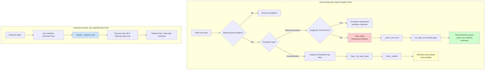
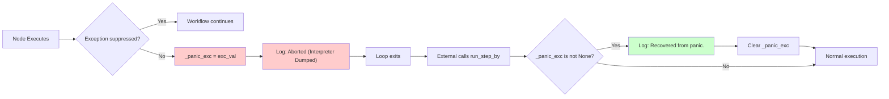
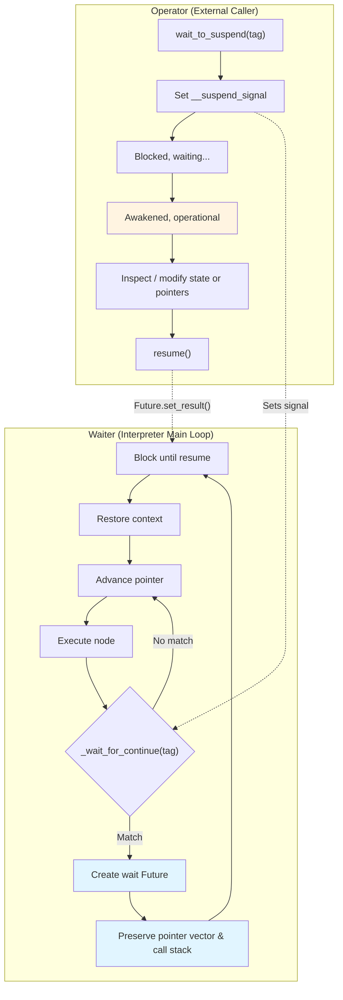
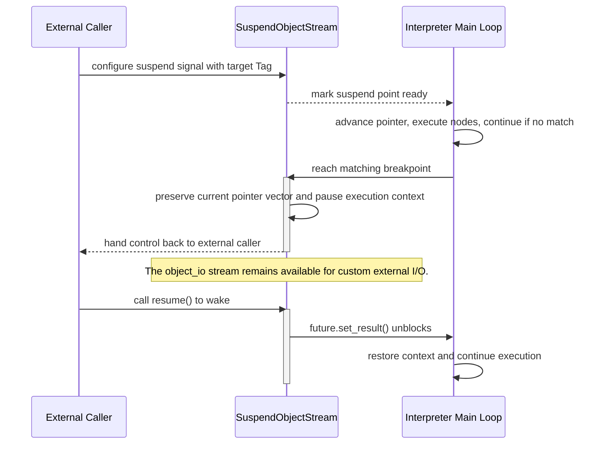

# Execution & Interrupt

In complex workflow scenarios, execution alone is not enough. We need the ability to pause the execution flow when necessary, allow external inspection or intervention, and then continue running. AmritaSense builds this capability into the core of the interpreter.

## 3.4.1 Interrupt mechanism overview

AmritaSense's interpreter interrupt system is divided into two fundamentally different modes:

| Mode                   | Trigger source                                                            | Controllability                                                                                                         | Consequence                                                                                                                          |
| ---------------------- | ------------------------------------------------------------------------- | ----------------------------------------------------------------------------------------------------------------------- | ------------------------------------------------------------------------------------------------------------------------------------ |
| **Internal Interrupt** | Exception thrown inside a node (including `InterruptNotice`)              | Regular exceptions suppressible via `TRY`/`CATCH`; `InterruptNotice` (`BaseException`) is **internally uncontrollable** | Regular exception uncaught -> **Panic state** (Interpreter Dumped); `InterruptNotice` -> clears stack & pointer, workflow terminates |
| **External Interrupt** | External code injects a sub-call via `call_sub(interrupt=True)` mid-cycle | **Externally driven, internally uncontrollable**                                                                        | Sub-call executes under interpreter lock protection, serialized with main loop                                                       |



Both interrupt modes are coordinated through a single interpreter lock (`_interpret_lock`):

- **Internal Interrupt**: The interpreter main loop acquires `_interpret_lock` before executing a node; exceptions are thrown inside the lock and propagate through the normal exception path.
- **External Interrupt**: `call_sub(interrupt=True)` acquires `_interpret_lock` to serialize with the main loop; `interrupt=False` bypasses the lock and runs outside the interrupt-safe zone.

## 3.4.2 Internal Interrupt — Node exception system

Internal interrupts originate from **inside the workflow**. Any exception thrown during node execution falls under the internal interrupt category. Based on the exception type, internal interrupts split into two paths.

### Path 1: Suppressible exceptions (regular `Exception` subclasses) -> Panic / Recover

Regular exceptions (inheriting from `Exception`) can be suppressed by `TRY`/`CATCH` blocks. AmritaSense provides two suppression mechanisms:

1. **`TRY`/`CATCH` workflow nodes**: Explicitly specify which exception types should be caught and suppressed.
2. **`exception_ignored` init parameter**: Pass a tuple of exception types that will **bypass all TRY/CATCH blocks**.

```python
from amrita_sense.runtime import WorkflowInterpreter

interpreter = WorkflowInterpreter(
    workflow,
    exception_ignored=(ValueError, TypeError),
)
```

> **Note**: `InterruptNotice` and `BreakLoop` are added to `exception_ignored` by default.

**Panic and Recover flow**:



Key state after Panic:

- `_panic_exc`: records the exception (query via `interpreter.get_exception()`)
- `_waiter_fut`: set to exception state (`set_exception(exc_val)`)
- Pointer vector and call stack: **preserved** (not cleared)

```python
try:
    await interpreter.run()
except Exception as e:
    exc = interpreter.get_exception()
    print(f"Panic caused by: {exc}")
    await interpreter.run()  # "Recovered from panic."
```

### Path 2: Unsuppressible exception (`InterruptNotice`) -> Flow termination

`InterruptNotice` inherits from `BaseException`, not `Exception`:

```python
class InterruptNotice(BaseException):
    def __init__(self, message: str | None = None):
        self.message = message
```

Python's `except Exception` does not catch `BaseException` subclasses. Therefore:

- No `TRY` node can suppress `InterruptNotice`
- `try/except Exception` inside node code cannot catch it
- Only the interpreter main loop's outermost `except InterruptNotice` responds

**Trigger methods**:

1. **Raise externally**:

   ```python
   raise InterruptNotice("Timeout: workflow exceeded time limit")
   ```

2. **Insert `INTERRUPT` node in workflow**:
   ```python
   from amrita_sense.instructions import INTERRUPT
   workflow = Sequence(StepA(), Branch(If(condition=is_error, then=INTERRUPT), ...))
   ```

**Interpreter main loop handling**:

```python
except InterruptNotice as e:
    self._ret_addr_stack.clear()   # Clear entire call stack
    self._pointer.clear()          # Reset pointer vector
    self._jump_marked = False
```

**This is termination, not suspension**. The call stack and pointer are fully cleared; workflow cannot resume.

### Internal Interrupt Summary

| Path           | Exception type                      | Suppressible | If uncaught                      | Recoverable             |
| -------------- | ----------------------------------- | ------------ | -------------------------------- | ----------------------- |
| Suppressible   | `Exception` subclasses              | ✅ TRY/CATCH | Panic -> Interpreter Dumped      | ✅ Recovered from Panic |
| Unsuppressible | `InterruptNotice` (`BaseException`) | ❌           | Clear stack & pointer, terminate | ❌                      |

## 3.4.3 External Interrupt — `call_sub(interrupt=True)`

External interrupts are fundamentally different from exceptions. Through `call_sub(interrupt=True)`, external code injects protected sub-calls **mid-cycle** into the interpreter.

### Core mechanism: the interpreter lock (`_interpret_lock`)

The interpreter main loop acquires `_interpret_lock` before each node:

```python
while True:
    await self.object_io._wait_for_continue(PC_CHECKPOINT)  # Suspend check (outside lock)
    async with self._interpret_lock:   # Enter interrupt-safe zone
        yield await self._call()       # Execute node
```

When external code calls `call_sub(interrupt=True)`, the caller and main loop compete for `_interpret_lock`:

```mermaid
flowchart TB
    subgraph Main["Interpreter Main Loop"]
        A["_wait_for_continue() (outside lock)"] --> B["async with _interpret_lock:"]
        B --> C[_call() execute node]
        C --> D[Release lock]
        D --> A
    end

    subgraph Ext["External Caller"]
        E["call_sub(addr, interrupt=True)"] --> F{Lock free?}
        F -->|No| G[Wait]
        G --> F
        F -->|Yes| H["async with _interpret_lock:"]
        H --> I[_call() execute sub-call]
        I --> J[Release lock]
    end

    B -.->|Mutually exclusive| H

    style B fill:#cce5ff
    style H fill:#cce5ff
```

| `interrupt`       | Behavior                                    | Semantics                                                                                               |
| ----------------- | ------------------------------------------- | ------------------------------------------------------------------------------------------------------- |
| `True`            | Acquires `_interpret_lock` before executing | Sub-call runs in the **interrupt-safe zone** — serialized with main loop; external can inject mid-cycle |
| `False` (default) | Bypasses the lock                           | Sub-call runs outside the safe zone, suitable for internal helper calls                                 |

### Why is it called "external interrupt"?

When `interrupt=True`, the timing of the sub-call is determined by the **external caller** — external code invokes `call_sub(interrupt=True)` at any point in the interpreter cycle, the sub-call waits to acquire `_interpret_lock` (competing with the main loop), then executes. Internal code has **no control** over when this happens.

Unlike `InterruptNotice` (which is still an exception thrown from within), `call_sub(interrupt=True)` is a truly **externally driven** interrupt: the external caller decides the timing, content, and duration.

### Design implications

- **Suspend checks happen outside the lock**: `_wait_for_continue` runs before lock acquisition
- **Node execution is inside the lock**: Guarantees state consistency during execution
- **External interrupt is mutually exclusive with the main loop**: Only one runs inside the lock at a time

## 3.4.4 Interaction model for suspension (cooperative suspend points)

The suspension model divides the participants into two roles.



The underlying capability is provided by the `SuspendObjectStream` base class. The interpreter uses `object_io._wait_for_continue()` to pause at two kinds of tags: `WorkflowInterpreter::each_node` for the between-node global breakpoint, and each node's own `NodeSuspend::{node name}`-style tag for pre-execution suspension.

### Full suspension interaction sequence diagram



> **Stateful vs. Stateless distinction**
>
> - **`SuspendObjectStream` holds the suspend signal (stateful)**: When external calls `wait_to_suspend()`, a suspend signal (`__suspend_signal` Future) is written into the SoS instance and **persists** until consumed by a matching breakpoint.
> - **The interpreter polls the suspend signal (stateless)**: At each clock cycle (node boundary), the interpreter performs an instantaneous check on SoS.
>
> Thus, **the suspend signal is persistent state, while the interrupt check is an instantaneous action**.

## 3.4.5 Between-node breakpoint

**Trigger timing:** after each node completes, as the interpreter enters the next loop iteration, after advancing the pointer and resolving the next location, but before executing the next node.

**Identifier:** `WorkflowInterpreter::each_node` (constant `PC_CHECKPOINT`).

This is the most general, global suspension point. When suspended here, developers can:

- view or modify the current pointer vector to decide which node executes next
- redirect the subsequent execution target

::: warning
If you redirect the target at this point, you must **operate directly on the pointer**. Do not use standard jump APIs, or you may corrupt interpreter state.
:::

## 3.4.6 Pre-execution breakpoint

**Trigger timing:** after a specific node is loaded by the address resolver, but before its function body executes.

**Identifier:** defaults to `NodeSuspend::{node name}`, or can be defined by a custom tag string.

When suspended here:

- a full address snapshot has already been preserved
- the recorded address is of the node that **will run next**
- forcing the pointer to advance directly here may break interpreter consistency

::: warning
Any jump or modification at this breakpoint must use official interpreter APIs (`jump_to`, `jump_near`, etc.).
:::

## 3.4.7 Event system and custom hooks

AmritaSense also provides a runtime event/hook system. Custom events are defined by subclassing `BaseEvent`, handlers are registered with `on_event(event_type)`, and events are dispatched through `MatcherFactory.trigger_event(...)`.

For a full description, see: `Advanced > Event System`.

## 3.4.8 Summary

AmritaSense's interruption system covers the full spectrum from node-level exceptions to externally injected sub-calls:

| Mechanism                                        | Type      | Recoverable                | Trigger source               | Controllability                               |
| ------------------------------------------------ | --------- | -------------------------- | ---------------------------- | --------------------------------------------- |
| Cooperative suspend (`wait_to_suspend`/`resume`) | Suspend   | ✅ Recoverable             | External, proactive          | Internal cooperates                           |
| Internal·suppressible (node exception -> Panic)  | Interrupt | ✅ Recoverable via Recover | Inside node                  | Suppressible via TRY/CATCH                    |
| Internal·unsuppressible (`InterruptNotice`)      | Interrupt | ❌ Irrecoverable           | Inside node / external throw | Internally uncontrollable                     |
| External Interrupt (`call_sub(interrupt=True)`)  | Interrupt | No "recovery" concept      | External caller              | Internally uncontrollable, serialized by lock |

The core value of this system is:

- **Debuggability**: developers can pause, inspect, and single-step at any node boundary.
- **Intervenability**: external systems can inject sub-calls mid-cycle via `call_sub(interrupt=True)`.
- **Fault tolerance**: the Panic + Recover pattern enables graceful recovery after regular exceptions.
- **Safety**: `InterruptNotice` terminates workflows unconditionally; the external interrupt lock mechanism guarantees state consistency.

In the advanced chapters, we will explore how to combine this interruption mechanism with interpreter locks and external calls to build a full debugger or external monitoring system.
