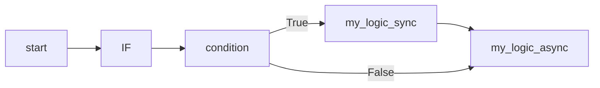

# Basic Example

After reviewing the minimal example, let’s look at a more complete basic usage.

## 2.2.2 Example

### Code

```python
import asyncio
from amrita_sense import Node, WorkflowInterpreter, IF

@Node()
async def condition() -> bool:
    ...  # assume this is your decision logic
    return True

@Node()
def my_logic_sync():
    ...  # business logic here
    print("I'm a sync node")

@Node()
async def my_logic_async():
    ...  # business logic here
    print("I'm an async node")

comp = IF(condition, my_logic_sync) >> my_logic_async  # IF can accept both sync and async functions; this is just an example
graph = comp.render()

interpreter = WorkflowInterpreter(graph)

if __name__ == "__main__":
    asyncio.run(interpreter.run())
```

### Explanation

This example demonstrates conditional execution in AmritaSense. Let’s break it down:

- `IF` is a conditional execution node that accepts a condition node (which must return `bool` and declare its return type in the signature) and a logic payload node. If the condition node returns `True`, the logic node is executed.
- `my_logic_sync` is a synchronous function that prints `"I'm a sync node"`.
- `my_logic_async` is an asynchronous function that prints `"I'm an async node"`.

The execution order of the `IF` node is as follows:



Of course, `IF` also supports `ELIF` and `ELSE`. We will cover those in later chapters.

> **More examples**: See the `demos/` directory in the source repository for more standalone, runnable examples covering all core features.
