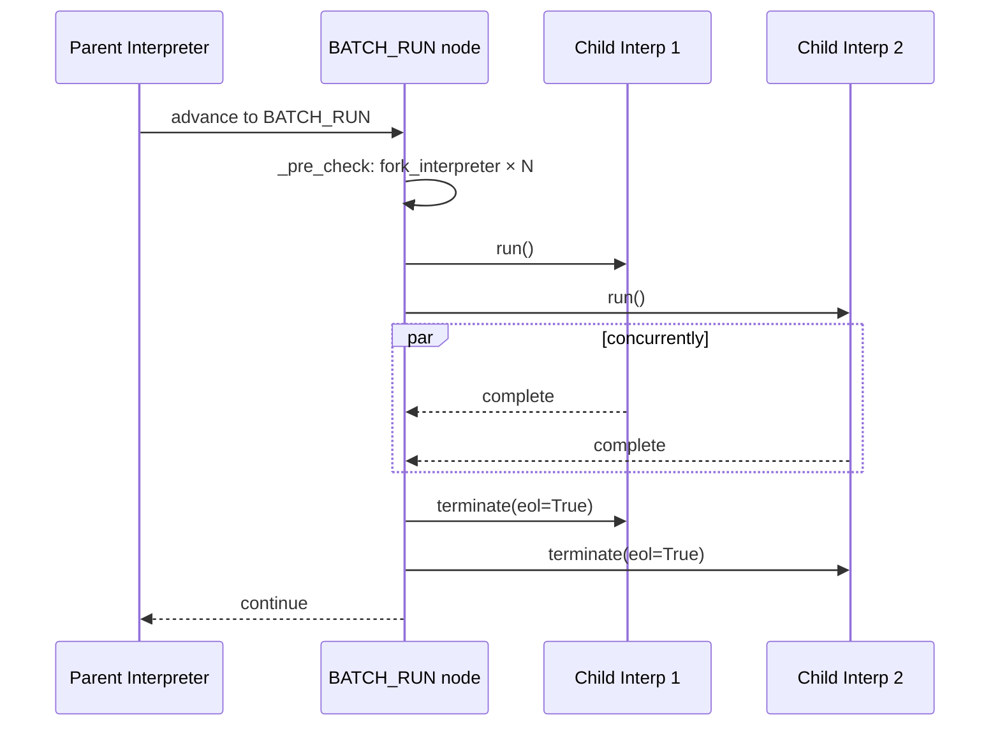

# Node and Branch Concurrent Invocation

::: warning Prerequisites
Before reading this article, make sure you understand:

- **[Subgraph Isolation](/guide/practice/subgraph-isolation)** — how `FUN_BLOCK` executes sub-workflows in independent child interpreters
- **Interpreter Tree Mechanism** — the tree structure of `WorkflowInterpreter`, including `fork_interpreter()`, `parent`, `sub_interpreters`, `top_interpreter`, and lifecycle methods like `terminate()` / `wait_all()` (see [Runtime System API](/reference/api/runtime#interpreter-tree-v030))
  :::

## Overview

`FUN_BLOCK` places **one** sub-workflow into a child interpreter for **sequential** execution — the parent suspends and waits, then continues. But in real-world scenarios you often need to execute **multiple** independent sub-tasks **simultaneously**: calling several microservices in parallel, batch-processing data shards, or running independent computation branches. AmritaSense v0.4.4 introduces **`BATCH_RUN`** for exactly this purpose.

`BATCH_RUN` leverages the interpreter tree's `fork_interpreter()` mechanism to create an independent child interpreter for each input, executes them concurrently via `asyncio.gather()`, and collects results or exceptions afterward.

## `BATCH_RUN` vs `FUN_BLOCK`

| Aspect            | `BATCH_RUN`                                             | `FUN_BLOCK`                             |
| ----------------- | ------------------------------------------------------- | --------------------------------------- |
| Execution mode    | Concurrent (launches N interpreters at once)            | Sequential (blocks until subgraph done) |
| Input             | Multiple `BaseNode` / `NodeCompose` / self-compile      | Single `NodeComposeRendered`            |
| Interpreter count | N child interpreters                                    | 1 child interpreter                     |
| Error handling    | Collected as `BaseExceptionGroup`; supports `fail_fast` | Exception propagates directly           |
| Use case          | Parallel I/O, fan-out/fan-in                            | Isolated single sub-task                |

## Instruction Signature

```python
from amrita_sense.instructions.batch import BATCH_RUN

def BATCH_RUN(
    *nodes: BaseNode | NodeCompose | SelfCompileInstruction,
    sos_io: SuspendObjectStream | None = None,
    middleware: Callable[[WorkflowInterpreter], Awaitable[Any]] | None | object = UNSET,
    fail_fast: bool = True,
) -> BatchRun:...
```

### Parameters

| Parameter    | Type                                                | Default    | Description                                                                     |
| ------------ | --------------------------------------------------- | ---------- | ------------------------------------------------------------------------------- |
| `*nodes`     | `BaseNode \| NodeCompose \| SelfCompileInstruction` | (required) | Branches to execute concurrently                                                |
| `fail_fast`  | `bool`                                              | `True`     | If `True`, first exception cancels the rest. If `False`, collect all exceptions |
| `sos_io`     | `SuspendObjectStream \| None`                       | `None`     | Shared I/O stream                                                               |
| `middleware` | `Callable \| None \| UNSET`                         | `UNSET`    | Child interpreter middleware inheritance                                        |

### Return Value

Returns a `BatchRun` node, placed directly in the `>>` chain.

## Three Input Modes

Internally, `_post_compile` dispatches based on input type:

- **Bare `BaseNode`**: Multiple bare nodes are bundled into a single `__BATCH_CALLER__` interpreter.
- **`NodeCompose`**: Each is independently `.render()`ed → one child interpreter each.
- **`SelfCompileInstruction`**: Each is `.extract().render()`ed → one child interpreter each.

All three can be mixed freely; internal logic classifies automatically.

## Execution Flow



## Example 1: Parallel Bare Nodes

```python
from amrita_sense import Node, WorkflowInterpreter
from amrita_sense.instructions.batch import BATCH_RUN

@Node()
async def fetch_users() -> str:
    return "users"

@Node()
async def fetch_orders() -> str:
    return "orders"

@Node()
async def fetch_products() -> str:
    return "products"

workflow = BATCH_RUN(fetch_users, fetch_orders, fetch_products)
await WorkflowInterpreter(workflow.as_compose().render()).run()
```

All three nodes run concurrently in separate child interpreters.

## Example 2: Parallel Subgraphs

```python
from amrita_sense.node.core import NodeCompose

@Node()
async def validate(): ...

@Node()
async def enrich(): ...

@Node()
async def clean(): ...

@Node()
async def transform(): ...

branch_a = validate >> enrich
branch_b = clean >> transform

workflow = BATCH_RUN(branch_a, branch_b)
await WorkflowInterpreter(workflow.as_compose().render()).run()
```

## Example 3: Mixed Input with fail_fast

```python
from amrita_sense.instructions import IF

@Node()
async def check():
    return True

@Node()
async def action():
    print("condition met")

@Node()
async def side_task():
    print("side task")

workflow = BATCH_RUN(
    IF(check, action).ELIF(lambda: False, action).ELSE(action),
    side_task,
    fail_fast=False,
)
```

## Error Handling

### `fail_fast=True` (default)

Any child exception immediately cancels the rest:

```python
workflow = BATCH_RUN(risky_node, safe_node)
# → ExceptionGroup propagates, safe_node is cancelled
```

### `fail_fast=False`

All children run to completion, then all exceptions are collected:

```python
workflow = BATCH_RUN(risky_node, safe_node, fail_fast=False)
# → safe_node completes; all exceptions raised as BaseExceptionGroup
```

### Wrapping with `TRY/CATCH`

```python
from amrita_sense.instructions import TRY

@Node()
def handle_error(exc: ExceptionGroup):
    print(f"Batch error: {exc.exceptions}")

workflow = TRY(BATCH_RUN(risky_node, safe_node, fail_fast=False)) \
    .CATCH(ExceptionGroup, handle_error)
```

> **Note**: `BATCH_RUN` raises `exceptiongroup.BaseExceptionGroup` (Python stdlib). Ensure `CATCH` type matches.

## Combining with `FUN_BLOCK`

```python
sub_a = (node_a1 >> node_a2).render()
sub_b = (node_b1 >> node_b2 >> node_b3).render()

workflow = BATCH_RUN(
    FUN_BLOCK(sub_a, one_time_interp=True),
    FUN_BLOCK(sub_b, one_time_interp=True),
)
```

Each `FUN_BLOCK` retains independent middleware and error boundaries while running concurrently.

## Lifecycle Management

`BATCH_RUN` automatically calls `terminate(eol=True)` in its `finally` block. Therefore:

- **No manual cleanup** — children are auto-removed from the tree
- **Exception-safe** — `finally` runs even if `gather()` raises
- **Nesting-safe** — children can contain their own `FUN_BLOCK` or `BATCH_RUN`

## Notes

- Concurrency is limited by the event loop; batch large numbers of branches
- Child interpreters share the parent's `SuspendObjectStream` — concurrent writes need CLCA safety
- Bare-node mode bundles into one interpreter, suitable for lightweight parallelism
- Each branch has an independent DI context (separate `fork_interpreter`)
