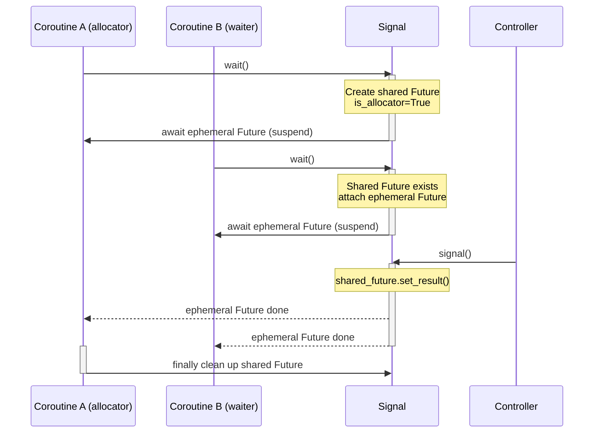
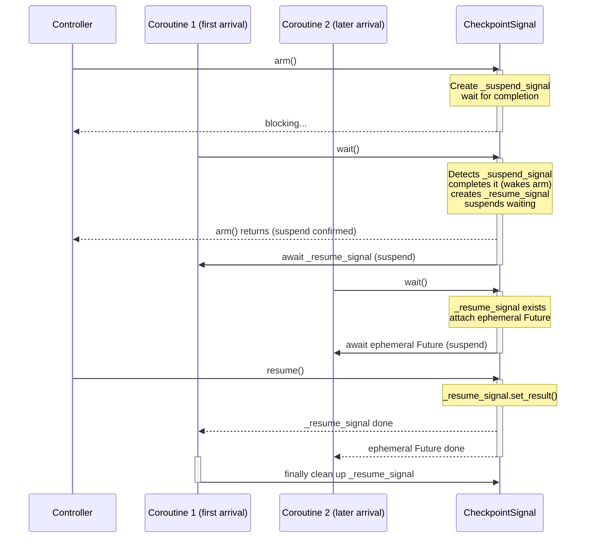

# CLCA Design Pattern

In async programming, one classic scenario keeps surfacing: multiple coroutines need to simultaneously wait for the same external "signal", then all resume together. That signal might be a button click, a long-awaited network response, or a background workflow node completing its task.

Two paths typically present themselves: bring in a full message queue (too heavy), or hand-roll a simple notification using `asyncio.Event` or a shared `Future`. The hand-rolled approach, however, has fatal gaps: a bare shared `Future` only lets one coroutine consume the result; swap in an `Event`, and you can wake many waiters, but safely crossing event-loop boundaries becomes precarious. Ensuring one signal reliably wakes _all_ waiters — even across multiple event loops — usually forces polling or per-waiter `Future` bookkeeping, burdening the external controller with significant complexity.

This article presents a lightweight signal-distribution pattern distilled from practice — **CLCA (Cross Loop Callback‑Allocate)**. It decouples "suspend" and "resume" from complex flow-control logic, turning them into a standalone, highly reusable cross-event-loop communication primitive.

## What It Isn't: Not a Queue

First, a clarification: CLCA is not a "queue". A queue is a FIFO pipeline that carries a data stream and cares about "who gets this element". CLCA cares about the _signal_ — a bare "you may proceed" notification. Its core responsibility is **allocation**: from a single signal source, precisely waking every coroutine waiting on that signal.

That is the meaning of "Callback‑Allocate": through a callback mechanism, the signal is _allocated_ to every registered waiter.

## Core Mechanism

CLCA is built from three cooperating primitives:

### **Shared `Future` (Signal Source)**

An `asyncio.Future` completed via `set_result()`. It carries no business data — only the "wake" signal.

### **Ephemeral `Future` + `add_done_callback` (Allocation Channel)**

This is the heart of CLCA. Waiters attach their own "ephemeral `Future`" to the shared `Future` via `add_done_callback`. When the signal source fires, every attached ephemeral `Future` completes automatically, waking all waiters in one shot. Crucially, this mechanism is inherently cross-event-loop: each coroutine ultimately `await`s a `Future` inside its own event loop, sidestepping the compatibility issues of cross-loop `await`.

### **`aiologic.Lock` (State Synchronization)**

In multi-threaded, multi-event-loop environments, ensures that mutations to the shared `Future` and waiter state are atomic and visible across loops.

## Two Variants: Voluntary Yield vs. Checkpoint Suspend

Depending on _who initiates the suspend_, CLCA manifests in two typical forms:

- **Voluntary yield (active)** — The coroutine itself decides when to suspend and wait for an external signal. This is the most direct one-to-many notification scenario, represented by the **`Signal`** class.
- **Checkpoint suspend (passive)** — An external controller pre-sets a "checkpoint"; when a coroutine reaches that point it passively detects and suspends until explicitly resumed. This form excels when the system needs fine-grained external control over coroutine execution pacing, represented by the **`CheckpointSignal`** class.

Both forms share the same CLCA kernel; they differ only in the direction of the suspend trigger.

## Practice I: Signal — Voluntary Yield

Sequence diagram:



The coroutine voluntarily calls `wait()` to yield control, waiting for an external signal. This is the classic scenario described earlier, implemented as follows:

```python
import asyncio

import aiologic


class Signal:
    """A reusable signal. Workers voluntarily yield and suspend, waiting for
    an external signal to resume."""

    def __init__(self):
        self._shared_future: asyncio.Future | None = None  # shared signal source
        self._lock = aiologic.Lock()

    async def wait(self) -> None:
        """Suspend the current coroutine, waiting for the signal.
        Can be called from any event loop."""
        async with self._lock:
            # Decide: are we the allocator or a follower?
            if self._shared_future is None or self._shared_future.done():
                self._shared_future = asyncio.Future()
                shared_fut = self._shared_future
                is_allocator = True
            else:
                shared_fut = self._shared_future
                is_allocator = False

            await asyncio.sleep(0)  # brief yield

            if is_allocator:
                fut: asyncio.Future[None] = asyncio.Future()
                shared_fut.add_done_callback(lambda _: fut.set_result(None))
            else:
                fut = shared_fut

        try:
            await fut
        finally:
            if is_allocator:
                async with self._lock:  # safely clean up under the lock
                    if (
                        self._shared_future is shared_fut
                    ):  # guard against next-cycle Future
                        self._shared_future = None

    async def signal(self) -> None:
        """Fire the signal, waking all waiters.
        Can be called from any event loop."""
        async with self._lock:
            if self._shared_future and not self._shared_future.done():
                self._shared_future.set_result(True)
```

### Key Points

- **Allocator vs. waiter**: The first coroutine calling `wait()` creates the shared `Future` and cleans up after waking; subsequent coroutines bind to the same shared `Future` via `add_done_callback`. The `await asyncio.sleep(0)` inside the lock ensures callbacks are safely attached after the lock is released.
- **One shot wakes all**: `signal()` completes the shared `Future`, firing all registered callbacks and waking every waiter simultaneously.
- **Cross-loop safety**: `aiologic.Lock` protects all shared-state reads and writes. Each coroutine ultimately `await`s a `Future` in its own event loop, naturally avoiding cross-loop waiting issues.

## Practice II: CheckpointSignal — External Checkpoint Suspend

Sequence diagram:



When control resides externally, a "checkpoint" mechanism is needed: the outside sets a suspension point, and internal coroutines automatically suspend upon arrival, waiting for external resumption. Stripping away business logic (queue, tag filtering, callbacks, etc.) from the real-world `SuspendObjectStream` yields the pure **`CheckpointSignal`**.

### Design Rationale

`CheckpointSignal` exposes three core operations:

- `arm()` — Called externally; sets the checkpoint and blocks until a coroutine actually arrives and suspends. This lets the outside world confirm the coroutine has paused.
- `wait()` — Called internally by coroutines. If a checkpoint has been armed, suspend until `resume()` is called; otherwise return immediately.
- `resume()` — Called externally; wakes all coroutines waiting at the checkpoint.

This mechanism is fully built on CLCA: two `Future`s implement a bidirectional handshake. `_suspend_signal` handles "suspend acknowledgment" (external waits for coroutine arrival), and `_resume_signal` handles "resume notification" (coroutines wait for external resumption).

### Implementation

```python
import asyncio

import aiologic


class CheckpointSignal:
    """An externally-armed checkpoint: coroutines automatically suspend
    on arrival and wait for external resumption."""

    def __init__(self):
        self._suspend_signal: asyncio.Future | None = None  # external awaits "suspend confirmed"
        self._resume_signal: asyncio.Future | None = None   # coroutines await "resume"
        self._lock = aiologic.Lock()

    async def arm(self) -> None:
        """Arm the checkpoint and block until a coroutine actually arrives
        and suspends."""
        async with self._lock:
            if self._suspend_signal is not None and not self._suspend_signal.done():
                raise RuntimeError("Already armed")
            self._suspend_signal = asyncio.Future()
        await self._suspend_signal

    async def wait(self) -> None:
        """
        Called internally by coroutines. If a checkpoint is armed, suspend
        until resume() is called; otherwise return immediately.
        """
        async with self._lock:
            if self._suspend_signal is None:
                return
            if self._resume_signal is not None and not self._resume_signal.done():
                # Another coroutine is already waiting — attach our own ephemeral Future
                shared = self._resume_signal
                is_first = False
            else:
                # First coroutine to arrive: confirm suspend, create resume Future
                if not self._suspend_signal.done():
                    self._suspend_signal.set_result(True)
                self._resume_signal = asyncio.Future()
                shared = self._resume_signal
                is_first = True

            await asyncio.sleep(0)

            if is_first:
                fut = shared
            else:
                fut = asyncio.Future()
                shared.add_done_callback(lambda _: fut.set_result(None))

        try:
            await fut
        finally:
            if is_first:
                async with self._lock:
                    if self._resume_signal is fut:
                        self._resume_signal = None

    def resume(self) -> None:
        """Wake all coroutines suspended at the checkpoint."""
        with self._lock:
            if self._resume_signal is not None and not self._resume_signal.done():
                self._resume_signal.set_result(True)
```

### Key Points

- **Bidirectional handshake**: `arm()` creates `_suspend_signal` and blocks. The first coroutine to reach `wait()` detects `_suspend_signal`, completes it to wake `arm()` — this confirms to the external controller that the coroutine is precisely at the checkpoint.
- **CLCA reuse**: Multiple coroutines may arrive at the same checkpoint concurrently. The first creates the shared `_resume_signal`; later coroutines attach their own ephemeral `Future`s via `add_done_callback`. `resume()` completes the shared `_resume_signal`, waking all waiters at once.
- **Lifecycle cleanup**: The first coroutine cleans up `_resume_signal` after waking, preventing stale state from leaking into the next cycle.
- **Idempotency & guardrails**: Repeated `arm()` raises an exception to prevent state confusion; `wait()` returns immediately when no checkpoint is armed, ensuring coroutines are never blocked on the normal execution path.

## Usage Examples

### 1. Signal: Multiple Coroutines Waiting for an External Event

```python
signal = Signal()

async def worker(name):
    print(f"Worker {name} suspending...")
    await signal.wait()
    print(f"Worker {name} received signal, resuming!")

async def controller():
    await asyncio.sleep(1)
    print("Controller firing signal!")
    await signal.signal()

async def main():
    await asyncio.gather(worker("A"), worker("B"), controller())
```

### 2. CheckpointSignal: External Control of Coroutine Pacing

```python
checkpoint = CheckpointSignal()

async def stage(name):
    print(f"Stage {name} starting...")
    await asyncio.sleep(0.5)
    print(f"Stage {name} reached checkpoint, awaiting external command...")
    await checkpoint.wait()
    print(f"Stage {name} completing!")

async def controller():
    # Arm the checkpoint and wait for coroutine arrival
    print("Controller: arming checkpoint...")
    await checkpoint.arm()
    print("Controller: checkpoint active, coroutine suspended. Performing other work...")
    await asyncio.sleep(1)
    print("Controller: resuming execution!")
    checkpoint.resume()

async def main():
    await asyncio.gather(stage("A"), controller())
```

### 3. Cross-Event-Loop Synchronization

Both `Signal` and `CheckpointSignal` are built on the same CLCA kernel and natively support cross-thread, cross-event-loop usage. Below is a cross-loop example with `CheckpointSignal` (Python 3.14+):

```python
import threading

checkpoint = CheckpointSignal()

async def worker_in_loop():
    print("Coroutine in another loop reached checkpoint...")
    await checkpoint.wait()
    print("Coroutine in another loop has been woken!")

def run_loop():
    asyncio.run(worker_in_loop())

thread = threading.Thread(target=run_loop)
thread.start()

async def main():
    await asyncio.sleep(0.5)
    print("Main loop: arming checkpoint and waiting...")
    await checkpoint.arm()
    print("Main loop: checkpoint active, sending resume signal")
    checkpoint.resume()

asyncio.run(main())
thread.join()
```

## Summary

CLCA abstracts "suspend‑resume" into a standalone signal-distribution primitive, solving the core challenge of multi-coroutine synchronized waiting. From this foundation, two practical variants emerge depending on the control relationship:

- **`Signal`** — Voluntary yield, suitable for coroutines willingly waiting on external events;
- **`CheckpointSignal`** — External checkpoint suspend, suitable for externally controlling coroutine execution pacing with precision.

Both share the same lightweight, cross-event-loop CLCA kernel, achieving high flexibility and reusability with nothing more than `Future` + `Lock`. If your system needs to insert precise synchronization points into complex async flows, these two signal primitives will serve as exceptionally effective tools.
