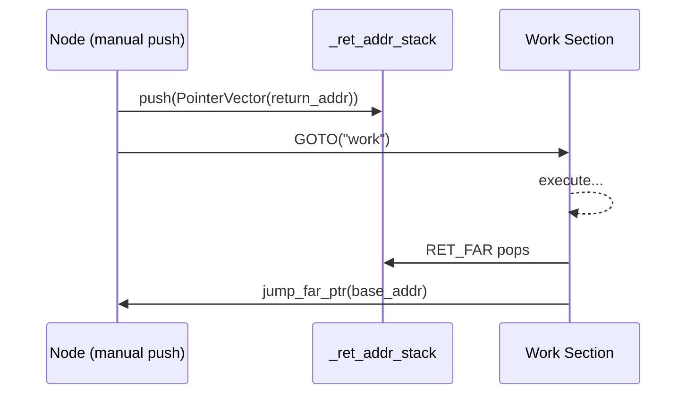

# Advanced Topic: Manual Stack Space Management

The `CALL` instruction and `call_sub` method automatically manage the return address stack (`_ret_addr_stack`) for you: they push the current pointer before entering a subroutine, and the `finally` block pops it upon return. For most workflows, this is all you need.

However, AmritaSense also exposes the return address stack for **manual control** via `RET_FAR`. The pattern is:

1. **Manual push** — A node explicitly pushes a `PointerVector` onto `_ret_addr_stack`
2. **GOTO** — Jump somewhere else in the workflow
3. **RET_FAR** — Pop the saved address and jump back

This lets you implement custom call/return schemes that don't follow the rigid `CALL`/`call_sub` discipline.

## The Return Address Stack

`_ret_addr_stack` is a `Stack[PointerVector]` on the `WorkflowInterpreter`. `CALL` pushes the current pointer onto it; the `finally` block of `call_sub` pops and restores it. But you can also push onto it directly from any node that has access to the interpreter via `POINTER_DEPENDS`.



## RET_FAR

`RET_FAR` is a factory function that creates a `RetFarNode`. At runtime, it does exactly one thing:

1. Pops the top entry from `_ret_addr_stack`
2. Calls `pc.jump_far_ptr(ptr.base_addr)` to jump to the saved address

`RetFarNode` is a regular `BaseNode`, placed directly in the workflow composition — **not returned from inside another node**.

## Example: Manual Push + GOTO + RET_FAR

```python
from amrita_sense import ALIAS, NOP, Node, PointerVector, WorkflowInterpreter
from amrita_sense.instructions import RET_FAR, GOTO

@Node()
async def start() -> None:
    print("Start")

@Node()
async def save_ret_addr(pc: WorkflowInterpreter) -> None:
    """Manually push a return destination onto _ret_addr_stack."""
    return_dest = PointerVector(pc.find_addr_alias("after"))
    pc._ret_addr_stack.push(return_dest)

@Node()
async def doing_work() -> None:
    """The section we GOTO into."""
    print("  Doing work")

@Node()
async def after_return() -> None:
    """RET_FAR pops _ret_addr_stack and jumps here."""
    print("Back here (via RET_FAR)")

comp = (
    start
    >> save_ret_addr
    >> GOTO("work")
    >> ALIAS(after_return, "after")
    >> GOTO("end")
    >> ALIAS(doing_work, "work")
    >> RET_FAR()
    >> ALIAS(NOP, "end")
)
await WorkflowInterpreter(comp.render()).run()
```

**Flow**:

1. `save_ret_addr` pushes the address of `"after"` (i.e. `after_return`) onto `_ret_addr_stack`
2. `GOTO("work")` jumps to the `doing_work` node
3. After `doing_work`, `RET_FAR` pops the saved `PointerVector` and jumps back to `after_return`

## When to Use Manual Stack Management

| Scenario                      | Use                                               |
| ----------------------------- | ------------------------------------------------- |
| Simple subroutine call/return | `CALL` + natural `call_sub` return                |
| Custom return destination     | Manual push + `GOTO` + `RET_FAR`                  |
| Multi-level stack unwinding   | Push multiple addresses, `RET_FAR` once per level |
| Non-linear control flow       | Combine with `GOTO` for arbitrary jump patterns   |

## Caution

- **Stack integrity**: `RET_FAR` pops from `_ret_addr_stack` unconditionally. If the stack is empty, this raises an `IndexError`. Always push a corresponding address before reaching `RET_FAR`.
- **Jump flag**: `RET_FAR` calls `jump_far_ptr` which is decorated with `@markup`, setting `_jump_marked = True`. The interpreter will NOT advance the pointer after `RET_FAR` — execution resumes at the jumped-to address.
- **Not a subprogram instruction**: `RET_FAR` is a standalone node in the composition chain. Do NOT `return RET_FAR()` from inside a `@Node()` function — that return value is ignored. Place `RET_FAR()` directly in the `>>` chain.
