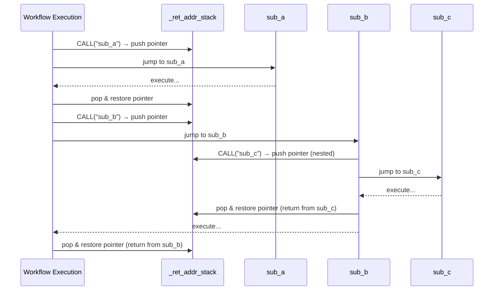

# Advanced Topic: Manual Stack Space Management

The `CALL` instruction and `call_sub` method automatically manage the return address stack for you: they push the current pointer before entering a subroutine and pop it upon return. In most workflows, this is all you need. However, when you need **manual control over the call stack**, AmritaSense provides `RET_FAR` — an instruction that lets you explicitly pop and jump to a saved return address.

## The Return Address Stack

Every time `CALL` or `call_sub` executes, the current `PointerVector` is pushed onto `_ret_addr_stack`. When the subroutine finishes normally, the `finally` block of `call_sub` pops that address and restores the pointer.



## When Normal Return Is Not Enough

Normal subroutine return works when execution reaches the end of the called node sequence. But consider these scenarios:

1. **Early exit from nested scopes** — You're deep inside a multi-level `CALL` chain and need to jump directly back to the outermost caller, bypassing intermediate returns.
2. **Custom stack unwinding** — You want to manually pop multiple return addresses to implement a form of non-local exit.
3. **Bubble boundary crossing** — You need to jump out of a node composition bubble into a completely different scope.

In these cases, you can use `RET_FAR` to take manual control.

## RET_FAR

`RET_FAR` is a factory function that creates a `RetFarNode`. At runtime, it:

1. Pops the top entry from `_ret_addr_stack` — this is the most recently saved return address
2. Calls `pc.jump_far_ptr(ptr.base_addr)` — performs a multi-dimensional absolute jump to the base address of the popped pointer

`RetFarNode` is a regular `BaseNode`, so it can be placed anywhere in a workflow composition — including inside nested `CALL` chains and bubbles.

## Example: Early Exit from Nested Scopes

```python
from amrita_sense.instructions import CALL, ALIAS, ARCHIVED_NODES, RET_FAR
from amrita_sense.instructions.workfl_ctrl import NOP
from amrita_sense.node.core import Node

@Node()
def deep_task():
    print("Entering deep task")
    # ... complex processing ...
    print("Early exit condition met — returning now")
    # RET_FAR pops the return address and jumps back to the outermost caller
    return RET_FAR()  # <-- manual stack pop & return

@Node()
def finish():
    print("Back to top level")
    return "done"

deep_subprogram = ARCHIVED_NODES(
    ALIAS(deep_task, "deep_work"),
    RET_FAR,  # alternative: place inside subprogram as explicit exit
)

workflow = (
    Node(lambda: print("Start"))
    >> CALL("deep_work")
    >> finish
    >> NOP
    >> deep_subprogram
)
```

## Relationship with CALL

| Aspect         | Normal CALL return              | RET_FAR                                |
| -------------- | ------------------------------- | -------------------------------------- |
| Stack pop      | Automatic in `call_sub.finally` | Manual via `_ret_addr_stack.pop()`     |
| Trigger        | Reaching end of subroutine      | Explicit when `RetFarNode` is executed |
| Nesting        | Returns one level at a time     | Can be placed anywhere in the stack    |
| Jump method    | `_pointer = saved_ptr`          | `pc.jump_far_ptr(ptr.base_addr)`       |
| `_jump_marked` | Checked, may skip restore       | Always sets the flag via `@markup`     |

`RET_FAR` uses the same `@markup`-protected jump mechanism as `GOTO` and `CALL`, but it explicitly controls which return address it pops. This gives you fine-grained control over the call stack.

## Caution

- **Stack integrity**: `RET_FAR` pops from `_ret_addr_stack` unconditionally. If the stack is empty, this will raise an error. Always ensure a corresponding `CALL` has pushed an address before using `RET_FAR`.
- **Not a replacement for normal return**: For straightforward subroutines, let the natural `call_sub` return handle stack management. `RET_FAR` is for advanced use cases only.
- **Interaction with GOTO**: If a `GOTO` inside a subroutine has already set `_jump_marked`, `call_sub` may skip its normal stack restoration. Be aware that mixing `GOTO`, `CALL`, and `RET_FAR` in the same subroutine requires careful stack planning.
