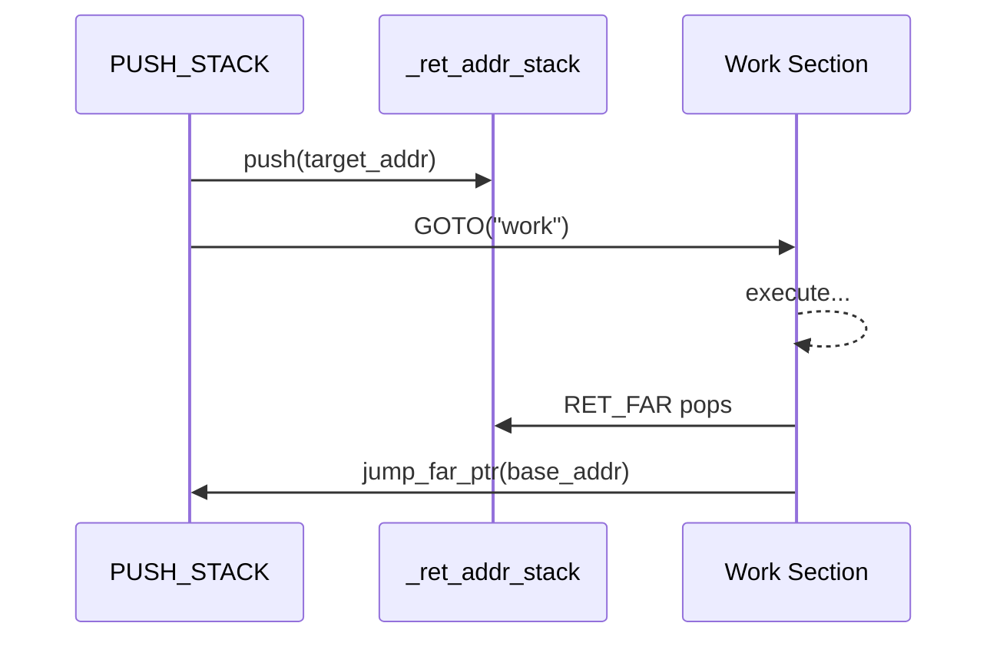

# Advanced Topic: Manual Stack Space Management

The `CALL` instruction and `call_sub` method automatically manage the return address stack (`_ret_addr_stack`) for you: they push the current pointer before entering a subroutine, and the `finally` block pops it upon return. For most workflows, this is all you need.

However, AmritaSense also exposes the return address stack for **manual control** via `PUSH_STACK` and `RET_FAR`. The pattern is:

1. **PUSH_STACK** — Push an alias or address onto `_ret_addr_stack`
2. **GOTO** — Jump somewhere else in the workflow
3. **RET_FAR** — Pop the saved address and jump back

This lets you implement custom call/return schemes that don't follow the rigid `CALL`/`call_sub` discipline.

## The Return Address Stack

`_ret_addr_stack` is a `Stack[PointerVector]` on the `WorkflowInterpreter`. `CALL` pushes the current pointer onto it; the `finally` block of `call_sub` pops and restores it. With `PUSH_STACK`, you can push any alias target onto the stack directly from the composition chain without writing a custom node.



## PUSH_STACK and RET_FAR

- **`PUSH_STACK(alias_or_idata)`** — pushes the resolved address of a target alias (or a raw address list) onto `_ret_addr_stack`. It is a `PushStackNode`, placed directly in the `>>` chain.
- **`RET_FAR()`** — pops the top entry from `_ret_addr_stack` and calls `jump_far_ptr` to jump to the saved address. Also a regular `BaseNode` placed in the composition chain.

Neither instruction should be `return`-ed from inside a `@Node()` function — place them directly in the `>>` chain.

## Example: PUSH_STACK + GOTO + RET_FAR

```python
from amrita_sense import ALIAS, NOP, Node, WorkflowInterpreter
from amrita_sense.instructions import GOTO, PUSH_STACK, RET_FAR

@Node()
async def start() -> None:
    print("Start")

@Node()
async def doing_work() -> None:
    """The section we GOTO into."""
    print("  Doing work")

@Node()
async def after_return() -> None:
    """RET_FAR pops _ret_addr_stack and jumps here."""
    print("Back here (via RET_FAR)")

comp = (
    start
    >> PUSH_STACK("after")
    >> GOTO("work")
    >> ALIAS(after_return, "after")
    >> GOTO("end")
    >> ALIAS(doing_work, "work")
    >> RET_FAR()
    >> ALIAS(NOP, "end")
)
await WorkflowInterpreter(comp.render()).run()
```

**Flow**:

1. `PUSH_STACK("after")` pushes the address of `after_return` onto `_ret_addr_stack`
2. `GOTO("work")` jumps to the `doing_work` node
3. After `doing_work`, `RET_FAR` pops the saved address and jumps back to `after_return`

## When to Use Manual Stack Management

| Scenario                      | Use                                               |
| ----------------------------- | ------------------------------------------------- |
| Simple subroutine call/return | `CALL` + natural `call_sub` return                |
| Custom return destination     | `PUSH_STACK` + `GOTO` + `RET_FAR`                 |
| Multi-level stack unwinding   | Push multiple addresses, `RET_FAR` once per level |
| Non-linear control flow       | Combine with `GOTO` for arbitrary jump patterns   |

## Subroutine-like Pattern with ARCHIVED_NODES

`PUSH_STACK` + `GOTO` + `RET_FAR` can be combined with `ARCHIVED_NODES` to create self-contained "subroutines" that are skipped during normal execution but can be entered via `GOTO`:

```python
from amrita_sense import ALIAS, ARCHIVED_NODES, NOP, Node, WorkflowInterpreter
from amrita_sense.instructions import GOTO, PUSH_STACK, RET_FAR

@Node()
async def start() -> None:
    print("Start")

@Node()
async def step1() -> None:
    print("  Step 1")

@Node()
async def step2() -> None:
    print("  Step 2")

@Node()
async def after_return() -> None:
    print("Back here (via RET_FAR)")

# Self-contained subroutine: normal flow skips it, GOTO enters it.
# Execution inside: step1 >> step2 >> RET_FAR() → pop stack → return.
subroutine = ARCHIVED_NODES(
    ALIAS(NOP, "sub_entry"),  # entry point marker
    step1,
    step2,
    RET_FAR(),
)

comp = (
    start
    >> PUSH_STACK("after")
    >> GOTO("sub_entry")
    >> ALIAS(after_return, "after")
    >> subroutine
)
await WorkflowInterpreter(comp.render()).run()
```

**Flow**:

1. `PUSH_STACK("after")` saves the return destination
2. `GOTO("sub_entry")` enters the subroutine at `NOP` (the entry marker)
3. `step1 >> step2` execute sequentially
4. `RET_FAR()` pops the saved address and jumps back to `after_return`

The `NOP` aliased as `"sub_entry"` acts as the named entry point — `GOTO` targets the alias, and the node itself is a no-op.

## Caution

- **Stack integrity**: `RET_FAR` pops from `_ret_addr_stack` unconditionally. If the stack is empty, this raises an `IndexError`. Always push a corresponding address (via `CALL` or `PUSH_STACK`) before reaching `RET_FAR`.
- **Jump flag**: `RET_FAR` calls `jump_far_ptr` which is decorated with `@markup`, setting `_jump_marked = True`. The interpreter will NOT advance the pointer after `RET_FAR` — execution resumes at the jumped-to address.
- **Not a subprogram instruction**: `PUSH_STACK` and `RET_FAR` are standalone nodes in the composition chain. Do NOT call them from inside a `@Node()` function — place them directly in the `>>` chain.
