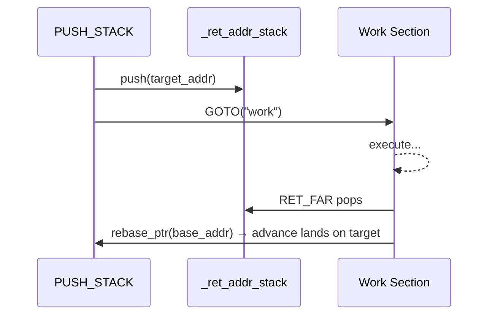

# Advanced Topic: Manual Stack Space Management

The `CALL` instruction and `call_sub` method automatically manage the return address stack (`_ret_addr_stack`) for you: they push the current pointer before entering a subroutine, and the `finally` block pops it upon return. For most workflows, this is all you need.

However, AmritaSense also exposes the return address stack for **manual control** via `PUSH_STACK` and `RET_FAR`. The pattern is:

1. **PUSH_STACK** — Push an alias or address onto `_ret_addr_stack`
2. **GOTO** — Jump somewhere else in the workflow
3. **RET_FAR** — Pop the saved address and jump back

This lets you implement custom call/return schemes that don't follow the rigid `CALL`/`call_sub` discipline.

## The Return Address Stack

`_ret_addr_stack` is a `Stack[PointerVector]` on the `WorkflowInterpreter`. `CALL` pushes the current pointer onto it; the `finally` block of `call_sub` pops and restores it. With `PUSH_STACK`, you can push any alias target onto the stack directly from the composition chain without writing a custom node.


```mermaid
sequenceDiagram
    participant N as PUSH_STACK
    participant S as _ret_addr_stack
    participant W as Work Section

    N->>S: push(target_addr)
    N->>W: GOTO("work")
    W-->>W: execute...
    W->>S: RET_FAR pops
    W->>N: rebase_ptr(base_addr) → advance lands on target
```

## PUSH_STACK and RET_FAR

- **`PUSH_STACK(alias_or_idata)`** — pushes the resolved address of a target alias (or a raw address list) onto `_ret_addr_stack`. The instruction returns a `NodeType[None]` (an inline `@Node`-decorated callable), placed directly in the `>>` chain.
- **`RET_FAR()`** — pops the top entry from `_ret_addr_stack` and restores the pointer via `rebase_ptr`. Unlike `jump_to` / `jump_far_ptr`, `rebase_ptr` does **not** set the jump flag, so the interpreter naturally **advances to the next instruction** (`return-address + 1`) after the return. Callers should push `target - 1` so that the advance step lands exactly on the target node.

Neither instruction should be `return`-ed from inside a `@Node()` function — place them directly in the `>>` chain.

## Example: PUSH_STACK + GOTO + RET_FAR

```python
from amrita_sense import ALIAS, NOP, Node, WorkflowInterpreter
from amrita_sense.instructions import GOTO, PUSH_STACK, RET_FAR

@Node()
async def start() -> None:
    print("Start")

@Node()
async def doing_work() -> None:
    """The section we GOTO into."""
    print("  Doing work")

@Node()
async def after_return() -> None:
    """RET_FAR pops _ret_addr_stack and resumes here."""
    print("Back here (via RET_FAR)")

comp = (
    start
    >> PUSH_STACK("resume")    # push the return address (NOP right before after_return)
    >> GOTO("work")            # jump into the work section
    >> ALIAS(NOP, "resume")    # RET_FAR rebases here; advance lands on after_return
    >> after_return
    >> GOTO("end")
    >> ALIAS(doing_work, "work")
    >> RET_FAR()
    >> ALIAS(NOP, "end")
)
await WorkflowInterpreter(comp.render()).run()
```

**Flow** (new `RET_FAR` semantics):

1. `PUSH_STACK("resume")` pushes the address of the `NOP` aliased `"resume"` — the node **before** `after_return`
2. `GOTO("work")` jumps to the `doing_work` node
3. After `doing_work`, `RET_FAR` pops the saved address, `rebase_ptr`s there, and the interpreter advances onto `after_return`

> Because `RET_FAR` does not set the jump flag, the saved address must be the **predecessor** of the real target (`target - 1`). The `"resume"` NOP plays that role here.

## PUSH_AND_GOTO (v0.3.0+)

**`PUSH_AND_GOTO(from_adr, to_adr)`** is a convenience instruction that combines `PUSH_STACK` + `GOTO` into a single node. Internally it:

1. Pushes `from_adr` onto `_ret_addr_stack` (just like `PUSH_STACK`)
2. Jumps to `to_adr` (just like `GOTO`)

`from_adr` accepts an alias string, a raw address list, or **`None`**. When `None`:

- Inside a subroutine call (`pc.outer_interpreting` is `True` — i.e. execution was entered via `call_sub`), it reuses the top of `_ret_addr_stack` (the return address pushed by the parent).
- Otherwise (main `run()` flow), it uses the current pointer — `RET_FAR` will then advance onto the node right after `PUSH_AND_GOTO`.

```python
from amrita_sense.instructions import PUSH_AND_GOTO, RET_FAR
from amrita_sense.instructions.subprogram import ARCHIVED_SEGMENT

# Pattern A: explicit two-step (push predecessor + GOTO)
comp_a = (
    start
    >> PUSH_STACK("resume")
    >> GOTO("work")
    >> ALIAS(NOP, "resume")
    >> after_return
    >> ALIAS(doing_work, "work")
    >> RET_FAR()
)

# Pattern B: PUSH_AND_GOTO convenience — None = current pointer
# RET_FAR rebases to PUSH_AND_GOTO itself, then advance lands on after_return.
# The body is hidden in an ARCHIVED_SEGMENT so normal flow skips it.
comp_b = (
    start
    >> PUSH_AND_GOTO(None, "work")
    >> after_return
    >> ARCHIVED_SEGMENT(ALIAS(doing_work, "work") >> RET_FAR())
)
```

`PUSH_AND_GOTO` is semantically equivalent to the two-step pattern (with the `None` default covering the common "return to the next node" case). Note that in Pattern B the body must be archived (`ARCHIVED_SEGMENT`) — otherwise the normal flow would re-enter it after `after_return`.

## When to Use Manual Stack Management

| Scenario                      | Use                                               |
| ----------------------------- | ------------------------------------------------- |
| Simple subroutine call/return | `CALL` + natural `call_sub` return                |
| Custom return destination     | `PUSH_STACK` + `GOTO` + `RET_FAR`                 |
| Push-and-jump convenience     | `PUSH_AND_GOTO` + `RET_FAR`                       |
| Multi-level stack unwinding   | Push multiple addresses, `RET_FAR` once per level |
| Non-linear control flow       | Combine with `GOTO` for arbitrary jump patterns   |

## Subroutine-like Pattern with ARCHIVED_NODES

`PUSH_STACK` + `GOTO` + `RET_FAR` can be combined with `ARCHIVED_NODES` to create self-contained "subroutines" that are skipped during normal execution but can be entered via `GOTO`:

```python
from amrita_sense import ALIAS, ARCHIVED_NODES, NOP, Node, WorkflowInterpreter
from amrita_sense.instructions import GOTO, PUSH_STACK, RET_FAR

@Node()
async def start() -> None:
    print("Start")

@Node()
async def step1() -> None:
    print("  Step 1")

@Node()
async def step2() -> None:
    print("  Step 2")

@Node()
async def after_return() -> None:
    print("Back here (via RET_FAR)")

# Self-contained subroutine: normal flow skips it, GOTO enters it.
# Execution inside: step1 >> step2 >> RET_FAR() -> pop stack -> return.
subroutine = ARCHIVED_NODES(
    ALIAS(NOP, "sub_entry"),  # entry point marker
    step1,
    step2,
    RET_FAR(),
)

comp = (
    start
    >> PUSH_STACK("resume")    # push the NOP right before after_return
    >> GOTO("sub_entry")       # enter the subroutine at the NOP marker
    >> ALIAS(NOP, "resume")    # return address: RET_FAR rebases here, advance -> after_return
    >> after_return
    >> subroutine
)
await WorkflowInterpreter(comp.render()).run()
```

**Flow** (new `RET_FAR` semantics):

1. `PUSH_STACK("resume")` saves the return address (the `NOP` before `after_return`)
2. `GOTO("sub_entry")` enters the subroutine at `NOP` (the entry marker)
3. `step1 >> step2` execute sequentially
4. `RET_FAR()` pops the saved address, `rebase_ptr`s there, and the interpreter advances onto `after_return`

The `NOP` aliased as `"sub_entry"` acts as the named entry point — `GOTO` targets the alias, and the node itself is a no-op.

> For full function bodies or interrupt service routines, prefer `ARCHIVED_SEGMENT` (with `FN` / `INTER_FN` or an explicit `RET_FAR` at the end) over `ARCHIVED_NODES`, which is meant for archiving a single node or short sequence.

## Caution

- **Stack integrity**: `RET_FAR` pops from `_ret_addr_stack` unconditionally. If the stack is empty, this raises an `IndexError`. Always push a corresponding address (via `CALL` or `PUSH_STACK`) before reaching `RET_FAR`.
- **Return-address + 1**: `RET_FAR` uses `rebase_ptr` (no jump flag), so execution resumes at the node **after** the saved address. Push `target - 1` (or rely on the `None` default of `PUSH_AND_GOTO`, which points at the instruction itself).
- **Not a subprogram instruction**: `PUSH_STACK` and `RET_FAR` are standalone nodes in the composition chain. Do NOT call them from inside a `@Node()` function — place them directly in the `>>` chain.
