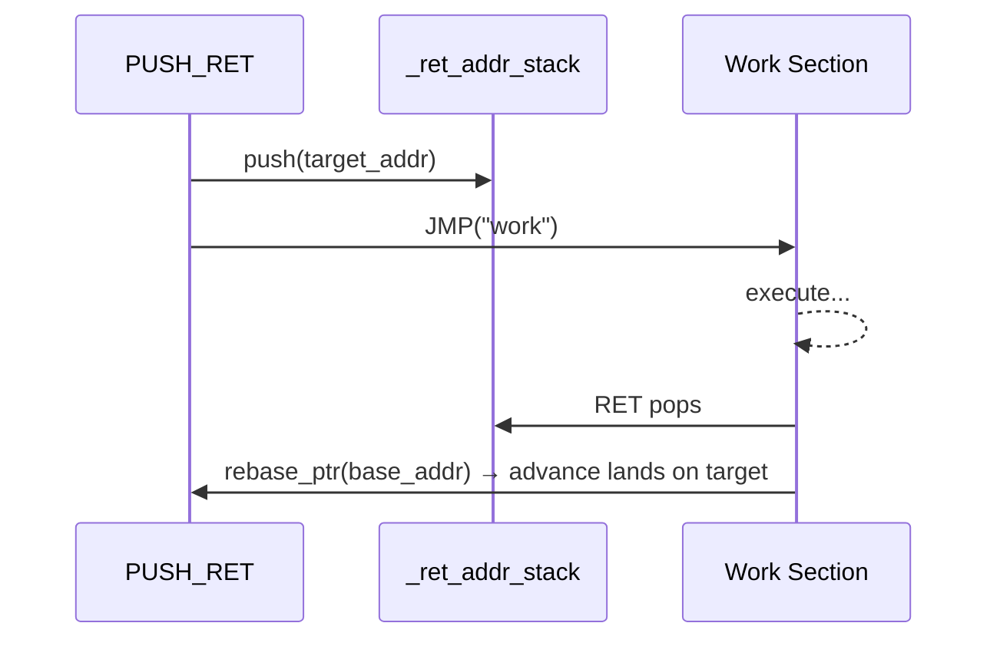

# Advanced Topic: Manual Stack Space Management

The `INVOKE` instruction and `call_sub` method automatically manage the return address stack (`_ret_addr_stack`) for you: they push the current pointer before entering a subroutine, and the `finally` block pops it upon return. For most workflows, this is all you need.

However, AmritaSense also exposes the return address stack for **manual control** via `PUSH_RET` and `RET`. The pattern is:

1. **PUSH_RET** — Push an alias or address onto `_ret_addr_stack`
2. **JMP** — Jump somewhere else in the workflow
3. **RET** — Pop the saved address and jump back

This lets you implement custom call/return schemes that don't follow the rigid `INVOKE`/`call_sub` discipline.

## The Return Address Stack

`_ret_addr_stack` is a `Stack[PointerVector]` on the `WorkflowInterpreter`. `INVOKE` pushes the current pointer onto it; the `finally` block of `call_sub` pops and restores it. With `PUSH_RET`, you can push any alias target onto the stack directly from the composition chain without writing a custom node.


```mermaid
sequenceDiagram
    participant N as PUSH_RET
    participant S as _ret_addr_stack
    participant W as Work Section

    N->>S: push(target_addr)
    N->>W: JMP("work")
    W-->>W: execute...
    W->>S: RET pops
    W->>N: rebase_ptr(base_addr) → advance lands on target
```

## PUSH_RET and RET

- `PUSH_RET(alias_or_idata)` — pushes the resolved address of a target alias (or a raw address list) onto `_ret_addr_stack`. The instruction returns a `NodeType[None]` (an inline `@Node`-decorated callable), placed directly in the `>>` chain.
- `RET()` — pops the top entry from `_ret_addr_stack` and restores the pointer via `rebase_ptr`. Unlike `jump_to` / `jump_far_ptr`, `rebase_ptr` does **not** set the jump flag, so the interpreter naturally **advances to the next instruction** (`return-address + 1`) after the return. Callers should push `target - 1` so that the advance step lands exactly on the target node.

Neither instruction should be `return`-ed from inside a `@Node()` function — place them directly in the `>>` chain.

## Example: PUSH_RET + JMP + RET

```python
from amrita_sense import ALIAS, NOP, Node, WorkflowInterpreter
from amrita_sense.instructions import JMP, PUSH_RET, RET


@Node()
async def start() -> None:
    print("Start")


@Node()
async def doing_work() -> None:
    """The section we JMP into."""
    print("  Doing work")


@Node()
async def after_return() -> None:
    """RET pops _ret_addr_stack and resumes here."""
    print("Back here (via RET)")


comp = (
    start
    >> PUSH_RET("resume")  # push the return address (NOP right before after_return)
    >> JMP("work")  # jump into the work section
    >> ALIAS(NOP, "resume")  # RET rebases here; advance lands on after_return
    >> after_return
    >> ALIAS(doing_work, "work")
    >> RET()
)
await WorkflowInterpreter(comp.render()).run()
```

**Flow** (new `RET` semantics):

1. `PUSH_RET("resume")` pushes the address of the `NOP` aliased `"resume"` — the node **before** `after_return`
2. `JMP("work")` jumps to the `doing_work` node
3. After `doing_work`, `RET` pops the saved address, `rebase_ptr`s there, and the interpreter advances onto `after_return`

> Because `RET` does not set the jump flag, the saved address must be the **predecessor** of the real target (`target - 1`). The `"resume"` NOP plays that role here.

## CALL (v0.3.0+)

`CALL(to_adr, *, from_adr=None)` is a convenience instruction that combines
`PUSH_RET` + `JMP` into a single node. Internally it:

1. Pushes `from_adr` onto `_ret_addr_stack` (just like `PUSH_RET`)
2. Jumps to `to_adr` (just like `JMP`)

`from_adr` is keyword-only and defaults to `None`, which means "return to the
current position". When it is `None`:

- Inside a subroutine call (`pc.outer_interpreting` is `True` — i.e. execution was entered via `call_sub`), it reuses the top of `_ret_addr_stack` (the return address pushed by the parent).
- Otherwise (main `run()` flow), it uses the current pointer — `RET` will then advance onto the node right after `CALL`.

Because `None` is the default, the common case is simply `CALL("target")`.

```python
from amrita_sense.instructions import CALL, RET
from amrita_sense.instructions.subprogram import ARCHIVED_SEGMENT

# Pattern A: explicit two-step (push predecessor + JMP)
comp_a = (
    start
    >> PUSH_RET("resume")
    >> JMP("work")
    >> ALIAS(NOP, "resume")
    >> after_return
    >> ALIAS(doing_work, "work")
    >> RET()
)

# Pattern B: CALL convenience — from_adr defaults to None (the current pointer)
# RET rebases to CALL itself, then advance lands on after_return.
# The body is hidden in an ARCHIVED_SEGMENT so normal flow skips it.
comp_b = (
    start
    >> CALL("work")
    >> after_return
    >> ARCHIVED_SEGMENT(ALIAS(doing_work, "work") >> RET())
)
```

`CALL` is semantically equivalent to the two-step pattern (with the `from_adr=None`
default covering the common "return to the next node" case). Note that in
Pattern B the body must be archived (`ARCHIVED_SEGMENT`) — otherwise the normal
flow would re-enter it after `after_return`.

## When to Use Manual Stack Management

| Scenario                      | Use                                            |
| ----------------------------- | ---------------------------------------------- |
| Simple subroutine call/return | `INVOKE` + natural `call_sub` return           |
| Custom return destination     | `PUSH_RET` + `JMP` + `RET`                     |
| Push-and-jump convenience     | `CALL` + `RET`                                 |
| Multi-level stack unwinding   | Push multiple addresses, `RET` once per level  |
| Non-linear control flow       | Combine with `JMP` for arbitrary jump patterns |

## Subroutine-like Pattern with FN

Since v0.6.0, the modern way to write a self-contained "subroutine" is **`FN(entrypoint, block)`** — it embeds its own skip mechanism (`_fn_escape`) and auto-appends `RET()`. Call it with `CALL(entrypoint)`; no manual `PUSH_RET` / `JMP` / `RET` plumbing is needed:

```python
from amrita_sense import Node, WorkflowInterpreter
from amrita_sense.instructions import FN, CALL


@Node()
async def start() -> None:
    print("Start")


@Node()
async def step1() -> None:
    print("  Step 1")


@Node()
async def step2() -> None:
    print("  Step 2")


@Node()
async def after_return() -> None:
    print("Back here (via FN)")


# Self-contained subroutine: normal flow skips it (via _fn_escape),
# CALL enters it; FN auto-appends RET() at the end.
subroutine = FN("sub_entry", step1 >> step2)

comp = (
    start
    >> CALL("sub_entry")  # from_adr=None -> return after this node
    >> after_return  # RET rebases to the call site -> advance lands here
    >> subroutine
)
await WorkflowInterpreter(comp.render()).run()
```

**Flow** (new `RET` semantics):

1. `CALL("sub_entry")` pushes the current pointer and jumps into the subroutine
2. `step1 >> step2` execute sequentially
3. The auto-appended `RET()` pops the saved address, `rebase_ptr`s to the call site, and the interpreter advances onto `after_return`

> **FN vs manual stack ops**: `PUSH_RET` / `JMP` / `RET` remain available for fully manual stack control (non-linear flow, multi-level unwinding). For ordinary "call a routine and come back", `FN` + `CALL` is the recommended, less error-prone form.

## Caution

- **Stack integrity**: `RET` pops from `_ret_addr_stack` unconditionally. If the stack is empty, this raises an `IndexError`. Always push a corresponding address (via `INVOKE` or `PUSH_RET`) before reaching `RET`.
- **Return-address + 1**: `RET` uses `rebase_ptr` (no jump flag), so execution resumes at the node **after** the saved address. Push `target - 1` (or rely on the `None` default of `CALL`, which points at the instruction itself).
- **Not a subprogram instruction**: `PUSH_RET` and `RET` are standalone nodes in the composition chain. Do NOT call them from inside a `@Node()` function — place them directly in the `>>` chain.
