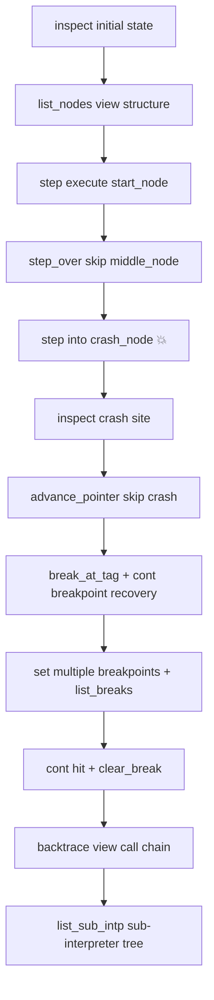

# REPL Debugging

AmritaSense v0.5.0 introduces a dedicated debugger module `amrita_sense.debugger`, providing a pure-function, REPL-first debugging toolkit. It leverages the interpreter's built-in Panic/Recover mechanism, middleware injection, and step-by-step execution to let you debug workflows in a Python REPL just like local programs — no extra tools, no IDE plugins required.

> **Prerequisites**
> We recommend reading [Execution & Interrupt](/guide/concepts/exec_and_interrupt) for step-by-step execution and suspension mechanisms, and [External Interrupt](/guide/advanced/external_interrupt) for the `call_sub(interrupt=True)` principle. This article builds on that infrastructure to deliver a complete debugging experience.

## Design Philosophy

The debugger follows three core principles:

1. **REPL-first** — All functions are synchronous (`step(inter)`, no `await`), callable directly in `python`, `ipython`, or VS Code's native REPL
2. **Pure-function** — No wrapper classes, no state encapsulation. Each function takes a `WorkflowInterpreter` as its first argument: `from amrita_sense.debugger import *`
3. **Non-invasive** — Breakpoints are injected via composite middleware, never modifying the core runtime. Debug code does not couple with business logic

```python
>>> from amrita_sense.debugger import *
>>> inspect(inter)       # view state
>>> step(inter)          # execute one node
>>> break_at_tag(inter, "my_node")
>>> cont(inter)          # continue to breakpoint
```

## State Inspection

The first step of debugging is always "know where you are." The debugger provides a complete set of state inspection tools.

### `where(inter)` — Current Location

A one-line summary to quickly confirm where execution is paused:

```
📍 [0, 2]  crash_here  stack_depth=0
```

Displays: current address, node tag, return-address stack depth.

### `inspect(inter)` — Full State

Pretty-prints all interpreter internal state:

- 🆔 Interpreter ID, parent & root
- 📍 Current pointer position and node info (tag, function name)
- 🏃 Running status and pending-stop flag
- 📚 Return address stack (depth + full contents)
- 📦 Context stack (depth + each context's pointer & exception)
- ⚠️ Panic exception (if crashed)
- 👶 Sub-interpreter tree (status & pointer for each child)

```python
>>> inspect(inter)
══════════════════════════════════════════════════════════
🆔  Interpreter: a1b2c3d4e5f6…
📍 Pointer:      [0, 2]
🔍 Node:         crash_here
   Function:     crash_node
🏃 Running:      no
🚩 Pending stop: no
📚 Return stack: depth=0
📦 Context stack: depth=0
⚠️  Panic:        RuntimeError: planned crash for demo
👶 Sub-interpreters: 0
══════════════════════════════════════════════════════════
```

### `backtrace(inter)` — Call Chain

Expands the full call chain: interpreter tree (Root → … → Current), return address stack, context stack, and current node.

```python
>>> backtrace(inter)
Interpreter → a1b2c3d4e5f6… [Root] [Current] at 0x7f8a1c00d000

Returning Stack:
    0. [0, 2] (Current)

Context Stack:
    (EMPTY_STACK)

Current node: crash_here -> crash_node
```

### `list_nodes(inter)` — Node Listing

Traverses the compiled graph's `_graph` tree, printing every node's address, tag, and function name. Like stdlib's `dis.dis()`, useful for understanding the overall workflow structure:

```
   [0, 0]  start             start_node
   [0, 1]  middle            middle_node
   [0, 2]  crash_here        crash_node
   [0, 3]  never_reached     never_reached
```

### `list_sub_intp(inter)` — Sub-interpreter Tree

Recursively expands the entire interpreter tree, showing each sub-interpreter's running status, current pointer, and exception:

```
🟢 a1b2c3...  ptr=[0, 1]
  ⏸️ d4e5f6...  ptr=[0, 1]  exc=RuntimeError
  🟢 g7h8i9...  ptr=[1, 2]
```

## Step Control

Step control lets you precisely control execution one node at a time. Two API flavors are provided:

| Style     | Functions                                                            | Use Case                      |
| --------- | -------------------------------------------------------------------- | ----------------------------- |
| **Sync**  | `step()` `step_over()` `step_out()` `cont()`                         | Python REPL (no `await`)      |
| **Async** | `step_async()` `step_over_async()` `step_out_async()` `cont_async()` | Inside an existing event loop |

### `step(inter)` — Single Step

Executes **exactly one** node and stops. The fundamental primitive:

```python
>>> step(inter)
  [start] running…
>>> where(inter)
📍 [0, 1]  middle  stack_depth=0
```

Under the hood: `step()` sets the `stepping` flag to `True` during execution, so breakpoint checks are skipped — meaning single-step debugging won't trigger breakpoints.

### `step_over(inter)` — Step Over

Executes the node but **does not enter** subroutine calls (`call_sub` / `CALL`). Internally monitors `_ret_addr_stack` depth — as long as depth exceeds the starting value, execution continues until returning to the same stack frame.

```python
>>> step_over(inter)  # If current node calls call_sub,
                       # the subroutine still executes fully,
                       # but won't pause inside it
```

### `step_out(inter)` — Step Out

Executes until the return address stack becomes shallower — i.e., exits the current subroutine call frame:

```python
>>> step_out(inter)   # Execute layer by layer from deep inside
                       # a call_sub until returning to the caller
```

### `cont(inter)` — Continue

Continues execution until a breakpoint is hit or the workflow ends. Clears the `stepping` flag so breakpoint checks resume:

```python
>>> cont(inter)
⏸️  Hit breakpoint: tag='my_node' hits=1
```

### Exception Handling

All step functions gracefully handle three predictable scenarios:

| Scenario                      | Behavior                                                   |
| ----------------------------- | ---------------------------------------------------------- |
| `BreakpointHit` raised        | Prints `⏸️  Hit breakpoint: ...`                           |
| `Ctrl+C` pressed              | Prints `⏸️  Stop at: [addr]`                               |
| Node throws exception (crash) | Prints `⚠️  Node crashed: ... Panic saved, use inspect().` |

After a crash, execution state is preserved — `_panic_exc`, `_pointer`, `_ret_addr_stack` all remain intact. Use `inspect()` to examine the full crash site.

## Breakpoint System

Breakpoints are injected via **composite middleware** into the interpreter. Core design:

```text
debug_middleware(pc):
    1. Check breakpoints → raise BreakpointHit if matched
    2. Call user's original middleware (if present)
    3. Otherwise call pc._call() directly
```

::: details Middleware injection details
When the first breakpoint is set, the debugger:

1. Saves `inter._middleware`'s current value (user's original middleware, if any)
2. Constructs composite middleware: `breakpoint check → user middleware → _call()`
3. Replaces `inter._middleware` with the composite

The user's original middleware is always respected; breakpoint checks are inserted as a prefix step. Clearing all breakpoints does **not** remove the composite middleware — recreate the interpreter if you need the original state restored.
:::

### `break_at_tag(inter, tag, *, condition=None)` — Set Breakpoint by Tag

Sets a breakpoint on **all** nodes whose `tag` matches. `tag` is the label specified in `@Node(tag="...")`:

```python
>>> break_at_tag(inter, "crash_here")
🔴 Breakpoint: tag='crash_here' hits=0
```

### `break_at_addr(inter, addr, *, condition=None)` — Set Breakpoint by Address

Sets a breakpoint at a precise address. `addr` can be:

- **Alias** (`str`): resolved via `AddressCalculator.resolve_alias()`
- **Raw address** (`list[int]`): e.g., `[0, 2]`

```python
>>> break_at_addr(inter, [0, 1])
🔴 Breakpoint: addr=[0, 1] hits=0

>>> break_at_addr(inter, "my_alias")
🔴 Breakpoint: addr=[2, 0] hits=0
```

### Conditional Breakpoints

The `condition` parameter accepts a `(WorkflowInterpreter) -> bool` callable:

```python
>>> break_at_tag(inter, "middle", condition=lambda pc: len(pc._ret_addr_stack) > 0)
🔴 Breakpoint: tag='middle' hits=0 cond
```

The breakpoint only triggers when the condition returns `True`. If the condition raises an exception, it silently skips (no trigger).

### Managing Breakpoints

```python
>>> list_breaks(inter)                  # List all breakpoints
  1. TAG  'crash_here'  hits=1
  2. ADDR  [0, 1]  hits=0

>>> clear_break_tag(inter, "crash_here")  # Clear by tag
✖  Removed: tag='crash_here' hits=1

>>> clear_break_addr(inter, [0, 1])       # Clear by address
✖  Removed: addr=[0, 1] hits=0
```

### `BreakpointHit` — Breakpoint Exception

`BreakpointHit` inherits from `BaseException` (not `Exception`), so it is **never** caught by the Panic/Recover mechanism and will not put the interpreter into a panic state.

```python
>>> bp = Breakpoint(target="test", kind="tag")
>>> isinstance(BreakpointHit(bp), BaseException)  # True
>>> isinstance(BreakpointHit(bp), Exception)      # False
```

## Crash Recovery

AmritaSense's Panic/Recover mechanism is one of the debugger's core capabilities. When a node throws an unhandled exception, the interpreter preserves its state.

### Typical Workflow

```python
# 1. Execute into the crashing node
>>> step(inter)
  [crash_here] about to explode 💥
⚠️  Node crashed: RuntimeError('planned crash for demo'). Panic saved, use inspect().

# 2. Examine the crash site
>>> inspect(inter)  # Shows full state: _panic_exc = RuntimeError,
                     # _pointer stuck at crash_here, stacks intact

# 3. Manually skip the crashing node
>>> inter.advance_pointer()

# 4. Set a breakpoint on the recovery target
>>> break_at_tag(inter, "never_reached")

# 5. Continue execution (internally recovers from panic)
>>> cont(inter)
  [never_reached] recovered successfully! 🎉
```

**Recovery principle**: `step()` / `cont()` internally calls `_step_one()`, which checks `_panic_exc` before each execution. If non-`None`, it clears it (recover), then normally executes the node at the current pointer. Since you've already manually `advance_pointer()` past the crash node, recovery executes the next node.

## Full Example

The project includes `demos/21_debug_repl.py`, an end-to-end REPL debugging demo covering all features above:

```bash
python demos/21_debug_repl.py
```

Demo flow:



You can also operate manually in a REPL:

```python
>>> from amrita_sense.debugger import *
>>> from demos.21_debug_repl import inter
>>> inspect(inter)
>>> step(inter)     # no await needed!
```

## Security Considerations

### REMOVE_DEBUGGER — Production Self-Destruct

The debugger module offers deep access to interpreter internals, which could be exploited by SSTI (Server-Side Template Injection) attacks in production. Set an environment variable to **physically destroy** the module:

```bash
export REMOVE_DEBUGGER=true
```

Once set, any import or access of `amrita_sense.debugger` raises `AttributeError`:

```python
>>> import amrita_sense.debugger
>>> amrita_sense.debugger.inspect
AttributeError: Debugger is disabled. ...
>>> dir(amrita_sense.debugger)
[]
```

Implementation: the module checks the environment variable at `import` time. If enabled, it replaces `sys.modules[__name__]` with a `types.ModuleType` proxy whose `__getattr__` raises on all access and `__dir__` returns an empty list.

### Interpreter ID Leakage

`inspect()` and `list_sub_intp()` by default truncate interpreter UUIDs (`inter.id[:12]…`) to prevent full UUIDs from leaking into logs or terminals.
