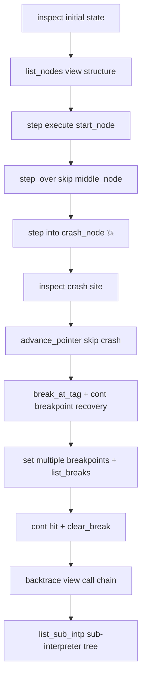

# REPL Debugging

AmritaSense v0.5.0 introduces a dedicated debugger module `amrita_sense.debugger`, providing a pure-function, REPL-first debugging toolkit. It leverages the interpreter's built-in Panic/Recover mechanism, middleware injection, and step-by-step execution to let you debug workflows in a Python REPL just like local programs — no extra tools, no IDE plugins required.

> **Prerequisites**
> We recommend reading [Execution & Interrupt](/guide/concepts/exec_and_interrupt) for step-by-step execution and suspension mechanisms, and [External Interrupt](/guide/advanced/external_interrupt) for the `call_sub(interrupt=True)` principle. This article builds on that infrastructure to deliver a complete debugging experience.

## Design Philosophy

The debugger follows three core principles:

1. **REPL-first** — All functions are synchronous (`step(inter)`, no `await`), callable directly in `python`, `ipython`, or VS Code's native REPL
2. **Pure-function** — No wrapper classes, no state encapsulation. Each function takes a `WorkflowInterpreter` as its first argument: `from amrita_sense.debugger import *`
3. **Non-invasive** — Breakpoints are injected via composite middleware, never modifying the core runtime. Debug code does not couple with business logic

```python
>>> from amrita_sense.debugger import *
>>> inspect(inter)       # view state
>>> step(inter)          # execute one node
>>> break_at_tag(inter, "my_node")
>>> cont(inter)          # continue to breakpoint
```

## State Inspection

The first step of debugging is always "know where you are." The debugger provides a complete set of state inspection tools.

### `where(inter)` — Current Location

A one-line summary to quickly confirm where execution is paused:

```
📍 [0, 2]  crash_here  stack_depth=0
```

Displays: current address, node tag, return-address stack depth.

### `inspect(inter)` — Full State

Pretty-prints all interpreter internal state:

- 🆔 Interpreter ID, parent & root
- 📍 Current pointer position and node info (tag, function name)
- 🏃 Running status and pending-stop flag
- 📚 Return address stack (depth + full contents)
- 📦 Context stack (depth + each context's pointer & exception)
- ⚠️ Panic exception (if crashed)
- 👶 Sub-interpreter tree (status & pointer for each child)

```python
>>> inspect(inter)
══════════════════════════════════════════════════════════
🆔  Interpreter: a1b2c3d4e5f6…
📍 Pointer:      [0, 2]
🔍 Node:         crash_here
   Function:     crash_node
🏃 Running:      no
🚩 Pending stop: no
📚 Return stack: depth=0
📦 Context stack: depth=0
⚠️  Panic:        RuntimeError: planned crash for demo
👶 Sub-interpreters: 0
══════════════════════════════════════════════════════════
```

### `backtrace(inter)` — Call Chain

Expands the full call chain: interpreter tree (Root → … → Current), return address stack, context stack, and current node.

```python
>>> backtrace(inter)
Interpreter → a1b2c3d4e5f6… [Root] [Current] at 0x7f8a1c00d000

Returning Stack:
    0. [0, 2] (Current)

Context Stack:
    (EMPTY_STACK)

Current node: crash_here -> crash_node
```

### `list_nodes(inter)` — Node Listing

Traverses the compiled graph's `_graph` tree, printing every node's address, tag, and function name. Like stdlib's `dis.dis()`, useful for understanding the overall workflow structure:

```
   [0, 0]  start             start_node
   [0, 1]  middle            middle_node
   [0, 2]  crash_here        crash_node
   [0, 3]  never_reached     never_reached
```

For a segment-oriented view that also shows mnemonics and the current program counter, use [`dis()`](#disassembly-view) instead.

### `list_sub_intp(inter)` — Sub-interpreter Tree

Recursively expands the entire interpreter tree, showing each sub-interpreter's running status, current pointer, and exception:

```
🟢 a1b2c3...  ptr=[0, 1]
  ⏸️ d4e5f6...  ptr=[0, 1]  exc=RuntimeError
  🟢 g7h8i9...  ptr=[1, 2]
```

## Disassembly View

A rendered workflow graph *is* an address-mapped instruction sequence — `[1, 0]` is an address and the pointer vector is the program counter. `dis()` renders it the way GDB renders machine code, with segments instead of indentation:

```
segment [root]:
=>[0] (top) ALIAS top; alias for Alpha
  [1]       CALL top -> [0]; CallNode
  [2]       *segment [2]
  [3]       JMP [0]; GOTO 'top'
  [4]       NOP; no operation

segment [2]:
  [2, 0] JMPIF; ConditionJumpNode
  [2, 1] Cond; Cond
  [2, 2] Beta; Beta
  [2, 3] NOP; no operation
```

- `=>` marks the program counter, exactly like GDB.
- A nested container appears in its parent as a `*segment [n]` reference line and gets its own block, so deep graphs stay flat instead of growing an indentation tree.
- `;` separates the mnemonic from the comment. A `(name)` next to an address is an `ALIAS`-registered symbol.
- A container that is not the default rendered graph shows its class, e.g. `segment [1] <DLLComposeProxy>:` — a reminder that everything below a DLL slot moves when `dll.apply()` rebases it.

### `dis(inter, *, around=5)` — Print the Listing

`dis()` prints a window of instructions around the program counter. Pass `around=None` for the whole graph, or use `disassemble()` to get the same text as a string:

```python
>>> dis(inter)                 # 5 lines before/after the PC
>>> dis(inter, around=None)    # the entire workflow
>>> text = disassemble(inter)  # same content, as a str
```

`step()` / `step_over()` / `step_out()` / `cont()` print the listing automatically, so every stop shows where you are:

```
>>> step(inter)
segment [1]:
  [1, 0] Beta; Beta
=>[1, 1] Gamma; Gamma
```

`step_over()` and `step_out()` print only once, when the whole movement finishes. Set `amrita_sense.debugger.code_disp.AUTO_DIS = False` to silence the automatic printing while keeping `dis()` available.

### Colour

The listing is colourised through [colorama](https://pypi.org/project/colorama/) when stdout is a terminal: the `=>` marker is bold green, addresses cyan, aliases green, mnemonics bold, operands yellow, comments dim, and segment headers bold magenta. Piping the output to a file or a pager naturally yields plain text.

```python
>>> from amrita_sense.debugger import code_disp
>>> code_disp.COLOR = True    # force on, even when piped
>>> code_disp.COLOR = False   # force off
>>> code_disp.COLOR = None    # auto-detect (default)
```

Colour is applied *after* column padding, so enabling it never shifts the instruction column. Every palette entry is a module constant (`code_disp.C_PC`, `C_ADDR`, `C_MNEMONIC`, `C_OPERAND`, …), so a theme is just a matter of reassigning them.

### Magic attributes: `__sdb_dis__` and `__sdb_cmt__`

The mnemonic comes from a **soft-constraint magic attribute** on the node, so an instruction can describe itself:

| Attribute     | Effect                                                                   |
| ------------- | ------------------------------------------------------------------------ |
| `__sdb_dis__` | The text in the instruction column.                                       |
| `__sdb_cmt__` | When not `None`, overrides the comment after `;` (which defaults to `tag`). |

Both are read through a plain `getattr` at disassembly time — the input is an *already compiled* graph, so an operand such as a jump target is resolved by then. All three declaration forms work:

| Form                  | Use it for                                                                                                                  |
| --------------------- | --------------------------------------------------------------------------------------------------------------------------- |
| **class attribute**   | a fixed mnemonic shared by every instance.                                                                                   |
| **`@property`**       | a value derived from instance state — it re-reads on every listing, so nothing has to be re-assigned after a recompile.      |
| **instance attribute** | factory-created instructions whose operand only exists inside a closure (`PUSH_STACK`, `INTERRUPT_INTO`, …).                  |

Neither name is subject to name mangling (two trailing underscores), so `self.__sdb_dis__ = ...` inside a class body is safe. A property is a *data descriptor*, though, so a node that declares one intentionally rejects `self.__sdb_dis__ = ...` — that is what keeps the value single-sourced.

```python
from amrita_sense.node.core import BaseNode, NodeComposeRendered


class MyJump(BaseNode):
    """Custom instruction that displays its resolved target."""

    __sdb_cmt__ = "custom jump"

    def __init__(self, alias: str) -> None:
        self._alias = alias
        self._target: list[int] = []
        self._init(self.__call__, tag=None, wrap_to_async=False, address_able=True)

    @property
    def __sdb_dis__(self) -> str:
        #  a property re-reads state, so this stays correct after every recompile
        return f"MYJMP {self._target or '?'}"

    def _post_compile(self, compose: NodeComposeRendered) -> None:
        self._target = compose.calc.resolve_alias(self._alias)
```

When a node declares nothing the view falls back to its `tag` — with a `__NAME__` decoration stripped, so `__RET_FAR__` shows as `RET_FAR` — or to the wrapped function name for auto-generated `NodeSuspend::…` tags.

### Operand notation

A node never knows its own address, so a target that is relative to the enclosing segment cannot be printed as a full address. Operands are written to match the pointer operation they come from:

| Notation       | Meaning                                   | Pointer operation |
| -------------- | ----------------------------------------- | ----------------- |
| `[1, 0]`       | an absolute address                       | `far_to`          |
| `#3`           | slot 3 **of the node's own segment**      | `near_to`         |
| `+2` / `-1`    | a delta **inside the node's own segment** | `offset`          |

The built-in instruction set uses this throughout, so a listing of framework control flow reads like assembly:

```
segment [2]:
  [2, 0] JMPIF then=#3 else=+3; ConditionJumpNode
  [2, 1] Cond; Cond
  [2, 2] Beta; Beta
  [2, 3] NOP; no operation

segment [3]:
  [3, 0] WHILE checkup=#3 else=#4; WhileNode
  [3, 3] WHILE.CHECK back=#0; CheckUpNode

segment [4]:
  [4, 0] TRY catch=ValueError#2; finally=#3 escape=#4
```

Other built-in mnemonics you will see: `JMP [0]` (`GOTO`), `CALL sym -> [0]` (`CALL`), `CALL.FAR from -> to` (`PUSH_AND_GOTO`), `PUSH [0]` (`PUSH_STACK`), `PUSHCTX` / `INTINTO` / `INT.KEEP` (interrupts), `DO loop=#3 break=#5`, `DO.CHECK back=#0 exit=#3`, and the native fast-path set `NJMPIF` / `NWHILE` / `NDO.CHECK` / `NENTER`.

### Addressing modes and contract safety

The listing is built by walking the graph through the `AbstractCompose` **contract** rather than a concrete class, because a rendered graph may be a `DLLComposeProxy` or a custom implementation (see [Compose Contracts](../advanced/compose-contracts)). Two consequences are worth knowing:

- A container that refuses to be read — an unbuilt DLL proxy raises `NullPointerException` — is shown as an `(unreadable)` segment instead of aborting the listing.
- The symbol table (`alias2vector_map`) is *not* part of the contract, so aliases are a soft feature: a graph without one degrades to plain addresses.

Because a DLL rebase makes absolute addresses unreliable (see [Dynamic Linking](../advanced/dll_feature)), prefer aliases when reading a listing — the alias column tells you which addresses are symbols.

## Step Control

Step control lets you precisely control execution one node at a time. Two API flavors are provided:

| Style     | Functions                                                            | Use Case                      |
| --------- | -------------------------------------------------------------------- | ----------------------------- |
| **Sync**  | `step()` `step_over()` `step_out()` `cont()`                         | Python REPL (no `await`)      |
| **Async** | `step_async()` `step_over_async()` `step_out_async()` `cont_async()` | Inside an existing event loop |

### `step(inter)` — Single Step

Executes **exactly one** node and stops. The fundamental primitive:

```python
>>> step(inter)
  [start] running…
>>> where(inter)
📍 [0, 1]  middle  stack_depth=0
```

Under the hood: `step()` sets the `stepping` flag to `True` during execution, so breakpoint checks are skipped — meaning single-step debugging won't trigger breakpoints.

Every step also prints the [disassembly view](#disassembly-view) at the new program counter, so you can see exactly which instruction you are about to execute.

### `step_over(inter)` — Step Over

Executes the node but **does not enter** subroutine calls (`call_sub` / `CALL`). Internally monitors `_ret_addr_stack` depth — as long as depth exceeds the starting value, execution continues until returning to the same stack frame.

```python
>>> step_over(inter)  # If current node calls call_sub,
                       # the subroutine still executes fully,
                       # but won't pause inside it
```

### `step_out(inter)` — Step Out

Executes until the return address stack becomes shallower — i.e., exits the current subroutine call frame:

```python
>>> step_out(inter)   # Execute layer by layer from deep inside
                       # a call_sub until returning to the caller
```

### `cont(inter)` — Continue

Continues execution until a breakpoint is hit or the workflow ends. Clears the `stepping` flag so breakpoint checks resume:

```python
>>> cont(inter)
⏸️  Hit breakpoint: tag='my_node' hits=1
```

A breakpoint stops execution **before** its node runs, so the next `cont()` executes that node and moves on:

```python
>>> cont(inter)   # runs everything up to 'my_node', stops before it
>>> cont(inter)   # 'my_node' runs, then continues to the next breakpoint
```

Only the address that was actually stopped on is skipped, so a second breakpoint further along still fires. Once a workflow has finished, the next `cont()` starts it over from the first instruction.

`cont()` also prints the [disassembly view](#disassembly-view) where it stops — either at the breakpoint or at the end of the workflow.

### Exception Handling

All step functions gracefully handle three predictable scenarios:

| Scenario                      | Behavior                                                   |
| ----------------------------- | ---------------------------------------------------------- |
| `BreakpointHit` raised        | Prints `⏸️  Hit breakpoint: ...`                           |
| `Ctrl+C` pressed              | Prints `⏸️  Stop at: [addr]`                               |
| Node throws exception (crash) | Prints `⚠️  Node crashed: ... Panic saved, use inspect().` |

After a crash, execution state is preserved — `_panic_exc`, `_pointer`, `_ret_addr_stack` all remain intact. Use `inspect()` to examine the full crash site.

## Breakpoint System

Breakpoints are injected via **composite middleware** into the interpreter. Core design:

```text
debug_middleware(pc):
    1. Check breakpoints → raise BreakpointHit if matched
    2. Call user's original middleware (if present)
    3. Otherwise call pc._call() directly
```

A hit means the node at the current address is *about to* run — nothing has executed yet. The debugger remembers that address so the next `cont()` skips the check once and lets the node run; without that, the same breakpoint would fire again before the node ever got a chance to execute, and `cont()` could never progress. An explicit `step()` discards a pending resume, since stepping bypasses breakpoint checks anyway.

::: details Middleware injection details
When the first breakpoint is set, the debugger:

1. Saves `inter._middleware`'s current value (user's original middleware, if any)
2. Constructs composite middleware: `breakpoint check → user middleware → _call()`
3. Replaces `inter._middleware` with the composite

The user's original middleware is always respected; breakpoint checks are inserted as a prefix step. Clearing all breakpoints does **not** remove the composite middleware — recreate the interpreter if you need the original state restored.
:::

### `break_at_tag(inter, tag, *, condition=None)` — Set Breakpoint by Tag

Sets a breakpoint on **all** nodes whose `tag` matches. `tag` is the label specified in `@Node(tag="...")`:

```python
>>> break_at_tag(inter, "crash_here")
🔴 Breakpoint: tag='crash_here' hits=0
```

### `break_at_addr(inter, addr, *, condition=None)` — Set Breakpoint by Address

Sets a breakpoint at a precise address. `addr` can be:

- **Alias** (`str`): resolved via `AddressCalculator.resolve_alias()`
- **Raw address** (`list[int]`): e.g., `[0, 2]`

```python
>>> break_at_addr(inter, [0, 1])
🔴 Breakpoint: addr=[0, 1] hits=0

>>> break_at_addr(inter, "my_alias")
🔴 Breakpoint: addr=[2, 0] hits=0
```

### Conditional Breakpoints

The `condition` parameter accepts a `(WorkflowInterpreter) -> bool` callable:

```python
>>> break_at_tag(inter, "middle", condition=lambda pc: len(pc._ret_addr_stack) > 0)
🔴 Breakpoint: tag='middle' hits=0 cond
```

The breakpoint only triggers when the condition returns `True`. If the condition raises an exception, it silently skips (no trigger).

### Managing Breakpoints

```python
>>> list_breaks(inter)                  # List all breakpoints
  1. TAG  'crash_here'  hits=1
  2. ADDR  [0, 1]  hits=0

>>> clear_break_tag(inter, "crash_here")  # Clear by tag
✖  Removed: tag='crash_here' hits=1

>>> clear_break_addr(inter, [0, 1])       # Clear by address
✖  Removed: addr=[0, 1] hits=0
```

### `BreakpointHit` — Breakpoint Exception

`BreakpointHit` inherits from `BaseException` (not `Exception`), so it is **never** caught by the Panic/Recover mechanism and will not put the interpreter into a panic state.

```python
>>> bp = Breakpoint(target="test", kind="tag")
>>> isinstance(BreakpointHit(bp), BaseException)  # True
>>> isinstance(BreakpointHit(bp), Exception)      # False
```

## Crash Recovery

AmritaSense's Panic/Recover mechanism is one of the debugger's core capabilities. When a node throws an unhandled exception, the interpreter preserves its state.

### Typical Workflow

```python
# 1. Execute into the crashing node
>>> step(inter)
  [crash_here] about to explode 💥
⚠️  Node crashed: RuntimeError('planned crash for demo'). Panic saved, use inspect().

# 2. Examine the crash site
>>> inspect(inter)  # Shows full state: _panic_exc = RuntimeError,
                     # _pointer stuck at crash_here, stacks intact

# 3. Manually skip the crashing node
>>> inter.advance_pointer()

# 4. Set a breakpoint on the recovery target
>>> break_at_tag(inter, "never_reached")

# 5. Continue execution (internally recovers from panic)
>>> cont(inter)
  [never_reached] recovered successfully! 🎉
```

**Recovery principle**: `step()` / `cont()` internally calls `_step_one()`, which checks `_panic_exc` before each execution. If non-`None`, it clears it (recover), then normally executes the node at the current pointer. Since you've already manually `advance_pointer()` past the crash node, recovery executes the next node.

## Full Example

The project includes `demos/21_debug_repl.py`, an end-to-end REPL debugging demo covering all features above:

```bash
python demos/21_debug_repl.py
```

Demo flow:


```mermaid
flowchart TD
    A[inspect initial state] --> B[list_nodes view structure]
    B --> C[step execute start_node]
    C --> D[step_over skip middle_node]
    D --> E[step into crash_node 💥]
    E --> F[inspect crash site]
    F --> G[advance_pointer skip crash]
    G --> H[break_at_tag + cont breakpoint recovery]
    H --> I[set multiple breakpoints + list_breaks]
    I --> J[cont hit + clear_break]
    J --> K[backtrace view call chain]
    K --> L[list_sub_intp sub-interpreter tree]
```

You can also operate manually in a REPL:

```python
>>> from amrita_sense.debugger import *
>>> from demos.21_debug_repl import inter
>>> inspect(inter)
>>> step(inter)     # no await needed!
```

## Security Considerations

### Interpreter ID Leakage

`inspect()` and `list_sub_intp()` by default truncate interpreter UUIDs (`inter.id[:12]…`) to prevent full UUIDs from leaking into logs or terminals.
