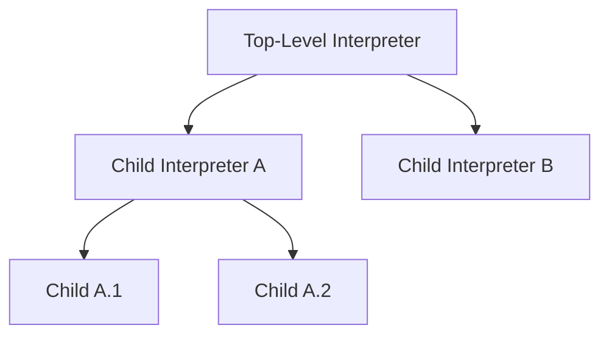

# Advanced Practice: Subgraph Isolation Calls

AmritaSense v0.3.0 introduces the **`FUN_BLOCK`** instruction and a full **interpreter tree model**, enabling workflows to launch isolated sub-workflows with their own lifecycle, middleware, and error boundaries.

## Concept

A subgraph isolation call takes a compiled `NodeComposeRendered` graph and executes it inside a **child `WorkflowInterpreter`**. The parent interpreter suspends waiting for the child to complete. This is analogous to calling a function in a traditional language, but with full runtime isolation — separate execution context, separate middleware, and a separate suspend/resume lifecycle.

The key difference from `CALL`/`call_sub` is that `FUN_BLOCK` launches the sub-workflow as an **independent interpreter** in the tree, rather than reusing the current interpreter's pointer stack.

## The Interpreter Tree

Every interpreter belongs to a tree. The root is the **top-level interpreter** you create directly; children are created via `fork_interpreter()` (used internally by `FUN_BLOCK`).



Key properties:

| Property                           | Description                                          |
| ---------------------------------- | ---------------------------------------------------- |
| `interpreter.id`                   | Unique UUID string identifying this interpreter      |
| `interpreter.parent`               | The parent interpreter, or `None` for top-level      |
| `interpreter.top_interpreter`      | The root of the tree                                 |
| `interpreter.sub_interpreters`     | Dict of direct children (`{id: interpreter}`)        |
| `interpreter.all_sub_interpreters` | (top-level only) Dict of all descendants in the tree |

## `FUN_BLOCK` Instruction

```python
from amrita_sense.instructions import FUN_BLOCK

FUN_BLOCK(
    sub_comp,          # NodeComposeRendered — the sub-workflow graph
    middleware=UNSET,  # Callable | None | UNSET — middleware for the child
    object_io=None,    # SuspendObjectStream | None — I/O stream for the child
    one_time_interp=False,  # bool — create a fresh interpreter each call?
)
```

### Parameters

- **`sub_comp`** (`NodeComposeRendered`): The compiled workflow graph to execute in isolation. Use `.render()` on any `NodeCompose` to obtain this.
- **`middleware`** (`Callable | None | UNSET`): Controls middleware inheritance:
  - `UNSET` (default): Inherits the parent's middleware, unless `__flags__.NO_SHARED_MIDDLEWARE` is `True`.
  - `None`: No middleware for the child interpreter.
  - A callable: Custom middleware for this child only.
- **`object_io`** (`SuspendObjectStream | None`): I/O stream for the child. Default `None` shares the parent's `SuspendObjectStream`. Since v0.3.2, `SuspendObjectStream` is concurrency-safe via the **CLCA (Cross Loop Callback-Allocate) signal design pattern**, so sharing across interpreters and even threads is safe.
- **`one_time_interp`** (`bool`): If `True`, a new `WorkflowInterpreter` is created on every invocation and torn down after completion. If `False` (default), the interpreter is reused across invocations (its state is reset but not reconstructed).

### Return Value

Returns a `FuncBlock` node, which is placed directly in the `>>` composition chain like any other node.

## One-Time vs. Reusable Interpreters

| Aspect               | `one_time_interp=False` (default)  | `one_time_interp=True`                  |
| -------------------- | ---------------------------------- | --------------------------------------- |
| Interpreter creation | Once, on first call                | Every call                              |
| State between calls  | Reset (pointer, stack, jump flags) | Fully destroyed                         |
| Performance          | Lower overhead for repeated calls  | Higher overhead                         |
| Use case             | Repeated sub-workflow calls        | One-shot or rarely-called sub-workflows |
| Memory               | Interpreter persists in memory     | Interpreter is GC'd                     |

## Lifecycle Management

When you have a tree of interpreters, you need to coordinate their lifecycles. The top-level interpreter provides several methods:

### Waiting

```python
# Wait for this specific interpreter to finish
await interpreter.wait

# Wait for all direct children
await interpreter.wait_all_forks()

# Wait for the entire tree (top-level only!)
await top_interpreter.wait_all()
```

### Termination

```python
# Mark this interpreter for graceful stop
await interpreter.terminate(eol=True)

# Terminate all direct children
await interpreter.terminate_all_forks(eol=True)

# Terminate the entire tree (top-level only!)
await top_interpreter.terminate_all(eol=True)
```

- `eol=True` removes the interpreter from the tree after termination. Set `eol=False` to keep it registered.
- `terminate()` sets `pending_stop = True` and awaits the interpreter's `_waiter_fut`.
- `terminate_all()` on a non-top-level interpreter raises `IllegalState`.

### Status

```python
interpreter.is_running    # True if currently executing
interpreter.pending_stop  # True if terminate() was called
```

## Middleware Isolation

Each interpreter in the tree can have its own middleware. By default, a forked interpreter inherits the parent's middleware. You can:

- Pass `middleware=None` to `FUN_BLOCK` for a middleware-free child.
- Pass a custom callable for child-specific middleware.
- Set `__flags__.NO_SHARED_MIDDLEWARE = True` to make `UNSET` behave like `None`.

## Complete Example

```python
import asyncio
from amrita_sense import ALIAS, NOP, Node, NodeCompose, WorkflowInterpreter
from amrita_sense.instructions import FUN_BLOCK

# --- Define a sub-workflow ---
@Node()
async def sub_start() -> None:
    print("  [sub] start")

@Node()
async def sub_work() -> None:
    print("  [sub] working...")

sub_comp = (sub_start >> sub_work >> ALIAS(NOP, "done")).render()

# --- Define the main workflow ---
@Node()
async def main_start() -> None:
    print("[main] start")

@Node()
async def main_after() -> None:
    print("[main] sub-workflow finished")

main_comp = (
    main_start
    >> FUN_BLOCK(sub_comp, one_time_interp=True)
    >> main_after
    >> ALIAS(NOP, "done")
)

# --- Execute ---
async def main():
    interpreter = WorkflowInterpreter(main_comp.render())
    await interpreter.run()

asyncio.run(main())
```

Output:

```
[main] start
  [sub] start
  [sub] working...
[main] sub-workflow finished
```

## Error Handling

If the sub-workflow raises an exception, `FUN_BLOCK` collects all exceptions (including those from nested sub-interpreters) via `search_exceptions()` and re-raises them as a `BaseExceptionGroup`. This means you can wrap `FUN_BLOCK` in a `TRY/CATCH` to handle sub-workflow failures:

```python
from amrita_sense.instructions import Try

comp = (
    main_start
    >> Try(
        FUN_BLOCK(sub_comp),
        CATCH=(ValueError, handle_value_error)
    )
    >> ALIAS(NOP, "done")
)
```

## When to Use Subgraph Isolation

| Scenario                                            | Recommendation                            |
| --------------------------------------------------- | ----------------------------------------- |
| Simple subroutine call/return within same state     | `CALL` / `call_sub`                       |
| Independent sub-workflow with error isolation       | `FUN_BLOCK`                               |
| Parallel execution of multiple sub-workflows        | `fork_interpreter()` + `asyncio.gather()` |
| Sub-workflow with custom middleware                 | `FUN_BLOCK(middleware=...)`               |
| Repeated sub-workflow calls (performance-sensitive) | `FUN_BLOCK(one_time_interp=False)`        |
