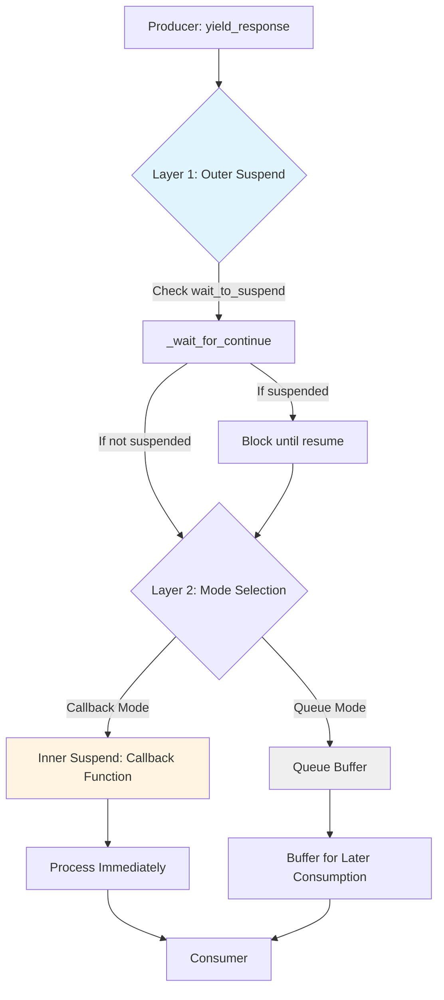
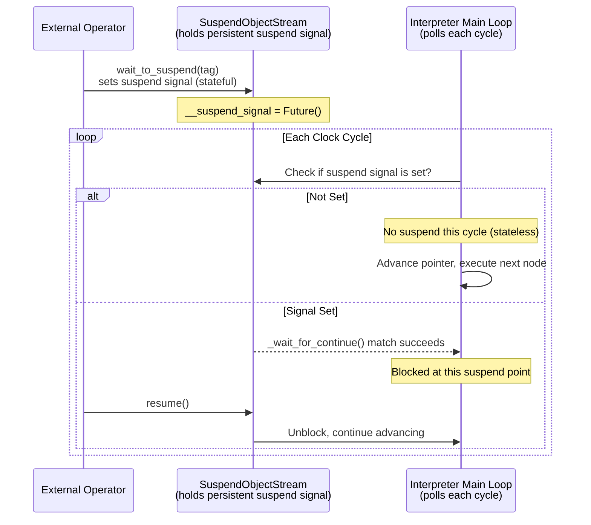
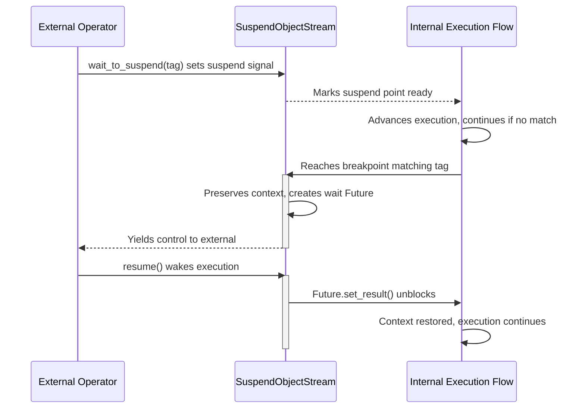

# SuspendObjectStream

`SuspendObjectStream` is a generic asynchronous duplex stream utility that provides the complete infrastructure for cooperative suspend/resume control flow. It serves as the `object_io` core component for AmritaSense `WorkflowInterpreter`.

## Overview

`SuspendObjectStream[ObjectTypeT]` internally combines four layers of mechanism:

| Layer            | Component                                                       | Purpose                                                                          |
| ---------------- | --------------------------------------------------------------- | -------------------------------------------------------------------------------- |
| **Transport**    | `anyio` in-memory object stream (two independent channel pairs) | Independent bidirectional data flow: producer→consumer and consumer→producer     |
| **Control**      | Suspend signal + resume signal (`asyncio.Future` pair)          | Cooperative pause/continue between external operator and internal execution flow |
| **Intercept**    | Callback functions (dual-lock protected)                        | Inject custom processing logic into the data path without affecting control flow |
| **Reverse flow** | Reverse send/receive channels + EOF marker                      | Consumer can actively send data back to producer for true bidirectional dialogue |

Key capabilities:

- **Cooperative suspension**: Use `wait_to_suspend()` / `_wait_for_continue()` to voluntarily yield control at configurable tags
- **Precise resumption**: Use `resume()` to unblock internal execution, continuing exactly from the suspend point
- **Bidirectional data transport**: `yield_response()` / `push_object()` producer→consumer, `send_to_producer()` consumer→producer
- **Tag-based breakpoint filtering**: Multi-tag matching for fine-grained breakpoint selection
- **Callback interception**: Inject async callbacks into either data path for real-time per-item processing

### Two-Layer Interrupt Architecture

The interrupt mechanism in `SuspendObjectStream` operates at two distinct levels. They are orthogonal and can be composed:



#### 1. Outer Suspend — Control Flow Interruption

Implemented via the `@SuspendObjectStream.suspend` decorator and the `wait_to_suspend()/resume()` pair:

- **Externally driven**: The external caller proactively requests suspension via `wait_to_suspend()`
- **Flow control**: Pauses the entire coroutine's execution, yielding control
- **Tag filtering**: Supports filtering specific breakpoints by tag for precise control
- **Bidirectional**: Must explicitly call `resume()` to unblock

> 🚦 **Analogy**: A traffic light — full stop, waiting for green (`resume()`) before proceeding.

#### 2. Inner Suspend / Callback — Data Flow Interception

Implemented via the `callback` mechanism:

- **Internally driven**: Automatically triggered on every `yield_response()`
- **Data interception**: Inserts async processing logic into the data transmission path
- **Real-time**: No need for external `resume()`; execution continues automatically after callback
- **One-way flow**: Data flows through and is processed without blocking the producer

> 🛂 **Analogy**: A customs checkpoint — every item is inspected, but released immediately after inspection without prolonged detention.

::: warning Callback and Iterator Are Mutually Exclusive
**Important limitation**: `callback` and `async for` iteration are **mutually exclusive**. A single `SuspendObjectStream` instance can only use one method to handle the response stream. Setting a callback and using an iterator simultaneously will raise `StreamStateError`.
:::

### Suspend Points vs. Clock-Cycle Interrupts: Stateful vs. Stateless

To understand the role of `SuspendObjectStream` within the AmritaSense system, two distinct layers of semantics must be separated:

| Layer                 | Term                           | State Characteristic | Description                                                                                                                                                                                                                                                                            |
| --------------------- | ------------------------------ | -------------------- | -------------------------------------------------------------------------------------------------------------------------------------------------------------------------------------------------------------------------------------------------------------------------------------- |
| **Inside SoS**        | **Suspend Point** (Breakpoint) | **Stateful**         | The suspend signal set by `wait_to_suspend()` **persists** until the internal execution flow reaches a matching breakpoint and consumes it. The `__suspend_signal` Future is a persistent state field on the SoS instance.                                                             |
| **Interpreter Clock** | **Interrupt**                  | **Stateless**        | The workflow interpreter **polls** whether SoS has a suspend signal set at each clock cycle (node boundary). Each cycle's check is independent and instantaneous — if not matched this cycle, execution advances to the next node; no state is retained within the interpreter itself. |



**Key takeaways**:

- **SoS remembers "whether to suspend"** (stateful signal), while the **interpreter merely checks once per cycle** (stateless polling).
- This means `wait_to_suspend()` can be called **before** or **after** the interpreter starts — as long as the signal is set on SoS, the interpreter will hit it on the next clock cycle.
- The interpreter's suspension occurs in the **gaps between nodes**, not during node execution. It is therefore "cooperative" — a node must fully execute to its boundary before the interpreter can respond to a suspend.

### Concurrency Safety (v0.3.2+)

`SuspendObjectStream` is fully concurrency-safe. Multiple coroutines and threads can safely share a single instance — concurrent `wait_to_suspend()`, `resume()`, `yield_response()`, and `push_object()` calls are protected by the **CLCA (Cross Loop Callback-Allocate) signal design pattern**. See [CLCA Design Pattern](/guide/practice/clca-design-pattern) for details.

Internally, all critical state changes are protected by `_state_lock` (`aiologic.Lock`), and callback execution is serialized by `_callback_lock` and `_callback_sending_lock` respectively. Multiple waiters share a single `__resume_signal` Future via `add_done_callback`, avoiding the single-waiter limitation.

### Interaction Model

The suspend logic divides participants into two roles:



- **Waiter (internal execution flow)**: Listens for externally issued suspend commands, voluntarily suspends upon reaching a marked point, yielding control.
- **Operator (external caller)**: Proactively issues a suspend request, waits for the execution flow to pause at the specified marker, performs intervention, then wakes the flow via `resume()`.

---

## Constructor

### `__init__(queue_size=45, queue_timeout=10.0, callback=None, receive_callback=None)`

Create a new `SuspendObjectStream` instance.

| Parameter          | Type                    | Default | Description                                                                                          |
| ------------------ | ----------------------- | ------- | ---------------------------------------------------------------------------------------------------- |
| `queue_size`       | `int`                   | `45`    | Maximum buffer size of the internal memory object stream                                             |
| `queue_timeout`    | `float \| None`         | `10.0`  | Timeout in seconds for queue put operations; `None` means wait indefinitely                          |
| `callback`         | `CALLBACK_TYPE \| None` | `None`  | Producer-side response callback, invoked on every `yield_response()`                                 |
| `receive_callback` | `CALLBACK_TYPE \| None` | `None`  | Sender-side response callback, invoked on every `push_object()` (when set, objects bypass the queue) |

```python
from amrita_sense.streaming import SuspendObjectStream

# Default configuration
stream = SuspendObjectStream[str]()

# Custom buffer size and timeout
stream = SuspendObjectStream[str](queue_size=100, queue_timeout=30.0)

# Pre-configured callback
async def my_callback(response: str):
    print(f"Received: {response}")

stream = SuspendObjectStream[str](callback=my_callback)
```

---

## Static Methods (Decorators)

### `static suspend(func, tag=None)`

A decorator for coroutine functions that automatically inserts a suspend point before execution.

| Parameter | Type                 | Description                                              |
| --------- | -------------------- | -------------------------------------------------------- |
| `func`    | `Callable[..., Any]` | The coroutine function to decorate                       |
| `tag`     | `str \| None`        | Suspend point tag; `None` means unconditional breakpoint |

| Returns              | Description                    |
| -------------------- | ------------------------------ |
| `Callable[..., Any]` | The wrapped coroutine function |

| Raises      | Condition                                                                     |
| ----------- | ----------------------------------------------------------------------------- |
| `TypeError` | `func` is not a coroutine function                                            |
| `TypeError` | No `SuspendObjectStream` instance found in the decorated function's arguments |

**How it works**: The decorator automatically searches for the first `SuspendObjectStream`-typed parameter in the function arguments and calls `await chat_object._wait_for_continue(tag)` before executing the original function body.

```python
from amrita_sense.streaming import SuspendObjectStream

class MyProcessor:
    @SuspendObjectStream.suspend
    async def process(self, stream: SuspendObjectStream, data: str):
        # If external called stream.wait_to_suspend(),
        # execution suspends here (before function body)
        print(f"Processing: {data}")

    @SuspendObjectStream.suspend_with_tag("before_validate")
    async def validate(self, stream: SuspendObjectStream, data: str):
        # Suspends only when external calls stream.wait_to_suspend("before_validate")
        return len(data) > 0
```

### `static suspend_with_tag(tag)`

Returns a `suspend` decorator factory with a fixed tag.

| Parameter | Type  | Description           |
| --------- | ----- | --------------------- |
| `tag`     | `str` | The suspend point tag |

| Returns    | Description                                                                    |
| ---------- | ------------------------------------------------------------------------------ |
| `Callable` | A decorator that accepts a coroutine function and returns the wrapped function |

```python
# Equivalent forms
@SuspendObjectStream.suspend_with_tag("my_tag")
async def foo(self, stream, x): ...

# Is equivalent to
@SuspendObjectStream.suspend(tag="my_tag")
async def foo(self, stream, x): ...
```

---

## Suspend/Resume Control Methods

### `async wait_to_suspend(*tags, timeout=None)`

**External operator entry point**. Requests that the execution flow pause at the next matching suspend point, blocking until that breakpoint is triggered.

| Parameter | Type            | Default | Description                                            |
| --------- | --------------- | ------- | ------------------------------------------------------ |
| `*tags`   | `str`           | —       | Zero or more suspend tags to filter target breakpoints |
| `timeout` | `float \| None` | `None`  | Timeout in seconds; `None` means wait indefinitely     |

| Raises                 | Condition                                               |
| ---------------------- | ------------------------------------------------------- |
| `StreamStateError`     | Another `wait_to_suspend()` is already in progress      |
| `asyncio.TimeoutError` | No matching breakpoint reached within `timeout` seconds |

**Tag matching rules**:

| `wait_to_suspend()` call            | Matched breakpoints                                                          |
| ----------------------------------- | ---------------------------------------------------------------------------- |
| `wait_to_suspend()` (no args)       | Matches **all** `@suspend` or `@suspend_with_tag(...)` decorated breakpoints |
| `wait_to_suspend("tag_a")`          | Matches only `@suspend_with_tag("tag_a")` breakpoints                        |
| `wait_to_suspend("tag_a", "tag_b")` | Matches breakpoints tagged `"tag_a"` **or** `"tag_b"`                        |

```python
# External controller runs in a separate async task
async def controller(stream: SuspendObjectStream):
    # Wait for any suspend point, up to 5 seconds
    await stream.wait_to_suspend(timeout=5.0)
    print("Execution flow suspended!")
    # Inspect state, modify variables here...
    stream.resume()
```

### `resume()`

**External operator entry point**. Resumes the suspended execution flow. This method is synchronous (not a coroutine) and can be called from any context.

If no execution flow is currently waiting (`__resume_signal` is empty or already completed), the call has no side effect.

```python
stream.resume()  # Unblocks internal execution; flow continues
```

### `async _wait_for_continue(tag=None)`

**Internal execution flow entry point** (prefixed with `_` to indicate internal API). Manually injects a suspend point into custom coroutine logic.

| Parameter | Type          | Default | Description                                                                          |
| --------- | ------------- | ------- | ------------------------------------------------------------------------------------ |
| `tag`     | `str \| None` | `None`  | The tag for this breakpoint, used to match against external `wait_to_suspend(*tags)` |

| Returns | Description                                                                                                        |
| ------- | ------------------------------------------------------------------------------------------------------------------ |
| `bool`  | `True` if waiting actually occurred (was suspended), `False` if returned immediately (no matching suspend request) |

**Key behaviors**:

- If external has not called `wait_to_suspend()` or tags don't match, returns **immediately with `False`**, non-blocking
- If tags match, creates a wait Future and blocks until external calls `resume()`
- Multiple concurrent waiters share a single resume signal via `add_done_callback`, avoiding the single-waiter limitation

```python
async def custom_step(self, stream: SuspendObjectStream):
    print("Step 1: pre-processing...")
    # Manual suspend point — blocks only if external requested suspension
    was_suspended = await stream._wait_for_continue(tag="custom_step")
    if was_suspended:
        print("Resumed after being suspended at custom_step")
    print("Step 2: continuing...")
```

::: tip
All methods decorated with `@SuspendObjectStream.suspend` automatically call `_wait_for_continue()`. Only call this method manually when you need custom suspend logic.
:::

---

## Data Sending Methods (Producer Side)

### `async push_object(obj)`

Pushes an object into the stream's send queue, or handles it directly via callback. This method first passes through the `SUSPEND_ON_PUSH` tag suspend point check.

**Execution path**:

1. First passes `_wait_for_continue(SUSPEND_ON_PUSH)` check (outer suspend)
2. If `receive_callback` is configured → executes callback under `_callback_sending_lock`, **does not enqueue**
3. If no `receive_callback` → places object into internal send queue

| Parameter | Type          | Description                       |
| --------- | ------------- | --------------------------------- |
| `obj`     | `ObjectTypeT` | The object to push into the queue |

| Raises             | Condition                                                             |
| ------------------ | --------------------------------------------------------------------- |
| `StreamStateError` | No callback configured and queue is closed (`queue_closed() == True`) |
| `TimeoutError`     | Queue is full and cannot put within `queue_timeout` seconds           |

```python
# Default mode — pushes to queue
await stream.push_object("User input data")

# Callback mode — object handled directly by callback
async def handle_input(obj: str):
    print(f"Received input: {obj}")
stream.set_callback_fun_sending(handle_input)
await stream.push_object("This won't enter the queue")
```

### `async yield_response(response)`

Sends a response object to the consumer. **This is the primary data exit point for the producer.**

| Parameter  | Type          | Description                 |
| ---------- | ------------- | --------------------------- |
| `response` | `ObjectTypeT` | The response object to send |

| Raises             | Condition                                  |
| ------------------ | ------------------------------------------ |
| `StreamStateError` | No callback configured and queue is closed |
| `TimeoutError`     | Queue mode and queue is full with timeout  |

**Execution path**:

1. First passes `_wait_for_continue(SUSPEND_ON_YIELD)` check (outer suspend)
2. If `callback` is configured -> executes callback under `_callback_lock` protection (inner suspend), **does not enqueue**
3. If no `callback` -> places object into internal send queue for consumer to read via `get_response_generator()`

```python
# Queue mode — object goes into buffer
await stream.yield_response("Hello, World!")

# Callback mode — object is handled directly by callback
async def handle(response: str):
    print(f"Callback received: {response}")
stream.set_callback_func(handle)
await stream.yield_response("This won't enter the queue")
```

### `async yield_response_iteration(iterator)`

Iterates over an async generator and sends each yielded item through `yield_response()`.

| Parameter  | Type                                | Description                                  |
| ---------- | ----------------------------------- | -------------------------------------------- |
| `iterator` | `AsyncGenerator[ObjectTypeT, None]` | An async generator yielding response objects |

```python
async def my_generator():
    for i in range(5):
        yield f"Chunk {i}"
        await asyncio.sleep(0.1)

await stream.yield_response_iteration(my_generator())
# Equivalent to:
# async for chunk in my_generator():
#     await stream.yield_response(chunk)
```

---

## Callback Configuration Methods

### `set_callback_func(func)`

Sets the producer-side response callback. Once set, all `yield_response()` calls will invoke this callback directly **without going through the queue**.

| Parameter | Type            | Description                                                      |
| --------- | --------------- | ---------------------------------------------------------------- |
| `func`    | `CALLBACK_TYPE` | A coroutine function with signature `async (ObjectTypeT) -> Any` |

| Raises             | Condition                                                         |
| ------------------ | ----------------------------------------------------------------- |
| `StreamStateError` | Callback has already been set (can only be set once per instance) |

```python
async def monitor(response: str):
    if "error" in response.lower():
        await send_alert(response)
    print(response, end="", flush=True)

stream.set_callback_func(monitor)
# All subsequent yield_response() calls are handled by monitor
```

### `set_callback_fun_sending(func)`

Sets the sender-side response callback. Once set, all `push_object()` calls will invoke this callback directly **without going through the queue**.

| Parameter | Type            | Description                                                      |
| --------- | --------------- | ---------------------------------------------------------------- |
| `func`    | `CALLBACK_TYPE` | A coroutine function with signature `async (ObjectTypeT) -> Any` |

| Raises             | Condition                     |
| ------------------ | ----------------------------- |
| `StreamStateError` | Callback has already been set |

---

## Data Consumption Methods (Consumer Side)

### `get_response_generator()`

Returns an async generator that iterates over response objects until the done marker is encountered.

| Returns                             | Description                                  |
| ----------------------------------- | -------------------------------------------- |
| `AsyncGenerator[ObjectTypeT, None]` | An async generator yielding response objects |

| Raises             | Condition                                                                                  |
| ------------------ | ------------------------------------------------------------------------------------------ |
| `StreamStateError` | A consumer is already iterating (`_has_consumer == True`) **or** a callback is already set |

**Generator lifecycle**:

- Continuously reads objects from the internal receive stream during iteration
- Naturally terminates when the internal EOF marker is encountered
- Automatically closes the receive stream upon generator termination

```python
async for response in stream.get_response_generator():
    content = response if isinstance(response, str) else response.get_content()
    print(content, end="", flush=True)
# After iteration is naturally exhausted, stream is automatically closed
```

::: warning
`get_response_generator()` may only be called **once**. Multiple concurrent consumers or mixing with callback will raise `StreamStateError`.
:::

---

## Reverse Data Flow (Consumer → Producer)

`SuspendObjectStream` includes a second independent channel pair, allowing the consumer to actively send data back to the producer for true bidirectional dialogue.

### `async send_to_producer(obj)`

Consumer sends an object back to the producer over the reverse channel. Not affected by suspend signals on the main direction.

| Parameter | Type          | Description                             |
| --------- | ------------- | --------------------------------------- |
| `obj`     | `ObjectTypeT` | The object to send back to the producer |

| Raises             | Condition                                |
| ------------------ | ---------------------------------------- |
| `StreamStateError` | Reverse channel is closed (`_peer_done`) |

```python
# Consumer sends data back while processing responses
async def consumer(stream: SuspendObjectStream[str]):
    async for response in stream.get_response_generator():
        print(response, end="")
        if "need more info" in response:
            await stream.send_to_producer("Supplementary data: ...")
```

### `async send_done_to_producer()`

Consumer sends the end-of-stream marker to the producer, signaling no more data on the reverse channel.

- Idempotent: repeated calls have no side effect
- After calling, the producer's `get_producer_input_generator()` will stop yielding

```python
# Consumer finishes all back-transmission
await stream.send_done_to_producer()
```

### `get_producer_input_generator()`

Returns an async generator that yields every object sent by the consumer over the reverse channel.

| Returns                             | Description                                                   |
| ----------------------------------- | ------------------------------------------------------------- |
| `AsyncGenerator[ObjectTypeT, None]` | An async generator yielding consumer-back-transmitted objects |

| Raises             | Condition                                                 |
| ------------------ | --------------------------------------------------------- |
| `StreamStateError` | Another generator is already consuming the reverse stream |

```python
# Producer polls consumer back-transmissions while sending data
async def producer(stream: SuspendObjectStream[str]):
    # Start reverse stream consumer
    async def listen_input():
        async for msg in stream.get_producer_input_generator():
            print(f"Consumer sent back: {msg}")

    asyncio.create_task(listen_input())

    # Continue normal data sending
    for i in range(10):
        await stream.yield_response(f"Data {i}\n")
    await stream.set_queue_done()
```

---

## Queue State Methods

### `queue_closed()`

Checks whether the response queue has been closed.

| Returns | Description                                                       |
| ------- | ----------------------------------------------------------------- |
| `bool`  | `True` if the queue is closed and no longer accepts new responses |

### `async set_queue_done()`

Pushes the done marker into the queue, signaling the consumer that the stream has ended. Once called, no further responses may be sent.

- Idempotent: repeated calls have no side effect
- Silently ignores `BrokenResourceError` if the stream is already disconnected

```python
# After the producer has finished sending all data
await stream.set_queue_done()
```

---

## Usage Patterns

### Pattern 1: Iterator Mode (Recommended for Streaming Output)

The most common consumption pattern, ideal for chunked output to terminals or WebSockets.

```python
import asyncio
from amrita_sense.streaming import SuspendObjectStream

async def producer(stream: SuspendObjectStream[str]):
    for i in range(5):
        await stream.yield_response(f"Data chunk {i}\n")
        await asyncio.sleep(0.5)
    await stream.set_queue_done()

async def consumer(stream: SuspendObjectStream[str]):
    async for chunk in stream.get_response_generator():
        print(chunk, end="", flush=True)

async def controller(stream: SuspendObjectStream[str]):
    # External control: pause after the second data chunk
    await stream.wait_to_suspend(timeout=3.0)
    print("\n[Suspended]")
    await asyncio.sleep(1)
    stream.resume()
    print("[Resumed]")

async def main():
    stream = SuspendObjectStream[str]()
    prod = asyncio.create_task(producer(stream))
    ctrl = asyncio.create_task(controller(stream))
    await consumer(stream)
    await prod

asyncio.run(main())
```

### Pattern 2: Callback Mode

Ideal for intercepting every piece of data without writing manual loops.

```python
async def handle_chunk(chunk: str):
    print(chunk, end="", flush=True)

stream = SuspendObjectStream[str](callback=handle_chunk)

# Producer sends data normally
async def producer():
    for i in range(5):
        await stream.yield_response(f"Chunk {i}\n")
    await stream.set_queue_done()

# Wait for producer to finish
await producer()
```

### Pattern 3: Combining Outer Suspend + Callback

Both interrupt mechanisms are orthogonal and can be used together.

```python
async def monitor(response: str):
    """Inner suspend: real-time monitoring"""
    if "error" in response.lower():
        print("[Alert] Error detected!")

stream = SuspendObjectStream[str](callback=monitor)

async def controller():
    """Outer suspend: pause at key points"""
    await stream.wait_to_suspend("before_llm_call", timeout=10.0)
    print("\nAbout to call LLM, continue?")
    stream.resume()

# Launch producer and controller
asyncio.create_task(producer(stream))
asyncio.create_task(controller())
# Producer outputs via callback; outer suspend works independently
```

### Pattern 4: Bidirectional Dialogue (Reverse Stream)

Using the second independent channel pair, the consumer can actively send data back to the producer while processing responses.

```python
import asyncio
from amrita_sense.streaming import SuspendObjectStream

async def producer(stream: SuspendObjectStream[str]):
    # Start reverse stream listener
    async def handle_input():
        async for msg in stream.get_producer_input_generator():
            print(f"[Producer received] {msg}")
            await stream.yield_response(f"Processed: {msg}\n")

    asyncio.create_task(handle_input())

    for i in range(5):
        await stream.yield_response(f"Data {i}\n")
        await asyncio.sleep(0.3)
    await stream.set_queue_done()

async def consumer(stream: SuspendObjectStream[str]):
    async for response in stream.get_response_generator():
        print(response, end="")
        if "Data 2" in response:
            # Send back when processing a specific response
            await stream.send_to_producer("Need more context")
    await stream.send_done_to_producer()

async def main():
    stream = SuspendObjectStream[str]()
    prod = asyncio.create_task(producer(stream))
    await consumer(stream)
    await prod

asyncio.run(main())
```

---

## Internal Constants

### `SUSPEND_ON_YIELD`

- **Value**: `"SuspendObjectStream::yield_response"`
- **Purpose**: A suspend tag used internally by `yield_response()`. When external monitors via `wait_to_suspend(SUSPEND_ON_YIELD)`, each `yield_response()` call triggers a suspend check.

### `SUSPEND_ON_PUSH`

- **Value**: `"SuspendObjectStream::push_response"`
- **Purpose**: A suspend tag used internally by `push_object()`. When external monitors via `wait_to_suspend(SUSPEND_ON_PUSH)`, each `push_object()` call triggers a suspend check.

```python
from amrita_sense.streaming import SUSPEND_ON_YIELD, SUSPEND_ON_PUSH

# Suspend before every yield_response
await stream.wait_to_suspend(SUSPEND_ON_YIELD)

# Suspend before every push_object
await stream.wait_to_suspend(SUSPEND_ON_PUSH)
```

---

## Important Notes

### Lifecycle Management

- The producer **must** call `set_queue_done()` after finishing all data sends, otherwise the consumer will block forever
- The consumer **should** call `send_done_to_producer()` when finished with back-transmission, notifying the producer the reverse stream has ended
- `get_response_generator()` / `get_producer_input_generator()` automatically terminate and clean up upon encountering their respective channel's EOF marker
- Only one active generator may exist per channel direction per instance

### Callback and Iterator Are Mutually Exclusive

::: danger
Each channel direction supports only one consumption method: **callback** or **iterator**. They cannot be used simultaneously.

- Main direction: `callback` and `get_response_generator()` are mutually exclusive
- Reverse channel: `receive_callback` and `get_producer_input_generator()` are mutually exclusive
- Mixing will raise `StreamStateError`
  :::

### Thread/Coroutine Safety

- All critical state changes are protected by `_state_lock`
- Multiple coroutines may safely call `wait_to_suspend()`, `resume()`, `yield_response()` concurrently
- However, `wait_to_suspend()` itself is not reentrant — only one external waiter may exist at a time

### Tag Usage Recommendations

- Use meaningful tag names in complex workflows (e.g., `"before_llm_call"`, `"after_validation"`) for readability
- Unparameterized `wait_to_suspend()` matches all breakpoints and is suitable for global debugging scenarios
- Tagged `wait_to_suspend("xxx")` matches precisely and is suitable for targeted control in production

---

## See Also

- [Execution and Interrupt](/guide/concepts/exec_and_interrupt) — Flow interrupt architecture based on `SuspendObjectStream` in AmritaSense
- [External Interrupt](/guide/advanced/external_interrupt) — How external callers interact with the interpreter
- [CLCA Design Pattern](/guide/practice/clca-design-pattern) — Underlying design principles for concurrency safety
