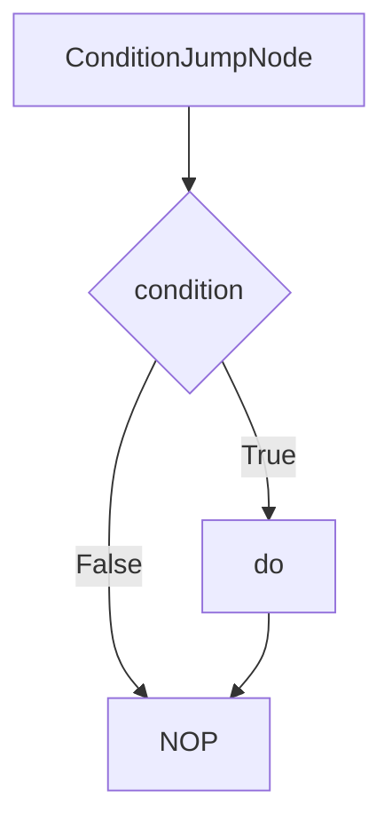
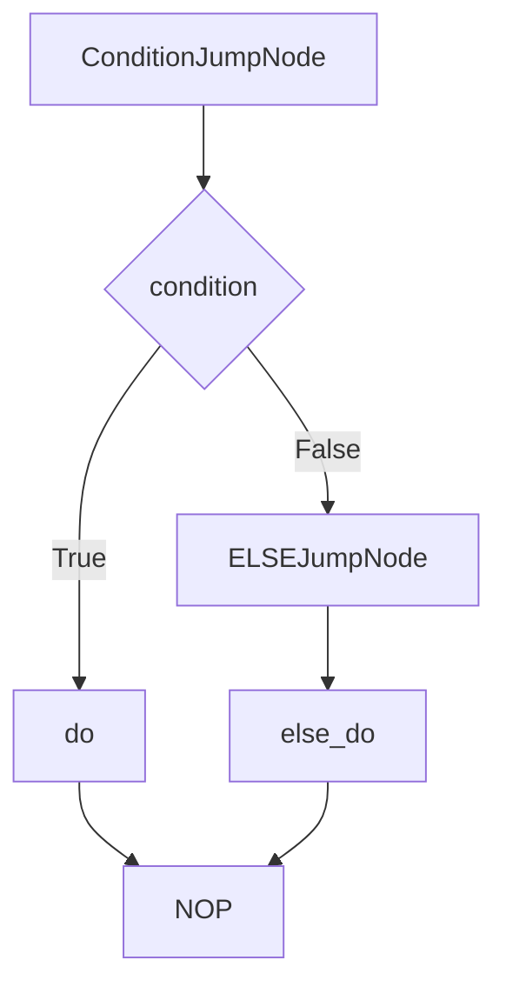
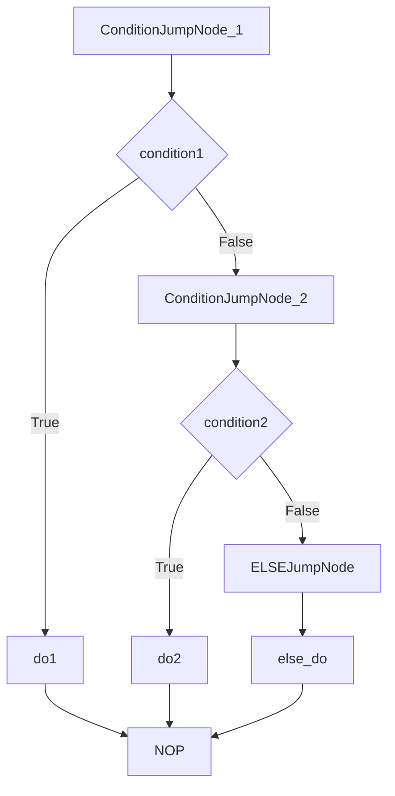

# 4.5.1 IF / ELIF / ELSE 条件链

AmritaSense 的条件分支指令完全复刻了 Python 的 `elif` 链式语法，提供了灵活而强大的条件控制能力。所有条件分支在编译期就完成了地址跳转的静态计算，运行时只有指针向量的算术操作。

## 底层实现机制

### 核心类结构

条件分支通过以下核心类实现：

- **`IFClause`**: 基础 IF 语句实现
- **`ELIFClause`**: ELIF 分支实现
- **`ELSEClause`**: ELSE 分支实现
- **`ConditionJumpNode`**: 条件判断和跳转节点

### 编译期地址计算

所有跳转地址在 `render()` 阶段静态计算：

- **简单 IF-ELSE**: 使用相对寻址指向作用域内的 NOP 位置
- **复杂 IF-ELIF-ELSE**: 使用绝对寻址指向整个作用域中 NOP 的绝对地址

## 运行时执行流程

虽然调用展开指的是编译期的空间结构，但理解运行时的执行流程同样重要：

### 简单 IF 执行流程

1. 执行 `ConditionJumpNode`
2. 调用 `condition` 节点获取布尔值
3. 如果为 `False`，跳转到 `NOP`（跳过 `do`）
4. 如果为 `True`，继续执行 `do` 节点

### IF-ELSE 执行流程

1. 执行 `ConditionJumpNode`
2. 调用 `condition` 节点
3. 如果为 `False`，跳转到 `ELSEJumpNode`
4. `ELSEJumpNode` 直接跳转到 `else_do`
5. 如果为 `True`，执行 `do` 后自动跳过 `else_do` 到 `NOP`

### IF-ELIF-ELSE 执行流程

对于多层嵌套的条件链，使用绝对寻址确保正确跳转：

1. 依次执行每个 `ConditionJumpNode`
2. 找到第一个条件为 `True` 的分支并执行
3. 如果所有条件都为 `False`，执行 `ELSE` 分支（如果有）
4. 所有分支执行完成后跳转到最终的 `NOP`

## 调用展开空间结构

### 简单 IF 语句空间展开

在工作流渲染阶段，IF 指令会被展开为以下空间结构：

```text
[ConditionJumpNode, condition, do, NOP]
```

对应的 Mermaid 空间结构图：


### IF-ELSE 空间展开

```text
[ConditionJumpNode, condition, do, ELSEJumpNode, else_do, NOP]
```


### IF-ELIF-ELSE 空间展开

```text
[ConditionJumpNode(condition1), condition1, do1,
 ConditionJumpNode(condition2), condition2, do2,
 ELSEJumpNode, else_do, NOP]
```


## 展开示意图

### 简单 IF 语句展开



### IF-ELSE 展开



### IF-ELIF-ELSE 展开



## 语法特性

### 灵活的语法组合

```python
# 纯 IF 语句（不要求配对 ELSE）
IF(condition, do)

# IF-ELSE 双分支
IF(condition, do).ELSE(else_do)

# IF-ELIF 链
IF(condition, do).ELIF(condition2, do2)

# 完整的 IF-ELIF-ELSE 链
IF(condition, do).ELIF(condition2, do2).ELSE(else_do)
```

### 条件节点特性

- **统一底层类型**: 所有条件表达式都是 `Node[bool]` 类型
- **同步异步混用**: 条件可以是同步函数或异步协程，引擎会自动归一化
- **复杂条件支持**: 条件节点本身可以包含依赖注入和复杂逻辑

## 最佳实践

### 条件优化

- **短路评估**: 将最可能为真的条件放在前面
- **简单条件优先**: 复杂条件放在 ELIF 后面
- **避免副作用**: 条件节点不应该有副作用

### 性能考虑

- **编译期优化**: 所有跳转地址在渲染时确定，运行时零开销
- **内存效率**: 不创建额外的数据结构，只使用指针算术
- **线程安全**: 条件执行过程完全线程安全

### 错误处理

- **类型安全**: 条件必须返回布尔值，否则会抛出类型错误
- **异常穿透**: 条件节点抛出的异常会正常穿透到上层处理
- **资源清理**: 使用 TRY/FINALLY 确保条件执行中的资源清理

通过这种设计，AmritaSense 的条件分支既保持了与 Python 语法的高度一致性，又实现了编译期优化的高性能执行。
