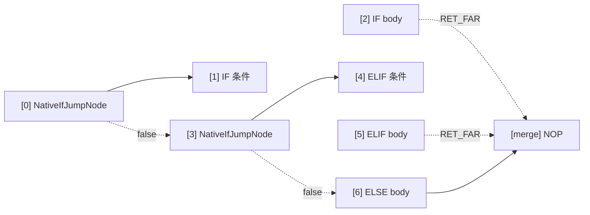

# 原生特性指令 (NATIVE_IF / NATIVE_WHILE / NATIVE_DO / BREAK_LOOP)

AmritaSense v0.5.1 引入的原生控制流指令集，基于 `PUSH / JMP / RET_FAR` 指针操作模式，是对传统 `call_sub` 指令的**正交扩展**。

## 概述

传统指令（`IF` / `WHILE` / `DO`）使用 `call_sub` 进入分支体，这涉及解释锁获取、中间件调用和依赖注入解析。原生指令用轻量的指针跳转模式替代：

```
call_sub 路径：  锁 → 中间件 → DI → 执行 → 返回
PUSH/JMP 路径：  压栈 → 跳转 → 执行 → RET_FAR → 弹栈
```

Bubble 体内的 `RET_FAR` 会弹栈并回到 `PUSH` 时记录的地址。编译器**总是**在每个 Bubble 体末尾自动插入一个 `RET_FAR` 作为兜底——你无需手动编写。如果你需要提前退出 Bubble，可以在中途手动插入 `RET_FAR`。

### RET_FAR 与 BREAK_LOOP

| 指令         | 用途                               | 自动插入？        |
| ------------ | ---------------------------------- | ----------------- |
| `RET_FAR`    | 结束 Bubble 执行（提前或正常退出） | ✅ 编译器末尾兜底 |
| `BREAK_LOOP` | 终止循环（弹栈 + 跳到出口哨兵）    | ❌ 需手动插入     |

`BREAK_LOOP` 和 `RET_FAR` 的关键区别：`RET_FAR` 弹栈后回到 `PUSH` 记录的地址（对于循环即条件节点，循环会继续），而 `BREAK_LOOP` 弹栈后直接跳到父层 Bubble 的最后一个哨兵 `NOP`，干净地结束整个循环。

### 编译时优化：\_is_single 分发

编译期通过 `_classify_body` 区分 payload 类型：

| payload 类型                             | `_is_single` | 机制                                    |
| ---------------------------------------- | ------------ | --------------------------------------- |
| `BaseNode`                               | `True`       | `call_offset` 调用（自动返回）          |
| `NodeCompose` / `SelfCompileInstruction` | `False`      | 包裹 Bubble（编译器自动末尾 `RET_FAR`） |

## NATIVE_IF

### 导入

```python
from amrita_sense.instructions.native import NATIVE_IF
```

### 签名

```python
NATIVE_IF(
    condition: Node[bool],
    body: BaseNode | NodeCompose | SelfCompileInstruction,
) -> NativeIfClause
```

### 方法

| 方法                     | 签名     | 说明                           |
| ------------------------ | -------- | ------------------------------ |
| `.ELIF(condition, body)` | → `Self` | 追加 ELIF 分支，可多次链式调用 |
| `.ELSE(body)`            | → `Self` | 追加 ELSE 分支，最多一次       |

### 编译布局

#### 单 IF（Bubble 体）


#### IF-ELIF-ELSE 链



ELSE 分支体不追加 `RET_FAR`，自然流入汇合点。

### 底层节点

- **`NativeIfJumpNode`**（`_core.py`）：IF/ELIF 的条件跳转节点。`_is_single` 标志决定单节点（`call_offset`）还是 Bubble（`PUSH + jump_far_ptr`）路径。

## NATIVE_WHILE

### 导入

```python
from amrita_sense.instructions.native import NATIVE_WHILE
```

### 签名

```python
NATIVE_WHILE(
    condition: Node[bool],
) -> NativeWhileClause
```

### 方法

| 方法            | 签名     | 说明                         |
| --------------- | -------- | ---------------------------- |
| `.ACTION(body)` | → `Self` | 设置循环体，必须调用且仅一次 |

### 编译布局


### 底层节点

- **`NativeWhileNode`**（`_core.py`）：条件判断 + 分派节点。`_is_single=True` 时 `call_offset` body 后 `jump_near(self_pos)` 回到自己；`_is_single=False` 时 `PUSH self_pos` 后 `jump_far_ptr` 进入 Bubble，由 `RET_FAR` 弹栈返回。

## NATIVE_DO

### 导入

```python
from amrita_sense.instructions.native import NATIVE_DO
```

### 签名

```python
NATIVE_DO(
    body: BaseNode | NodeCompose | SelfCompileInstruction,
) -> NativeDoClause
```

### 方法

| 方法                | 签名     | 说明                           |
| ------------------- | -------- | ------------------------------ |
| `.WHILE(condition)` | → `Self` | 设置循环条件，必须调用且仅一次 |

### 编译布局

#### 单节点


#### Bubble 体


### 底层节点

- **`NativeDoWhileNode`**（`_core.py`）：DO-WHILE 回边节点。条件真时 `jump_near(loop_pos)` 回到 body 入口（`NativeBubbleEnterNode` 处理重新进入）；条件假时 `jump_near(exit_pos)` 跳到出口。
- **`NativeBubbleEnterNode`**（`_core.py`）：Bubble 入口辅助节点。若构造时传入 `ret_pos`，先 `PUSH ret_pos` 再 `JMP` 进入 Bubble；否则仅 `JMP`（ELSE 场景）。

## BREAK_LOOP

### 导入

```python
from amrita_sense.instructions.native import BREAK_LOOP
```

### 签名

```python
BREAK_LOOP: _BreakLoopNode  # 单例
```

### 工作原理

1. 从 `pc._pointer.base_addr` 获取当前地址 `[a, b, c]`
2. `pc.get_graph().calc.find_addr([a])` 定位父层 Bubble → `NodeComposeRendered`
3. 计算目标：`len(父Bubble) - 1`（最后一个哨兵 NOP）
4. `pc._ret_addr_stack.pop()` 清理循环进入时压入的返回地址
5. `pc.jump_far_ptr([a, target])` 跳到出口

### 使用约束

- **仅在 Bubble 体内有效**：单节点体通过 `return` 自然跳出
- **必须位于原生循环体内**：地址深度不足会抛出 `RuntimeError`
- **跳出后继续正常执行**：父 Bubble 的下一个节点被正常推进

### 示例

```python
from amrita_sense.instructions.native import BREAK_LOOP, NATIVE_WHILE

NATIVE_WHILE(cond).ACTION(
    process_item
    >> BREAK_LOOP
    >> log_item
)
```

## 与传统指令对照

|          | `IF`                | `NATIVE_IF`                         | `WHILE`             | `NATIVE_WHILE`                      | `DO`                | `NATIVE_DO`                         |
| -------- | ------------------- | ----------------------------------- | ------------------- | ----------------------------------- | ------------------- | ----------------------------------- |
| 进入方式 | `call_sub`          | `PUSH+JMP` 或 `call_offset`         | `call_sub`          | `PUSH+JMP` 或 `call_offset`         | `call_sub`          | `PUSH+JMP` 或 `call_offset`         |
| 返回方式 | `call_sub` 自动返回 | `RET_FAR`（Bubble）或自动（单节点） | `call_sub` 自动返回 | `RET_FAR`（Bubble）或自动（单节点） | `call_sub` 自动返回 | `RET_FAR`（Bubble）或自动（单节点） |
| Break    | `raise BreakLoop`   | `BREAK_LOOP`                        | `raise BreakLoop`   | `BREAK_LOOP`                        | `raise BreakLoop`   | `BREAK_LOOP`                        |
| 中间件   | 触发                | 不触发                              | 触发                | 不触发                              | 触发                | 不触发                              |
| DI 解析  | 触发                | 不触发                              | 触发                | 不触发                              | 触发                | 不触发                              |

## 注意事项

1. **Bubble 体必须 RET_FAR**：编译器自动在 Bubble 末尾追加 `RET_FAR`，但如果你手动构造 `NodeCompose` 作为分支体，需要确保末尾有 `RET_FAR`
2. **BREAK_LOOP 不是异常**：它是同步指针操作指令，`wrap_to_async=False`，不会触发异常处理流程
3. **原生指令可混用**：与 `>>`、`NodeCompose` 和传统指令完全互操作
4. **ELSE 不压栈**：`NATIVE_IF` 的 ELSE 分支通过 `NativeBubbleEnterNode` 自然流入，不 `PUSH` 返回地址（因为不需要返回）
