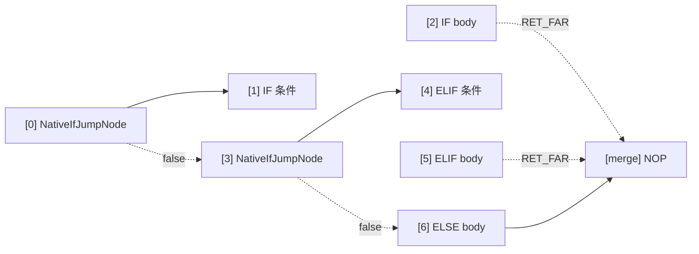

# 原生特性指令 (NATIVE_IF / NATIVE_WHILE / NATIVE_DO / BREAK_LOOP / CONTINUE)

AmritaSense v0.5.1 引入的原生控制流指令集，基于 `PUSH / JMP / CONTINUE / BREAK_LOOP` 指针操作模式，是对传统 `call_sub` 指令的**正交扩展**。v0.6.0 起循环体统一包装为 `NodeCompose(body, CONTINUE())`，`RET_FAR` **不再参与**原生循环。

## 概述

传统指令（`IF` / `WHILE` / `DO`）使用 `call_sub` 进入分支体，这涉及解释锁获取、中间件调用和依赖注入解析。原生指令用轻量的指针跳转模式替代：

```
call_sub 路径：     锁 → 中间件 → DI → 执行 → 返回
原生循环路径：     压栈 → 跳转 → 执行 → CONTINUE → 弹栈 → 跳回循环头
```

循环体总是以 `CONTINUE()` 结尾（编译器自动追加），它弹栈并跳回循环头，开始下一轮迭代。

### CONTINUE 与 BREAK_LOOP

| 指令            | 用途                                       | 自动插入？        |
| --------------- | ------------------------------------------ | ----------------- |
| `CONTINUE()`    | 结束本轮迭代，跳回循环头                   | ✅ 编译器末尾兜底 |
| `BREAK_LOOP()`  | 终止循环（弹栈 + 跳到出口哨兵）            | ❌ 需手动插入     |

关键区别：`CONTINUE()` 弹栈后跳回循环头（循环继续下一轮），而 `BREAK_LOOP()` 弹栈后直接跳到循环的出口哨兵 `NOP`，干净地结束整个循环。两者的目标位置都由外层循环的 `extract()` 在编译期通过 DFS 扫描器 `_configure_loop_control_nodes()` 配置——永远不需要手动指定。

> **`RET_FAR` 已退出原生循环**（v0.6.0 起）。它使用 `rebase_ptr` + 自然 `advance_pointer`，服务于手动栈返回模式（`PUSH_AND_GOTO` / `PUSH_STACK`）。`CONTINUE()` / `BREAK_LOOP()` 是直接 `jump_far_ptr` 操作，会设置跳转标记。

### 编译期 body 分类

编译期通过 `_classify_body` 区分 payload 类型：

| payload 类型                             | `NATIVE_IF` 路径                                | `NATIVE_WHILE` / `NATIVE_DO` 路径                    |
| ---------------------------------------- | ------------------------------------------------ | ---------------------------------------------------- |
| `BaseNode`                               | `call_offset` 调用（自动返回）                   | 自动包装 `NodeCompose(body, CONTINUE())`             |
| `NodeCompose` / `SelfCompileInstruction` | 包裹 Bubble（编译器自动末尾追加 `RET_FAR`）      | 包装为 `NodeCompose(*body._graph, CONTINUE())`       |

## NATIVE_IF

### 导入

```python
from amrita_sense.instructions.native import NATIVE_IF
```

### 签名

```python
NATIVE_IF(
    condition: Node[bool],
    body: BaseNode | NodeCompose | SelfCompileInstruction,
) -> NativeIfClause
```

### 方法

| 方法                     | 签名     | 说明                           |
| ------------------------ | -------- | ------------------------------ |
| `.ELIF(condition, body)` | → `Self` | 追加 ELIF 分支，可多次链式调用 |
| `.ELSE(body)`            | → `Self` | 追加 ELSE 分支，最多一次       |

### 编译布局

#### 单 IF（Bubble 体）


#### IF-ELIF-ELSE 链



ELSE 分支体不追加 `RET_FAR`，自然流入汇合点。

### 底层节点

- **`NativeIfJumpNode`**（`_core.py`）：IF/ELIF 的条件跳转节点。`_is_single` 标志决定单节点（`call_offset`）还是 Bubble（`PUSH + jump_far_ptr`）路径。Bubble 体末尾带 `RET_FAR`（编译器追加）。

## NATIVE_WHILE

### 导入

```python
from amrita_sense.instructions.native import NATIVE_WHILE
```

### 签名

```python
NATIVE_WHILE(
    condition: Node[bool],
) -> NativeWhileClause
```

### 方法

| 方法            | 签名     | 说明                         |
| --------------- | -------- | ---------------------------- |
| `.ACTION(body)` | → `Self` | 设置循环体，必须调用且仅一次 |

### 编译布局


### 底层节点

- **`NativeWhileNode`**（`_core.py`）：条件判断 + 分派节点。纯跳转：条件真 → `PUSH [0]`（自身地址）→ `jump_far_ptr` 进入循环体；条件假 → `jump_near(3)` 到出口。循环体末尾的 `CONTINUE()` 弹栈并跳回 `[0]`。

## NATIVE_DO

### 导入

```python
from amrita_sense.instructions.native import NATIVE_DO
```

### 签名

```python
NATIVE_DO(
    body: BaseNode | NodeCompose | SelfCompileInstruction,
) -> NativeDoClause
```

### 方法

| 方法                | 签名     | 说明                           |
| ------------------- | -------- | ------------------------------ |
| `.WHILE(condition)` | → `Self` | 设置循环条件，必须调用且仅一次 |

### 编译布局


单节点循环体以相同方式自动包装（`NodeCompose(body, CONTINUE())`）。

### 底层节点

- **`NativeDoWhileNode`**（`_core.py`）：DO-WHILE 回边节点。条件真时 `jump_near(loop_pos)` 回到 body 入口（`NativeBubbleEnterNode` 处理重新进入）；条件假时 `jump_near(exit_pos)` 跳到出口。
- **`NativeBubbleEnterNode`**（`_core.py`）：Bubble 入口辅助节点。**总是**先 `PUSH` 哨兵（自身地址）再 `jump_far_ptr` 进入 body，使 `CONTINUE()` / `BREAK_LOOP()` 可以弹栈。构造函数只接受 `body_pos`（v0.6.0 移除了 `ret_pos` 参数）。

## BREAK_LOOP

### 导入

```python
from amrita_sense.instructions.native import BREAK_LOOP
```

### 签名

```python
BREAK_LOOP() -> _BreakLoopNode  # 工厂函数（v0.6.0+）
```

v0.6.0 起，`BREAK_LOOP` 是**工厂函数**——需要调用：`BREAK_LOOP()`。旧的模块级单例已移除。

### 工作原理

1. `pc._ret_addr_stack.pop()` 清理循环进入时压入的返回地址
2. 从弹出的 `PointerVector` 推导外层 Bubble 的父地址
3. `pc.jump_far_ptr([*parent, break_pos])` 跳到出口哨兵 NOP——`break_pos` 由外层循环的 `extract()`（DFS 扫描器）在编译期配置

### 使用约束

- **必须位于原生循环体内**：未被任何外层循环配置的节点会在运行时抛 `RuntimeError`
- **每次调用弹一层**：弹一个栈条目，退出最内层包裹的原生循环
- **嵌套支持**：每层循环只配置自己 body 内的控制节点（DFS 扫描器在遇到内层原生循环边界时停止）
- **跳出后继续正常执行**：循环后的下一个节点被正常推进

### 示例

```python
from amrita_sense.instructions.native import BREAK_LOOP, NATIVE_WHILE

NATIVE_WHILE(cond).ACTION(
    process_item
    >> BREAK_LOOP()
    >> log_item
)
```

## CONTINUE

### 导入

```python
from amrita_sense.instructions.native import CONTINUE
```

### 签名

```python
CONTINUE() -> _ContinueNode  # 工厂函数
```

### 工作原理

与 `BREAK_LOOP()` 机制相同，但目标位置是**循环头**而非出口哨兵：`NATIVE_WHILE` 跳到 `[0]`（重新判断条件）；`NATIVE_DO` 跳到 `[2]`（do-while 节点，重新检查条件）。

### 使用约束

- **必须位于原生循环体内**：未配置时同样抛运行时 `RuntimeError`
- **自动追加**：每个循环体末尾已自动带有 `CONTINUE()`——你只需在需要跳过本轮剩余节点时手动插入
- **不是异常**：它是同步指针操作指令（`wrap_to_async=False`），不会触发异常处理流程

### 示例

```python
from amrita_sense.instructions.native import CONTINUE, NATIVE_DO

NATIVE_DO(
    step_a
    >> CONTINUE()   # 跳过 step_b，重新检查条件
    >> step_b
).WHILE(cond)
```

## 与传统指令对照

|          | `IF`                | `NATIVE_IF`                         | `WHILE`             | `NATIVE_WHILE`                      | `DO`                | `NATIVE_DO`                         |
| -------- | ------------------- | ----------------------------------- | ------------------- | ----------------------------------- | ------------------- | ----------------------------------- |
| 进入方式 | `call_sub`          | `PUSH+JMP` 或 `call_offset`         | `call_sub`          | `PUSH+JMP`                         | `call_sub`          | `PUSH+JMP`                         |
| 返回方式 | `call_sub` 自动返回 | `RET_FAR`（Bubble）或自动（单节点） | `call_sub` 自动返回 | `CONTINUE()`（自动）               | `call_sub` 自动返回 | `CONTINUE()`（自动）               |
| Break    | `raise BreakLoop`   | `BREAK_LOOP()`                      | `raise BreakLoop`   | `BREAK_LOOP()`                     | `raise BreakLoop`   | `BREAK_LOOP()`                     |
| Continue | —                   | —                                   | —                   | `CONTINUE()`                       | —                   | `CONTINUE()`                       |
| 中间件   | 触发                | 不触发                              | 触发                | 不触发                              | 触发                | 不触发                              |
| DI 解析  | 触发                | 不触发                              | 触发                | 不触发                              | 触发                | 不触发                              |

## 注意事项

1. **循环体总是以 CONTINUE() 结尾**：编译器自动在循环体末尾追加 `CONTINUE()`。如果你手动构造 `NodeCompose` 作为循环体，请把 `CONTINUE()` 放在末尾（或依赖自动包装）
2. **BREAK_LOOP / CONTINUE 不是异常**：它们是同步指针操作指令，`wrap_to_async=False`，不会触发异常处理流程
3. **原生指令可混用**：与 `>>`、`NodeCompose` 和传统指令完全互操作
4. **ELSE 不追加返回指令**：`NATIVE_IF` 的 ELSE 分支通过 `NativeBubbleEnterNode` 自然流入汇合点——与 IF/ELIF 的 Bubble 不同，它末尾没有 `RET_FAR`
