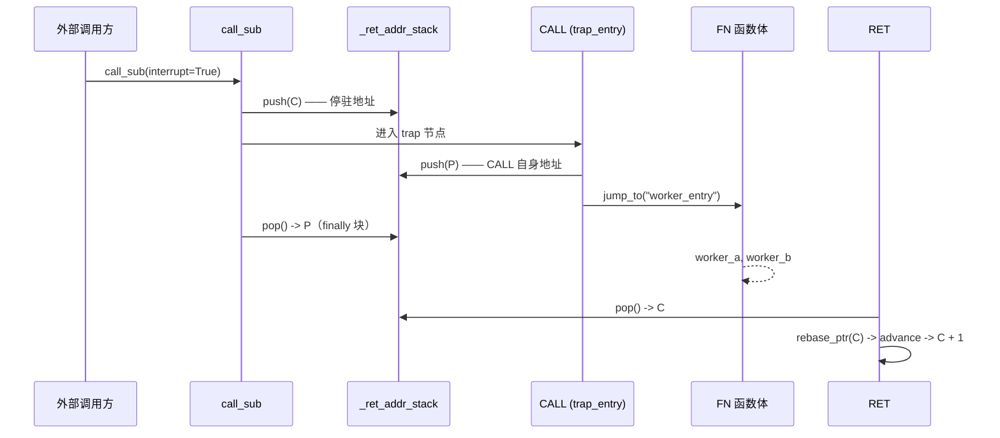

# 4.4 外部中断调用

AmritaSense 提供了一套安全的外部调用机制，允许**外部系统在节点边界注入子程序**，从而实现灵活的调试、监控与动态控制。这套机制的核心是解释锁与 `call_sub(interrupt=True)`，它让“中断”不再是硬件级的抢占，而是可控的、可编程的“安全外部调用”。

> **区分：流程挂起 vs. 外部调用**
> 第 3.4 节介绍的流程挂起（Suspend）是通过 `SuspendObjectStream` 暂停执行流，等待外部 `resume()` 后继续。而本节讨论的是在挂起窗口或节点边界，**由外部主动注入一个完整的子程序**，执行完毕后自动返回。两者可以组合使用，但属于不同维度的能力。

## 4.4.1 解释锁与安全外部调用原理

外部注入操作的核心是 `aiologic.Lock`（解释锁），它确保了注入的原子性，避免与正常执行流产生竞态。

### 为什么需要锁？

解释器的主循环在每次迭代中获取锁执行节点，锁在节点执行完毕后释放。在两次迭代之间，锁处于空闲状态，此时外部系统可以安全地调用 `call_sub(interrupt=True)` 来注入一个子程序。这个调用会重新获取锁，从而保证：

- 注入的子程序不会与正常节点并发执行
- 工作流内部状态不会被并发篡改
- 多个外部注入请求被序列化

### 安全外部调用的接口

外部系统通过解释器对象直接调用：

```python
# 假设 interpreter 是 WorkflowInterpreter 实例
await interpreter.call_sub(
    interpreter.get_graph().calc.resolve_alias("my_handler"),
    interrupt=True,
    some_arg="value",
)
```

关键点在于 `interrupt=True`，它告诉解释器在调用期间获取解释锁，实现安全的注入。

### 工作流内 vs 工作流外

- **节点内部**调用 `call_sub` 必须使用 `interrupt=False`（默认），否则会因为同一协程重复获取同一不可重入锁而被 `aiologic` 检测并抛出异常。
- **外部系统**（如另一个协程、调试器、HTTP 接口）必须使用 `interrupt=True`，因为它不持有锁。

这种设计让同一套 `call_sub` API 同时服务于内部复用和外部注入，仅通过一个布尔参数区分。

## 4.4.2 中断程序的存储结构

为了便于外部调用，我们需要在工作流中预置一些专门用于响应的节点序列，这些序列被打包成“中断程序”并存储在工作流中，正常流程会跳过它们。AmritaSense 提供了 `ARCHIVED_NODES` 来构建这种存储区。

### `ARCHIVED_NODES` 的结构

`ARCHIVED_NODES` 是一个自编译指令，它接收一系列节点（通常通过 `ALIAS` 标记以支持 `INVOKE` 寻址），自动生成如下结构：

```text
SubprogramJumpNode -> ALIAS(node1, "name1") -> ALIAS(node2, "name2") -> ... -> NOP
```

- `SubprogramJumpNode` 无条件跳转到末尾的 `NOP`，因此正常执行时整个存储区被跳过。
- 每个节点可通过别名寻址，按需调用其中任意一个。

### 示例

```python
from amrita_sense.instructions.subprogram import ARCHIVED_NODES
from amrita_sense.instructions.alias import ALIAS
from amrita_sense.node import Node


@Node()
def on_error(pc: WorkflowInterpreter):
    print("Handling error...")


@Node()
def cleanup(pc: WorkflowInterpreter):
    print("Cleaning up...")


interrupt_handlers = ARCHIVED_NODES(
    ALIAS(on_error, "on_error"), ALIAS(cleanup, "cleanup")
)
```

在工作流编排中，将 `interrupt_handlers` 放在末尾或合适位置即可。

> **ARCHIVED_NODES 与 ARCHIVED_SEGMENT 的区别**：`ARCHIVED_NODES` 归档一组扁平的独立节点（每个节点都可按别名寻址，适合构建处理器库）。`ARCHIVED_SEGMENT` 将整个 `NodeCompose` 归档为一个整体（`[JMP 2, Payload, NOP]`）——它是 `FN` / `INTER_FN` 函数块的构建基础。前者用于处理器库，后者用于完整例程。

## 4.4.3 SubprogramJumpNode 的执行逻辑

`SubprogramJumpNode` 是一个轻量级节点，专门用于跳过后续的存储区。其实现非常简单：

- 持有目标跳转地址 `_target_near`，通常指向存储区末尾的 `NOP`。
- 执行时调用 `pc.jump_near(self._target_near)`，使解释器直接跳到目标位置，而不执行中间的 `ALIAS` 节点。

它本身具有 `address_able=True`，可以被别名化（尽管通常不需要）。这种设计让存储区对正常执行流完全透明，但对地址解析（通过别名查表）完全开放。

### 为什么不用 JMP？

`SubprogramJumpNode` 是专门为跳过存储区设计的，语义更明确。而 `JMP` 是通用跳转指令，可能会被误用。使用专用的跳转节点可以降低开发者混淆的风险。

## 4.4.4 构建安全的可注入节点库

利用上述机制，开发者可以构建一套“可注入节点库”，用于调试、健康检查、错误恢复等。这些库节点必须遵循一定的安全约束。

### 节点设计原则

1. **无共享状态**：节点应是纯函数，或只依赖依赖注入的上下文，不修改全局状态。
2. **幂等性**：外部调用可能在任意时刻发生，节点逻辑应尽量幂等，多次调用结果一致。
3. **快速执行**：注入节点通常是轻量级的，避免长时间持有解释锁阻塞正常流程。
4. **明确的异常处理**：在节点内部捕获并处理可能的异常，避免注入操作本身导致工作流崩溃。如需致命错误，应通过 `InterruptNotice` 终止工作流。

### 示例：健康检查节点

```python
@Node()
async def health_check(pc: WorkflowInterpreter):
    # 只读操作，检查内部状态
    graph = pc.get_graph()
    addr = pc._pointer.copy()
    print(f"Current pointer: {addr}, graph size: {len(graph._graph)}")
    # 没有修改任何状态，安全
```

### 外部调用模式

外部系统（如调试器）可以这样注入：

```python
# 先确保工作流挂起在某个检查点或节点边界
await pc.object_io.wait_to_suspend(PC_CHECKPOINT)
# 现在锁空闲，安全注入
await pc.call_sub(pc.get_graph().calc.resolve_alias("health_check"), interrupt=True)
# 注入完成后，恢复工作流
pc.object_io.resume()
```

或者直接在工作流运行时，从另一个协程调用 `call_sub(interrupt=True)`，只要保证锁空闲（即不在节点执行期间），调用会等待锁，然后执行注入。

### 并发安全

`aiologic.Lock` 确保同一时刻只有一个注入在执行。多个外部调用者会排队，不会出现嵌套注入。解释器内部的状态在锁的保护下保持稳定。

通过这套机制，AmritaSense 将外部干预从“破坏性中断”变为“安全的功能调用”，为构建全功能调试器、监控系统和动态流控提供了坚实的基础。

## 4.4.5 Trap：从外部进入 `CALL` / `INT`

**Trap**（陷阱）指的是：外部 `call_sub(interrupt=True)` 的目标不是普通处理节点，而是 `CALL` 或 `INT` 节点本身。

`call_sub` 压入停驻地址 `C` 并进入目标节点。若该目标是 `CALL`，`CALL` 会压入**自身地址** `P` 再跳走——于是地址栈上变成 `[C, P]`。`call_sub` 的 `finally` 块再把 `P` 弹走（它是被进入的节点压的），剩回 `[C]`。随后 `FN` 块执行到末尾的 `RET`，`RET` 弹出 `C`，主流程从 `C + 1` 继续。

净效果：**trap 消耗掉解释器停驻的那一轮，执行从「停驻地址 + 1」继续。**



### 为什么别名必须包在 `CALL` 上

trap 的目标必须是真正执行陷阱的那个节点。`ALIAS` 是透明的：它同时转发 `__call__` 与 `_post_compile` 给被包裹的节点，因此 `ALIAS(CALL("worker_entry"), "trap_entry")` 的行为与裸 `CALL` 完全一致，只是额外获得了外部调用方可解析的名字。

### 完整示例

```python
import asyncio

from amrita_sense import ALIAS, Node, WorkflowInterpreter
from amrita_sense.instructions import CALL, FN
from amrita_sense.instructions.subprogram import ARCHIVED_NODES
from amrita_sense.runtime.workflow import PC_CHECKPOINT


@Node()
async def trap_point() -> None:
    print("[main] trap_point  <- 停驻在此；trap 会消耗掉这一轮")


@Node()
async def main_step() -> None:
    print("[main] main_step")


@Node()
async def worker_a() -> None:
    print("  [worker] a")


async def main() -> None:
    # FN 块渲染为：[_fn_escape, ALIAS(NOP, "worker_entry"), worker_a, RET()]
    worker = FN("worker_entry", worker_a)

    # trap 库：正常流会跳过，只有 call_sub(interrupt=True) 才会进入
    traps = ARCHIVED_NODES(ALIAS(CALL("worker_entry"), "trap_entry"))

    comp = trap_point >> main_step >> traps >> worker
    pc = WorkflowInterpreter(comp.render())

    task = asyncio.create_task(pc.run())
    await pc.object_io.wait_to_suspend(PC_CHECKPOINT)  # 停驻，锁此时空闲
    await pc.call_sub(
        pc.get_graph().calc.resolve_alias("trap_entry"), interrupt=True
    )
    pc.object_io.resume()
    await task


asyncio.run(main())
```

可直接运行的版本是 `demos/10_call_trap.py`，输出为：

```text
=== external trap: CALL -> FN -> RET ===

[ext]  parked at PointerVector([0]), is_running = True
  [worker] a
  [worker] b
[main] main_step
[main] main_tail

[ext]  done — the parked node was consumed, flow resumed at parked + 1
```

`INT` 同理：`ALIAS(INT("isr_entry"), "trap_entry")` 以停驻地址作为返回地址拍摄上下文快照，并派发进 `INTER_FN` 块；`IRET` 恢复快照后从 `C + 1` 继续。唯一区别在通道——`INT` / `IRET` 走上下文栈，`CALL` / `RET` 走返回地址栈。

### Trap 与普通注入的对比

| 注入目标                 | 返回地址栈                                                   | 恢复位置                          |
| ------------------------ | ------------------------------------------------------------ | --------------------------------- |
| 普通处理节点             | `[C]`，由 `call_sub` 的 `finally` 弹走                       | `C` —— 注入结束后停驻节点照常执行 |
| `CALL` / `INT` trap 节点 | `[C, P]`；`P` 由 `call_sub` 弹走，`C` 由 `RET` / `IRET` 弹走 | `C + 1` —— 停驻节点被 trap 消耗掉 |

### trap 目标不得自行操作地址栈

`call_sub` 的 `pop` 是无条件的，不会检查弹出的是谁压的。因此 trap 目标必须让返回地址栈保持平衡：`CALL` 与 `INT` 恰好满足这一点，而自行压栈/弹栈的节点会让地址栈失衡。请把 trap 目标限定为 `CALL` / `INT` 节点。

## 4.4.6 中断例程与上下文快照

AmritaSense 提供了用于工作流**内部**中断式控制转移的内置指令：`INT` / `IRET`。与从解释器**外部**注入代码的 `call_sub(interrupt=True)` 不同，这些指令直接放置在 `>>` 链中，执行：

1. 保存完整解释器状态 → `InterpreterContext`
2. 跳转到处理例程（如存储在 `ARCHIVED_NODES` 中）
3. 恢复状态并返回

适用场景：

- 需要完整上下文的错误恢复子程序
- 带状态检查的调试断点
- 嵌套中断处理（LIFO 上下文栈）

**外部 vs 内部**：`call_sub(interrupt=True)` 是外部驱动的（调试器、HTTP 端点）；`INT`/`IRET` 是在 `>>` 链中内部编排的。两种机制互补且可组合使用。

完整示例和模式请参见[中断例程与中断返回](/zh/guide/practice/interrupt-routine)。

::: tip REPL 调试器
基于上述外部调用机制和中断体系，AmritaSense 提供了完整的 REPL 调试器模块 `amrita_sense.debugger`，将步进执行、断点管理和状态检查封装为同步函数，无需手写 `run_step_by()` 循环。详情请参见 [REPL 调试](/zh/guide/practice/repl-debugging)。
:::
