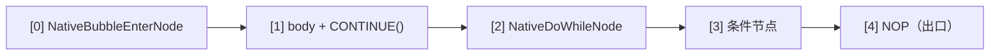

# 原生控制流

AmritaSense v0.5.1 引入的**原生控制流指令集**——`NATIVE_IF`、`NATIVE_WHILE`、`NATIVE_DO`、`BREAK_LOOP` 和 `CONTINUE`——是传统 `IF`/`WHILE`/`DO` 控制流指令的**正交扩展**。

v0.6.0 起循环机制被重新设计：循环体统一以 `CONTINUE()`（工厂函数）结尾，`BREAK_LOOP()` 改为工厂函数，`RET_FAR` **不再参与**原生循环。

## 设计理念

原生指令**不是**传统指令的性能替代品，而是它们的**正交扩展**。两者的核心差异在于底层实现模式：

|                 | 传统指令 (`IF`/`WHILE`/`DO`)        | 原生指令 (`NATIVE_IF`/`NATIVE_WHILE`/`NATIVE_DO`) |
| --------------- | ----------------------------------- | ------------------------------------------------- |
| 底层机制        | `call_sub`（嵌套调用 + 自动栈管理） | `PUSH / JMP / CONTINUE / BREAK_LOOP`（指针操作） |
| 分支体进入      | 解释器自动管理调用栈                | 开发者显式控制跳转和返回                          |
| Bubble 体返回   | 自动（`call_sub` 自带返回）         | IF/ELSE 自然回退（`advance_pointer`）；循环用 `CONTINUE` |
| 循环跳出        | 抛出 `BreakLoop` 异常               | `BREAK_LOOP()` 指令（弹栈 + 跳到出口哨兵）       |
| 跳过本轮剩余    | N/A                                 | `CONTINUE()` 指令（弹栈 + 跳到循环头）           |
| 适用场景        | 常规控制流，开箱即用                | 精确指针控制、更少的 call_sub 嵌套层级            |

> **DI 与中间件是解释器级别的**——原生指令**不会**绕过它们。无论节点是通过 `call_sub` 还是原生指针跳转到达，都会经由 `_call()` 执行，依赖注入与中间件钩子在两条路径上同样生效。原生指令省去的是 *`call_sub` 的额外嵌套层*（锁/栈簿记），而不是 DI 或中间件。

> **CONTINUE 与 BREAK_LOOP 的职责分离**：
>
> - `CONTINUE()`：本轮迭代的终点。编译器**总是**在每个循环体末尾自动插入一个 `CONTINUE()` 作为兜底——你无需手动编写。如果你想提前结束本轮（跳过剩余节点直接进入下一轮），可以在中途手动插入 `CONTINUE()`。
> - `BREAK_LOOP()`：专用于终止循环。它弹掉循环进入时压入的返回地址，然后直接跳到循环体的出口哨兵（`NOP`），干净地结束整个循环。
>
> 两者都会弹 `_ret_addr_stack` 并 `jump_far_ptr` 到**编译期配置**的目标位置（由外层循环的 `extract()` 通过 DFS 扫描器设置）——你永远不需要手动指定地址。

## NATIVE_IF

`NATIVE_IF` 的 API 与传统 `IF` 完全一致，支持 `ELIF` / `ELSE` 链式调用：

```python
NATIVE_IF(cond, body)                          # 纯 IF
NATIVE_IF(cond, body).ELSE(else_body)          # IF-ELSE
NATIVE_IF(cond, body).ELIF(cond2, body2)       # IF-ELIF 链
NATIVE_IF(cond, body).ELIF(cond2, body2).ELSE(else_body)  # 完整链
```

### 单节点分支体

当 `body` 是单个 `BaseNode` 时，编译期识别为 `_is_single=True`，分支体通过 `call_offset` 调用——零额外开销，行为与传统指令一致：

```python
NATIVE_IF(check_condition, my_action).ELSE(my_fallback)
```

编译布局（以单 IF 为例）：


### Bubble 分支体

当 `body` 是 `NodeCompose` 时，编译器将其包裹为 **Bubble**（嵌套容器）。v0.6.0 起 Bubble **不再带 `RET_FAR`**——它通过 `advance_pointer` 自然回退到汇合点，与 Python 的 `if`/`else` 块完全一致（没有提前返回语义）：

```python
NATIVE_IF(cond, step_a >> step_b).ELSE(fallback_a >> fallback_b)
```

编译布局：


执行流程：条件为真 → `JMP` 进入 Bubble → Bubble 执行完毕 → `advance_pointer` 弹回汇合点（`[3]` NOP）。

### ELIF / ELSE 链展开

每个 `ELIF` 在编译期追加一组 `[NativeIfJumpNode, cond, body_slot]` 三元组。IF/ELIF 的 Bubble 与 `ELSE` 的 Bubble 都是不带返回指令的普通嵌套容器——所有分支自然流入汇合点，与 Python 的 `if`/`elif`/`else` 语义一致。

## NATIVE_WHILE

`NATIVE_WHILE` 采用与传统 `WHILE` 相同的语义——**先判断条件，再执行循环体**：

```python
NATIVE_WHILE(condition).ACTION(body)
```

### 循环体（单节点与 Bubble 同一路径）

```python
NATIVE_WHILE(check_alive).ACTION(heartbeat)          # 单节点
NATIVE_WHILE(cond).ACTION(step_a >> step_b)          # Bubble
```

v0.6.0 起，单节点与 Bubble 循环体走**同一代码路径**：循环体总是被包装为 `NodeCompose(body, CONTINUE())`，通过末尾的 `CONTINUE()` 完成迭代。

编译布局：


运行时 `NativeWhileNode` 是纯跳转：条件真 → `PUSH` 自身地址 `[0]` → `jump_far_ptr` 进入循环体；条件假 → `jump_near(3)` 到出口。循环体末尾的 `CONTINUE()` 弹栈后 `jump_far_ptr` 回到 `[0]`，重新判断条件。

### 跳出循环：BREAK_LOOP()

`WHILE` 循环体内不能像传统 `WHILE` 那样抛 `BreakLoop` 异常——原生指令没有包裹 try/except。取而代之的是 **`BREAK_LOOP()` 指令**：

```python
NATIVE_WHILE(cond).ACTION(
    step_a
    >> BREAK_LOOP()
    >> step_b
)
```

`BREAK_LOOP()` 的工作原理：

1. `_ret_addr_stack.pop()` 清理 `NativeWhileNode` 压入的返回地址
2. 从弹出的 `PointerVector` 推导外层 Bubble 的父地址
3. `jump_far_ptr([*parent, break_pos])` 跳到出口哨兵 `NOP`——`break_pos` 由外层循环的 `extract()`（DFS 扫描器）在编译期配置

### 继续下一轮：CONTINUE()

想跳过本轮剩余节点、直接回到循环头（重新判断条件）时，使用 `CONTINUE()`：

```python
NATIVE_WHILE(cond).ACTION(
    step_a
    >> CONTINUE()   # 跳过 step_b，开始下一轮
    >> step_b
)
```

`CONTINUE()` 弹栈后 `jump_far_ptr` 到循环头（`NATIVE_WHILE` 为 `[0]`，`NATIVE_DO` 为 `[2]`）。与 `RET_FAR` 不同——后者用 `rebase_ptr` 依赖自然 `advance_pointer`——`CONTINUE` 是直接跳转，会设置跳转标记，目标节点立即执行。

## NATIVE_DO

`NATIVE_DO` 确保**循环体至少执行一次**，然后检查条件决定是否继续：

```python
NATIVE_DO(body).WHILE(condition)
```

### 循环体（单节点与 Bubble 同一路径）

```python
NATIVE_DO(send_request).WHILE(should_retry)         # 单节点
NATIVE_DO(step_a >> step_b).WHILE(cond)             # Bubble
```

与 `NATIVE_WHILE` 相同，循环体总是被包装为 `NodeCompose(body, CONTINUE())`。

编译布局：



初次进入：`NativeBubbleEnterNode` PUSH `[0]`（自身地址），JMP 进入循环体。
循环重入：循环体末尾的 `CONTINUE()` 弹栈并 `jump_far_ptr` 到 `[2]`（do-while 节点）；条件真 → `NativeDoWhileNode` `jump_near(0)`，再次触发 `NativeBubbleEnterNode` PUSH + JMP 进入循环体。
循环退出：条件假 → `jump_near(4)` 到 NOP 出口。或者 `BREAK_LOOP()` 主动跳出。

> **语义对齐**：v0.6.0 重构后，DO 和 WHILE 的循环体行为完全一致——两者都统一以 `CONTINUE()` 结尾，`BREAK_LOOP()` / `CONTINUE()` 统一弹栈跳转。

## 选用指南

| 场景                                | 推荐                                         |
| ----------------------------------- | -------------------------------------------- |
| 常规控制流，开箱即用                | 传统 `IF` / `WHILE` / `DO`                   |
| 性能敏感路径，减少嵌套层级          | `NATIVE_WHILE` / `NATIVE_DO` / `NATIVE_IF`   |
| 需要精确控制指针跳转行为            | `NATIVE_*`（纯跳转模型）                     |
| 需要异常穿透（`exception_ignored`） | 传统指令                                     |
| 循环内需要条件跳出                  | 传统：`raise BreakLoop` / 原生：`BREAK_LOOP()`|
| 跳过本轮直接下一轮                  | 原生：`CONTINUE()`（传统指令无对应物）       |

原生指令与传统指令可以**在同一工作流中自由混用**——它们是同一套指针向量和调用栈体系上的不同抽象层级。
