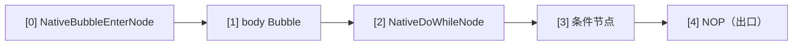

# 原生控制流

AmritaSense v0.5.1 引入的**原生控制流指令集**——`NATIVE_IF`、`NATIVE_WHILE`、`NATIVE_DO` 和 `BREAK_LOOP`——是传统 `IF`/`WHILE`/`DO` 控制流指令的**正交扩展**。

## 设计理念

原生指令**不是**传统指令的性能替代品，而是它们的**正交扩展**。两者的核心差异在于底层实现模式：

|                 | 传统指令 (`IF`/`WHILE`/`DO`)        | 原生指令 (`NATIVE_IF`/`NATIVE_WHILE`/`NATIVE_DO`) |
| --------------- | ----------------------------------- | ------------------------------------------------- |
| 底层机制        | `call_sub`（锁 + 中间件 + DI 解析） | `PUSH / JMP / RET_FAR`（纯指针操作）              |
| 分支体进入      | 解释器自动管理调用栈                | 开发者显式控制跳转和返回                          |
| Bubble 体返回   | 自动（`call_sub` 自带返回）         | 编译器自动追加 `RET_FAR` 兜底                     |
| 循环跳出        | 抛出 `BreakLoop` 异常               | `BREAK_LOOP` 指令（弹栈 + 跳到出口哨兵）          |
| 提前退出 Bubble | N/A                                 | 手动 `RET_FAR`（编译器总在末尾兜底，可选）        |
| 适用场景        | 常规控制流，开箱即用                | 需要精确控制指针、跳过中间件/DI 的场景            |

> **RET_FAR 与 BREAK_LOOP 的职责分离**：
>
> - **`RET_FAR`**：Bubble 执行的终点。编译器**总是**在每个 Bubble 体的末尾自动插入一个 `RET_FAR` 作为兜底——你无需手动编写。如果你想提前退出 Bubble（不执行后续节点），可以在中途手动插入 `RET_FAR`。
> - **`BREAK_LOOP`**：专用于终止循环。它弹掉循环进入时压入的返回地址，然后直接跳到父层 Bubble 的出口哨兵（`NOP`），干净地结束整个循环。
>
> 如果没有 `BREAK_LOOP`，循环体内的 `RET_FAR` 只会弹栈并返回到循环条件节点，导致循环继续——它无法终止循环。

## NATIVE_IF

`NATIVE_IF` 的 API 与传统 `IF` 完全一致，支持 `ELIF` / `ELSE` 链式调用：

```python
NATIVE_IF(cond, body)                          # 纯 IF
NATIVE_IF(cond, body).ELSE(else_body)          # IF-ELSE
NATIVE_IF(cond, body).ELIF(cond2, body2)       # IF-ELIF 链
NATIVE_IF(cond, body).ELIF(cond2, body2).ELSE(else_body)  # 完整链
```

### 单节点分支体

当 `body` 是单个 `BaseNode` 时，编译期识别为 `_is_single=True`，分支体通过 `call_offset` 调用——零额外开销，行为与传统指令一致：

```python
NATIVE_IF(check_condition, my_action).ELSE(my_fallback)
```

编译布局（以单 IF 为例）：


### Bubble 分支体

当 `body` 是 `NodeCompose` 时，编译器将其包裹为 **Bubble**，自动在末尾追加 `RET_FAR` 作为兜底（你无需手动编写）：

```python
NATIVE_IF(cond, step_a >> step_b).ELSE(fallback_a >> fallback_b)
```

编译布局：


执行流程：条件为真 → `PUSH` 汇合点地址 → `JMP` 进入 Bubble → 执行完毕后 `RET_FAR` 弹栈回到汇合点。

### ELIF / ELSE 链展开

每个 `ELIF` 在编译期追加一组 `[NativeIfJumpNode, cond, body_slot]` 三元组。`ELSE` 分支体通过 `NativeBubbleEnterNode`（无 `ret_pos`，不压栈）自然流入汇合点。

## NATIVE_WHILE

`NATIVE_WHILE` 采用与传统 `WHILE` 相同的语义——**先判断条件，再执行循环体**：

```python
NATIVE_WHILE(condition).ACTION(body)
```

### 单节点循环体

```python
NATIVE_WHILE(check_alive).ACTION(heartbeat)
```

编译布局：


`call_offset` 调用条件 → 真：`call_offset` 调用 body → `jump_near(0)` 回到 while 节点重新判断 → 假：`jump_near(3)` 跳到出口。

### Bubble 循环体

```python
NATIVE_WHILE(cond).ACTION(step_a >> step_b)
```

编译器在 Bubble 末尾追加 `RET_FAR`。运行时 `NativeWhileNode` 在进入 Bubble 前 `PUSH` 自身地址 `[0]`，这样 `RET_FAR` 弹栈后回到条件重新判断。

### 跳出循环：BREAK_LOOP

`WHILE` 的 Bubble 体内不能像传统 `WHILE` 那样抛 `BreakLoop` 异常——原生指令没有包裹 try/except。取而代之的是 **`BREAK_LOOP` 指令**：

```python
NATIVE_WHILE(cond).ACTION(
    step_a
    >> BREAK_LOOP
    >> step_b
)
```

`BREAK_LOOP` 的工作原理：

1. 获取当前指针地址 `[a, b, c]`
2. 寻址父层 Bubble `[a]` 得到 `NodeComposeRendered`
3. 计算目标地址：`len(父Bubble) - 1`（父层最后一个节点，即 `NOP` 出口）
4. `_ret_addr_stack.pop()` 清理 `NativeWhileNode` 压入的返回地址
5. `jump_far_ptr` 跳到出口

> 单节点循环体不需要 `BREAK_LOOP`——在 body 函数中 `return` 即自然结束本轮，条件假时跳出。

## NATIVE_DO

`NATIVE_DO` 确保**循环体至少执行一次**，然后检查条件决定是否继续：

```python
NATIVE_DO(body).WHILE(condition)
```

### 单节点循环体

```python
NATIVE_DO(send_request).WHILE(should_retry)
```

编译布局：


`NativeDoWhileNode` 构造参数：`condi_offset=1, loop_pos=0, exit_pos=3`。

body 先执行 → `call_offset` 调用条件 → 真：`jump_near(0)` 回到 body → 假：`jump_near(3)` 离开。

### Bubble 循环体

```python
NATIVE_DO(step_a >> step_b).WHILE(cond)
```

编译布局：



初次进入：`NativeBubbleEnterNode` PUSH `[2]`（do-while 节点地址），JMP 进入 body Bubble。
循环重入：条件真 → `NativeDoWhileNode` 无条件 `jump_near(0)`，再次触发 `NativeBubbleEnterNode` PUSH + JMP。
循环退出：条件假 → `jump_near(4)` 到 NOP 出口。或者 `BREAK_LOOP` 主动跳出。

> **语义对齐**：v0.5.1 重构后，DO 和 WHILE 的 Bubble 体行为完全一致——两者都需要 `PUSH` + `RET_FAR`，`BREAK_LOOP` 统一弹栈跳出。

## 选用指南

| 场景                                | 推荐                                         |
| ----------------------------------- | -------------------------------------------- |
| 常规控制流，需要依赖注入/中间件     | 传统 `IF` / `WHILE` / `DO`                   |
| 高性能敏感路径，跳过多余开销        | `NATIVE_*` 单节点模式                        |
| 需要精确控制指针跳转行为            | `NATIVE_*` Bubble 模式                       |
| 需要异常穿透（`exception_ignored`） | 传统指令                                     |
| 循环内需要条件跳出                  | 传统：`raise BreakLoop` / 原生：`BREAK_LOOP` |

原生指令与传统指令可以**在同一工作流中自由混用**——它们是同一套指针向量和调用栈体系上的不同抽象层级。
