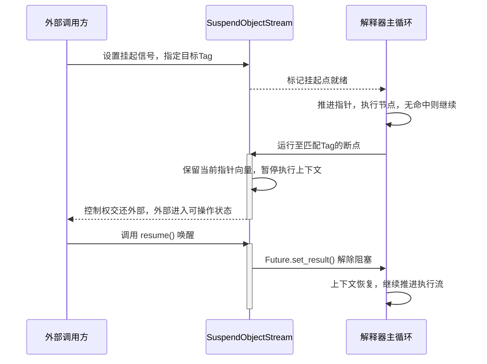

# 执行与中断

在复杂的工作流场景中，仅仅能“执行”是不够的。我们需要在必要时让执行流暂停下来，接受外部检查或干预，然后继续运行。AmritaSense 将这种能力内建在解释器核心之中。

## 3.4.1 中断机制概述

在 AmritaSense 体系中，存在**外部主动请求内部执行流，在指定位置挂起**的能力。这种机制我们称之为**流程中断**。

与操作系统级别的抢占式中断不同，AmritaSense 的中断是**协作式**的：执行流会一直运行，直到抵达一个预设的挂起点（Tag 标记点），然后主动让出控制权，等待外部唤醒。

工作流解释器内置了两类原生挂起点：

1. **节点间断点**（`WorkflowInterpreter::each_node` 全局钩子）：位于每个节点执行完毕、下一个节点开始之前。
2. **执行前断点**（`NodeSuspend::{节点函数名}` 或自定义 Tag 字符串）：位于某个特定节点被加载后、正式执行其函数体之前。

这两个断点的设计定位和可用能力完全不同，下文会逐一拆解。

## 3.4.2 挂起操作的交互模型

挂起逻辑将交互双方分为两种角色：

- **等待者（内部执行流）**：监听外部下发的挂起指令，在抵达标记点时主动挂起，交出控制权。
- **操作者（外部调用方）**：主动发起挂起请求，等待执行流在指定标记点暂停，完成干预后唤醒执行流继续运行。

底层能力全部由 `SuspendObjectStream` 基类提供，它同时也是 AmritaCore 与 AmritaSense 共享的流控基础设施。交互依赖以下两个核心机制：

1. **等待者逻辑**
   解释器在执行过程中，持续检查是否存在外部预设的挂起信号。若检测到当前标记点匹配了外部指定的 Tag 或全局钩子，则创建一个专属的等待 Future，将当前执行上下文（包含指针向量和调用栈）完整保留，然后阻塞执行流，等待外部唤醒信号。

2. **操作者逻辑**
   外部调用方预先在 `SuspendObjectStream` 实例上设置挂起信号（指定一个或多个目标 Tag），然后进入等待状态。当内部执行流运行至匹配的标记点并交出控制权时，操作者被唤醒。此时操作者可以安全地检查工作流状态、修改变量或指针，然后通过 `resume()` 方法解除内部等待 Future，唤醒执行流继续向下运行。

### 挂起完整交互时序图

## 3.4.3 事件系统与自定义钩子

AmritaSense 还提供了与工作流执行并行的运行时事件/钩子系统。自定义事件通过继承 `BaseEvent` 定义，处理器通过 `on_event(event_type)` 注册，事件通过 `MatcherFactory.trigger_event(...)` 触发。

完整的事件与钩子系统说明请参见单独的进阶文档页：`进阶 > 事件系统`。

## 3.4.3 节点间断点

**触发时机：** 每个节点执行完毕，解释器进入下一轮循环，在推进指针、寻址完成之后，正式执行下一个节点之前。

**定位标识：** `WorkflowInterpreter::each_node`。

这是最通用、最全局的挂起点。因为它位于节点与节点之间的间隙，不依赖于任何一个特定节点的标识，所以外部调用方可以在不关心工作流内部结构的情况下，实现“每一步都暂停”的单步调试效果。

在此挂起点暂停时，开发者可以在窗口期内进行以下操作：

- 查看或修改指针向量的当前值（决定下一步执行谁）
- 重定向后续运行目标节点

此时解释器处于稳定的“节点间”状态：上一个节点已完整执行完毕，下一个节点尚未开始，所有内部状态是一致的。

::: warning
在此时如果要重定向目标，请务必**直接操作指针**，不要使用标准跳转API，否则会导致状态混乱。
:::

## 3.4.5 执行前断点

**触发时机：** 某个特定节点被寻址加载后，正式执行其函数体之前。

**定位标识：** 默认为 `NodeSuspend::{节点函数名}`，也可通过自定义 Tag 字符串标记。

这是一个**节点维度特化**的专属前置断点。与节点间断点不同，它在执行流已经定位到具体节点、但尚未运行该节点逻辑的那一刻触发。

在此位置挂起时有几个重要特性：

- 全局完整地址快照已经保留，外部可以看到当前即将执行的节点
- 当前记录的地址，是**将要运行的节点地址**，而非上一次执行过的节点地址
- 此时节点本体虽已加载，但如果在此处强行直接推进指针，会破坏解释器的内部一致性，导致寻址越界或解析错误

::: warning
因此，在该断点内进行任何跳转或修改操作，**必须严格使用解释器提供的官方跳转 API**（如 `jump_to`、`jump_near` 等），让解释器通过标准流程更新内部状态，而非直接操纵指针向量。
:::

## 3.4.6 流程强制中断

除了上述协作式挂起机制外，AmritaSense 还提供了一种**紧急终止**手段：`InterruptNotice`。

当 `InterruptNotice` 被主动抛出时，将产生以下效果：

- **无视当前执行条件、嵌套深度与循环上下文**：无论工作流处于多少层 Bubble 嵌套内部，或正在执行哪个循环体，都会被立即穿透。
- **被工作流解释器全局无条件捕获**：解释器主循环在最外层专门捕获此通知，一旦捕获，立即进入清理流程。
- **直接无条件终止整条运行链路**：所有嵌套的调用栈被清空，指针向量被重置，工作流干净利落地退出。

使用方式有两种：

1. **外部直接抛出**：外部调用方在任意异步上下文中直接 `raise InterruptNotice()`，解释器会在下一次节点边界捕获该异常，并立即终止工作流。
2. **在工作流编排中插入 `INTERRUPT` 节点**：当工作流执行到 `INTERRUPT` 节点时，节点内部自动抛出 `InterruptNotice`。这允许开发者在工作流逻辑本身中预设紧急退出点，例如在错误处理分支中触发无条件终止。

> **与流程挂起的区别**
> 流程挂起（Suspend）是可恢复的——执行流暂停后可以通过 `resume()` 继续。而 `InterruptNotice` 是**不可恢复的终止**——一旦触发，当前工作流彻底结束，无法从终止点恢复运行。如果需要在终止后重新执行，必须重新渲染工作流并创建新的解释器实例。

## 3.4.7 总结

AmritaSense 的流程中断体系，从轻量级的协作式挂起到全局的强制终止，构成了一套完整的运行时控制矩阵。这套体系的核心价值在于：

- **可调试性**：开发者可以在任意节点边界暂停、检查状态、单步执行
- **可干预性**：外部系统可以在关键节点注入检查、修改或重定向逻辑
- **安全性**：紧急情况下可以无条件终止工作流，避免资源泄漏或逻辑错误蔓延

在进阶章节中，我们将进一步探讨如何利用这套中断机制，结合解释锁与外部调用，构建全功能的调试器和外部监控系统。
