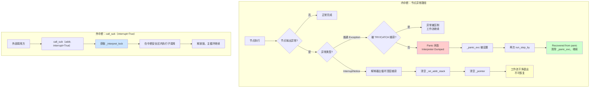
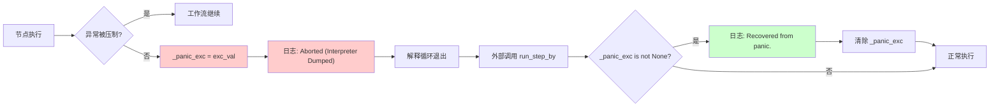
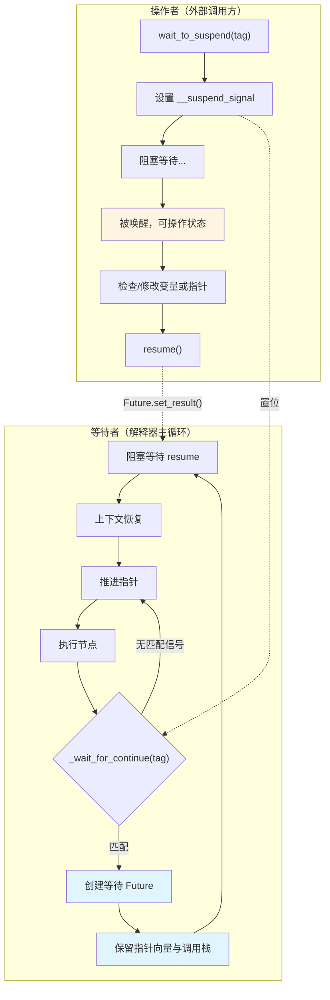
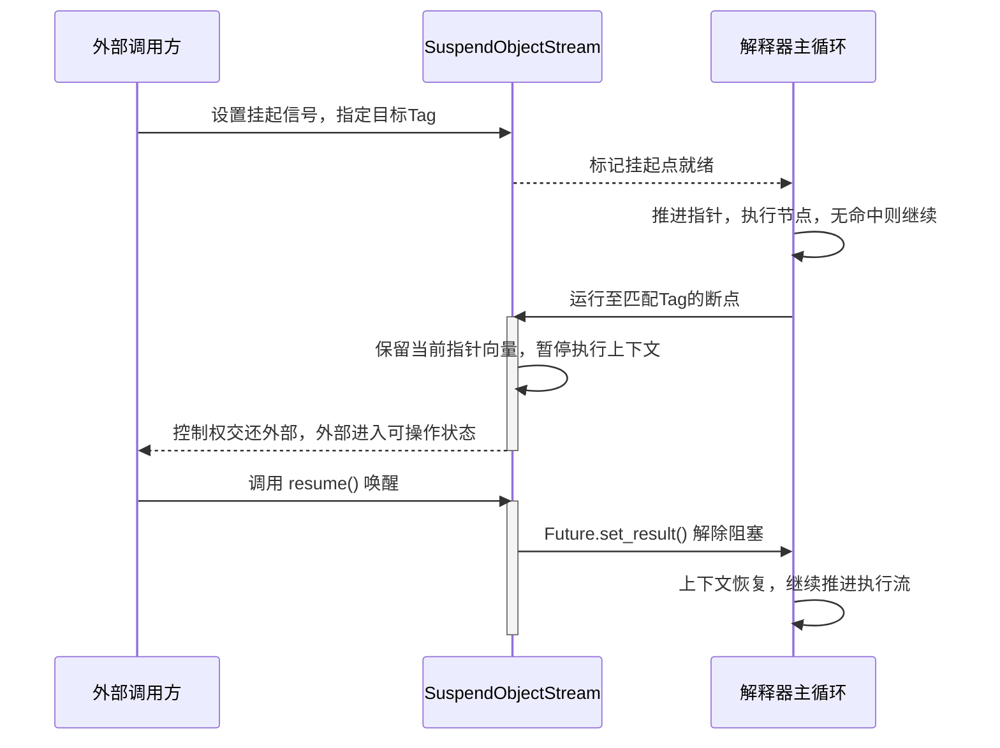

# 执行与中断

在复杂的工作流场景中，仅仅能“执行”是不够的。我们需要在必要时让执行流暂停下来，接受外部检查或干预，然后继续运行。AmritaSense 将这种能力内建在解释器核心之中。

## 3.4.1 中断机制概述

AmritaSense 解释器的中断体系分为两种本质不同的模式：

| 模式                             | 触发源                                                         | 可控性                                                                                  | 后果                                                                                                  |
| -------------------------------- | -------------------------------------------------------------- | --------------------------------------------------------------------------------------- | ----------------------------------------------------------------------------------------------------- |
| **内中断**（Internal Interrupt） | 节点内部抛出异常（含 `InterruptNotice`）                       | 普通异常可被 `TRY`/`CATCH` 压制；`InterruptNotice`（`BaseException`）内部**完全不可控** | 普通异常未捕获 -> **Panic 状态**（Interpreter Dumped）；`InterruptNotice` -> 清空栈与指针，工作流终止 |
| **外中断**（External Interrupt） | 外部通过 `call_sub(interrupt=True)` 在解释器周期中途注入子调用 | **外部驱动，内部无法控制**                                                              | 子调用在解释锁保护下执行，与主循环序列化                                                              |



两种中断模式通过同一个解释锁（`_interpret_lock`）协调：

- **内中断**：解释器主循环在获取 `_interpret_lock` 后执行节点；节点异常在锁内抛出，沿正常异常路径传播。
- **外中断**：`call_sub(interrupt=True)` 同样获取 `_interpret_lock` 后执行子调用，与主循环序列化；`interrupt=False` 则绕过锁，子调用运行在非中断安全区。

## 3.4.2 内中断（Internal Interrupt）—— 节点异常体系

内中断来自**工作流内部**。任何一个节点在执行过程中抛出的异常，都属于内中断范畴。根据异常类型，内中断分为两条路径。

### 路径一：可压制异常（普通 `Exception` 子类）-> Panic / Recover

普通异常（继承自 `Exception`）可被工作流中的 `TRY`/`CATCH` 块压制。AmritaSense 提供两种压制手段：

1. **`TRY`/`CATCH` 工作流节点**：在编排中显式指定哪些异常类型应被捕获并压制。被捕获的异常不会导致流程终止。
2. **`exception_ignored` 初始化参数**：在构造 `WorkflowInterpreter` 时传入一个异常类型元组。这些类型的异常将**绕过所有 TRY/CATCH 块**，直达解释器顶层。

```python
from amrita_sense.runtime import WorkflowInterpreter

# ValueError 和 TypeError 将不被任何 TRY/CATCH 捕获
interpreter = WorkflowInterpreter(
    workflow,
    exception_ignored=(ValueError, TypeError),
)
```

> **注意**：`InterruptNotice` 和 `BreakLoop` 默认加入 `exception_ignored`（除非设置 `DISABLE_EXC_IGNORED` 标志），确保它们不被意外吞没。

**Panic 与 Recover 的完整流程**：



进入 Panic 后关键状态：

- `_panic_exc`：记录导致 Panic 的异常对象（可通过 `interpreter.get_exception()` 查询）
- `_waiter_fut`：被设置为异常状态（`set_exception(exc_val)`）
- 指针向量和调用栈：**保留**在异常发生时的状态（不清空）

```python
try:
    await interpreter.run()
except Exception as e:
    exc = interpreter.get_exception()
    print(f"Panic caused by: {exc}")
    # 修复问题后重新运行
    await interpreter.run()  # 日志将显示 "Recovered from panic."
```

### 路径二：不可压制异常（`InterruptNotice`）-> 流程终止

`InterruptNotice` 继承自 `BaseException` 而非 `Exception`：

```python
class InterruptNotice(BaseException):
    """Exception raised to signal an interrupt in workflow execution."""
    def __init__(self, message: str | None = None):
        self.message = message
```

因为 Python 中 `except Exception` 不捕获 `BaseException` 子类，所以：

- 工作流中任何 `TRY` 节点**无法**压制 `InterruptNotice`
- 节点内部的 `try/except Exception` **无法**捕获它
- 只有解释器主循环的最外层 `except InterruptNotice` 才会响应

**触发方式**：

1. **外部直接抛出**：

   ```python
   from amrita_sense.exceptions import InterruptNotice
   raise InterruptNotice("Timeout: workflow exceeded time limit")
   ```

   解释器在下一个节点边界捕获此异常。

2. **工作流中插入 `INTERRUPT` 节点**：
   ```python
   from amrita_sense.instructions import INTERRUPT
   workflow = Sequence(
       StepA(),
       Branch(If(condition=is_error, then=INTERRUPT), Else(...))
   )
   ```
   `INTERRUPT` 是一个 `address_able=False` 的特殊节点，执行时直接抛出 `InterruptNotice("Interrupt Node")`。

**InterruptKeepContext（v0.4.x+）**

`InterruptKeepContext` 是 `InterruptNotice` 的子类，提供**保留上下文**的变体。解释器捕获后不调用 `reset()`，而是保留指针、调用栈和依赖注入参数。可在同一解释器上再次调用 `run()` 恢复执行。

| 异常                   | 捕获后                    | 可恢复     | 对应节点             |
| ---------------------- | ------------------------- | ---------- | -------------------- |
| `InterruptNotice`      | `reset()` — 清空所有状态  | ❌         | `INTERRUPT`          |
| `InterruptKeepContext` | 跳过 `reset()` — 状态保留 | ✅ `run()` | `INTERRUPT_KEEP_CTX` |

**触发方式**：

1. 在工作流中插入 `INTERRUPT_KEEP_CTX` 节点（从 `amrita_sense.instructions.workfl_ctrl` 导入）
2. 从节点代码中直接 `raise InterruptKeepContext()`

**解释器主循环处理流程**：

```python
except InterruptNotice as e:
    logger.info(f"Interrupt notice at {self._pointer} :{e.message}")
    self._ret_addr_stack.clear()   # 清空整个调用栈
    self._pointer.clear()          # 重置指针向量
    self._jump_marked = False      # 清除跳转标记
```

**这是终止，不是挂起**。调用栈和指针被完全清空，工作流退出，无法从中断点恢复。如需重新执行，必须重新渲染工作流并创建新的解释器实例。

### 内中断总结

| 路径         | 异常类型                            | 可压制       | 未压制后果                  | 可恢复                  |
| ------------ | ----------------------------------- | ------------ | --------------------------- | ----------------------- |
| 可压制异常   | `Exception` 子类                    | ✅ TRY/CATCH | Panic -> Interpreter Dumped | ✅ Recovered from Panic |
| 不可压制异常 | `InterruptNotice` (`BaseException`) | ❌           | 清空栈与指针，工作流终止    | ❌                      |
| 保留上下文   | `InterruptKeepContext`              | ❌           | 保留状态，等待恢复          | ✅ 再次 `run()`         |

## 3.4.3 外中断（External Interrupt）—— `call_sub(interrupt=True)`

外中断的本质与异常无关。它通过 `call_sub(interrupt=True)` 模式，让外部调用方在解释器**每个周期的中途**注入受保护的子调用。

### 核心机制：解释锁（`_interpret_lock`）

解释器主循环在每个周期获取 `_interpret_lock` 后执行节点：

```python
while True:
    await self.object_io._wait_for_continue(PC_CHECKPOINT)  # 协作挂起点（锁外）
    # ...
    async with self._interpret_lock:   # 进入中断安全区
        yield await self._call()       # 执行节点
```

外部调用 `call_sub(interrupt=True)` 时，调用方与主循环围绕 `_interpret_lock` 的竞争关系：

```mermaid
flowchart TB
    subgraph Main["解释器主循环"]
        A["_wait_for_continue()（锁外）"] --> B["async with _interpret_lock:"]
        B --> C[_call() 执行节点]
        C --> D[释放锁]
        D --> A
    end

    subgraph Ext["外部调用方"]
        E["call_sub(addr, interrupt=True)"] --> F{锁是否空闲?}
        F -->|否| G[等待]
        G --> F
        F -->|是| H["async with _interpret_lock:"]
        H --> I[_call() 执行子调用]
        I --> J[释放锁]
    end

    B -.->|互斥| H

    style B fill:#cce5ff
    style H fill:#cce5ff
```

| `interrupt` 值  | 行为                                | 语义                                                               |
| --------------- | ----------------------------------- | ------------------------------------------------------------------ |
| `True`          | 获取 `_interpret_lock` 后执行子调用 | 子调用在**中断安全区**内运行——与主循环序列化，外部可在周期中途注入 |
| `False`（默认） | 绕过锁，直接执行子调用              | 子调用在**非中断安全区**运行，适合不需要外部干预的内部辅助调用     |

### 为什么称为"外中断"？

当 `interrupt=True` 时，子调用的执行时机由**外部调用方**决定——外部在解释器周期的任意时刻发起 `call_sub(interrupt=True)`，子调用会等待获取 `_interpret_lock`（与主循环竞争同一把锁），然后执行。内部代码对此**完全无法控制**。

与 `InterruptNotice`（仍然是从内部抛出的异常）不同，`call_sub(interrupt=True)` 是真正意义上的**外部驱动中断**：外部决定了中断的时机、内容和持续时间。

### 设计意义

- **挂起检查发生在锁之外**：每个周期开始前先检查是否需要挂起（`_wait_for_continue`），不占用锁
- **节点执行在锁之内**：确保节点执行期间状态一致性
- **外中断与主循环互斥**：同一时刻只有一个在锁内运行，保证状态安全

## 3.4.4 挂起操作的交互模型（协作式挂起点）

与上述中断（终止性）不同，挂起是**可恢复的**。底层能力全部由 `SuspendObjectStream` 基类提供。

挂起逻辑将交互双方分为两种角色。下面以 `wait_to_suspend -> 节点边界命中 -> resume` 的完整流程展示双方交互：



### 挂起完整交互时序图



> **有状态与无状态的区分**
>
> - **`SuspendObjectStream` 持有挂起信号（有状态）**：当外部调用 `wait_to_suspend()` 时，一个挂起信号（`__suspend_signal` Future）被写入 SoS 实例并**持续存在**，直到被匹配的断点消费。SoS"记住"了挂起意图。
> - **解释器轮询检查挂起信号（无状态）**：解释器在每个时钟周期（节点边界）对 SoS 做一次瞬时检查——当前周期是否命中了挂起信号？命中则阻塞，未命中则推进指针进入下一节点。周期与周期之间，解释器本身不保留任何"我等待被挂起"的状态。
>
> 因此，**挂起信号是持久状态，而中断检查是瞬时动作**。正因为 SoS 有状态地持有信号，`wait_to_suspend()` 可以在解释器启动之前、之中或之后的任何时刻调用——只要信号在 SoS 上置位，解释器在下一个节点边界就会命中。

## 3.4.5 节点间断点

**触发时机：** 每个节点执行完毕，解释器进入下一轮循环，在推进指针、寻址完成之后，正式执行下一个节点之前。

**定位标识：** `WorkflowInterpreter::each_node`（常量 `PC_CHECKPOINT`）。

这是最通用、最全局的挂起点。因为它位于节点与节点之间的间隙，不依赖于任何一个特定节点的标识，所以外部调用方可以在不关心工作流内部结构的情况下，实现“每一步都暂停”的单步调试效果。

在此挂起点暂停时，开发者可以在窗口期内进行以下操作：

- 查看或修改指针向量的当前值（决定下一步执行谁）
- 重定向后续运行目标节点

此时解释器处于稳定的“节点间”状态：上一个节点已完整执行完毕，下一个节点尚未开始，所有内部状态是一致的。

::: warning
在此时如果要重定向目标，请务必**直接操作指针**，不要使用标准跳转API，否则会导致状态混乱。
:::

## 3.4.6 执行前断点

**触发时机：** 某个特定节点被寻址加载后，正式执行其函数体之前。

**定位标识：** 默认为 `NodeSuspend::{节点函数名}`，也可通过自定义 Tag 字符串标记。

这是一个**节点维度特化**的专属前置断点。与节点间断点不同，它在执行流已经定位到具体节点、但尚未运行该节点逻辑的那一刻触发。

在此位置挂起时有几个重要特性：

- 全局完整地址快照已经保留，外部可以看到当前即将执行的节点
- 当前记录的地址，是**将要运行的节点地址**，而非上一次执行过的节点地址
- 此时节点本体虽已加载，但如果在此处强行直接推进指针，会破坏解释器的内部一致性，导致寻址越界或解析错误

::: warning
因此，在该断点内进行任何跳转或修改操作，**必须严格使用解释器提供的官方跳转 API**（如 `jump_to`、`jump_near` 等），让解释器通过标准流程更新内部状态，而非直接操纵指针向量。
:::

## 3.4.7 事件系统与自定义钩子

AmritaSense 还提供了与工作流执行并行的运行时事件/钩子系统。自定义事件通过继承 `BaseEvent` 定义，处理器通过 `on_event(event_type)` 注册，事件通过 `MatcherFactory.trigger_event(...)` 触发。

完整的事件与钩子系统说明请参见单独的进阶文档页：`进阶 > 事件系统`。

## 3.4.8 总结

AmritaSense 的流程中断体系，涵盖了从节点级异常到外部强制终止的完整控制谱系：

| 机制                                     | 类型 | 可恢复                 | 触发源              | 可控性                     |
| ---------------------------------------- | ---- | ---------------------- | ------------------- | -------------------------- |
| 协作式挂起（`wait_to_suspend`/`resume`） | 挂起 | ✅ 可恢复              | 外部主动            | 内部协作                   |
| 内中断·可压制（节点异常 -> Panic）       | 中断 | ✅ 可通过 Recover 恢复 | 节点内部            | 可通过 TRY/CATCH 压制      |
| 内中断·不可压制（`InterruptNotice`）     | 中断 | ❌ 不可恢复            | 节点内部 / 外部抛出 | 内部完全不可控             |
| 外中断（`call_sub(interrupt=True)`）     | 中断 | 无"恢复"概念           | 外部调用方          | 内部完全不可控，由锁序列化 |

这套体系的核心价值在于：

- **可调试性**：开发者可以在任意节点边界暂停、检查状态、单步执行
- **可干预性**：外部系统可以在关键节点注入检查、修改或重定向逻辑（通过外中断 `call_sub`）
- **容错性**：Panic + Recover 模式允许普通异常后的优雅恢复
- **安全性**：紧急情况下通过 `InterruptNotice` 终止工作流；通过外中断锁机制保证状态一致性

在进阶章节中，我们将进一步探讨如何利用这套中断机制，结合解释锁与外部调用，构建全功能的调试器和外部监控系统。
