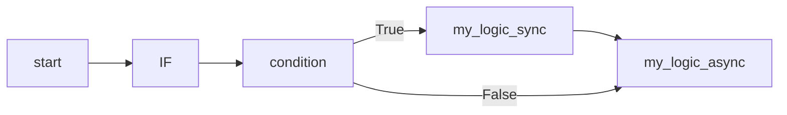

# 基本示例

在看完了最小示例，让我们来看看一个更加复杂的基本用法。

## 2.2.2 示例

### 代码

```python
import asyncio
from amrita_sense import Node, WorkflowInterpreter, IF

@Node()
async def condition() -> bool:
    ... # 假设这里是你的判断逻辑
    return True

@Node()
def my_logic_sync():
    ... # 这里是逻辑
    print("I'm a sync node")

@Node()
async def my_logic_async():
    ... # 这里是逻辑
    print("I'm an async node")


comp = IF(condition, my_logic_sync) >> my_logic_async  # IF其实可以接受同步和异步两种函数，这里只是为了演示
graph = comp.render()

interpreter = WorkflowInterpreter(graph)

if __name__ == "__main__":
    asyncio.run(interpreter.run())
```

### 解析

在这个示例中，我们展示了 AmritaSense 中的条件执行示例，接下来让我们解析一下：

- `IF`是一个条件执行节点，它接受一个条件节点（必须返回bool，需要在签名内声明）和一个 逻辑Payload 节点，如果条件节点返回True，则执行逻辑节点。
- `my_logic_sync`是一个同步函数，它将打印`“I'm an sync node”`。
- `my_logic_async`是一个异步函数，它将打印`“I'm an async node”`。

`IF`节点的逻辑执行顺序如下：



当然，`IF`也有`ELIF`与`ELSE`的用法，我们会在后续篇章中详细介绍。
