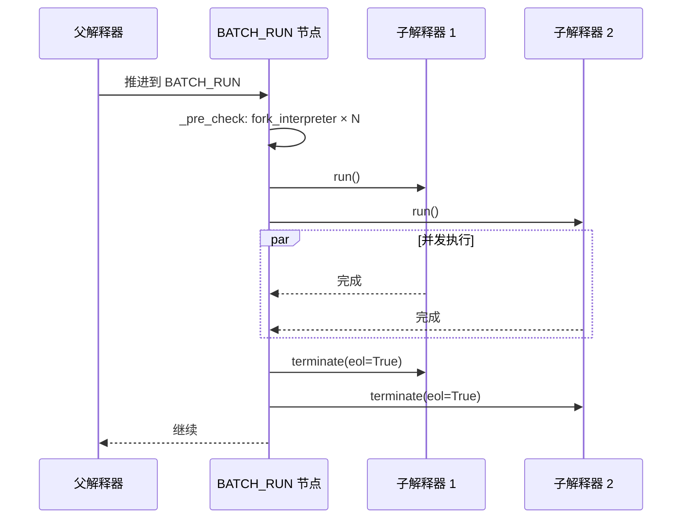

# 节点与分支并发调用

::: warning 前置阅读
在阅读本文之前，请确保你已经理解以下内容：

- **[子图隔离调用](/zh/guide/practice/subgraph-isolation)** — `FUN_BLOCK` 如何将子工作流放入独立的子解释器中执行
- **解释器树机制** — `WorkflowInterpreter` 的树形结构，包括 `fork_interpreter()`、`parent`、`sub_interpreters`、`top_interpreter`，以及 `terminate()` / `wait_all()` 等生命周期管理方法（参见[运行时系统 API](/zh/reference/api/runtime#解释器树v030)）
  :::

## 概述

`FUN_BLOCK` 将**一个**子工作流放入子解释器中**串行**执行——父解释器挂起等待，然后继续。但在实际场景中，你常常需要**同时**执行多个独立的子任务：并行调用多个微服务、批量处理数据分片、或同时执行多个互不依赖的计算分支。AmritaSense v0.4.4 引入的 **`BATCH_RUN`** 指令正是为此而生。

`BATCH_RUN` 基于解释器树的 `fork_interpreter()` 机制，为每个输入项创建一个独立的子解释器，通过 `asyncio.gather()` 并发执行，并在所有子解释器完成后统一收集结果或异常。

## `BATCH_RUN` vs `FUN_BLOCK`

| 维度       | `BATCH_RUN`                                   | `FUN_BLOCK`                |
| ---------- | --------------------------------------------- | -------------------------- |
| 执行模式   | 并发（同时启动 N 个子解释器）                 | 串行（阻塞直到子图完成）   |
| 输入       | 多个 `BaseNode` / `NodeCompose` / 自编译指令  | 单个 `NodeComposeRendered` |
| 解释器数量 | N 个子解释器                                  | 1 个子解释器               |
| 错误处理   | 收集为 `BaseExceptionGroup`，支持 `fail_fast` | 异常直接传播               |
| 适用场景   | 并行 I/O、扇出-扇入                           | 隔离的单个子任务           |

## 指令签名

```python
from amrita_sense.instructions.batch import BATCH_RUN

def BATCH_RUN(
    *nodes: BaseNode | NodeCompose | SelfCompileInstruction,
    sos_io: SuspendObjectStream | None = None,
    middleware: Callable[[WorkflowInterpreter], Awaitable[Any]] | None | object = UNSET,
    fail_fast: bool = True,
) -> BatchRun:...
```

### 参数

| 参数         | 类型                                                | 默认值  | 说明                                                    |
| ------------ | --------------------------------------------------- | ------- | ------------------------------------------------------- |
| `*nodes`     | `BaseNode \| NodeCompose \| SelfCompileInstruction` | (必填)  | 要并发执行的分支                                        |
| `fail_fast`  | `bool`                                              | `True`  | `True`：任一分支异常立即取消其余；`False`：收集所有异常 |
| `sos_io`     | `SuspendObjectStream \| None`                       | `None`  | 共享 I/O 流                                             |
| `middleware` | `Callable \| None \| UNSET`                         | `UNSET` | 子解释器中间件继承策略                                  |

### 返回值

返回一个 `BatchRun` 节点，可直接放入 `>>` 编排链中。

## 三种输入模式

内部 `_post_compile` 根据输入类型分派处理：

- **裸 `BaseNode`**：多个裸节点被收集到一个 `__BATCH_CALLER__` 解释器中
- **`NodeCompose`**：每个被独立 `.render()`，各得一个子解释器
- **`SelfCompileInstruction`**：先 `.extract()` 再 `.render()`，各得一个子解释器

三种可混合传入，内部自动分类处理。

## 执行流程



## 示例 1：并行裸节点

```python
from amrita_sense import Node, WorkflowInterpreter
from amrita_sense.instructions.batch import BATCH_RUN

@Node()
async def fetch_users() -> str:
    return "users"

@Node()
async def fetch_orders() -> str:
    return "orders"

@Node()
async def fetch_products() -> str:
    return "products"

workflow = BATCH_RUN(fetch_users, fetch_orders, fetch_products)
await WorkflowInterpreter(workflow.as_compose().render()).run()
```

三个节点在各自的子解释器中并发执行。

## 示例 2：并行子图

```python
from amrita_sense.node.core import NodeCompose

@Node()
async def validate(): ...

@Node()
async def enrich(): ...

@Node()
async def clean(): ...

@Node()
async def transform(): ...

branch_a = validate >> enrich
branch_b = clean >> transform

workflow = BATCH_RUN(branch_a, branch_b)
await WorkflowInterpreter(workflow.as_compose().render()).run()
```

## 示例 3：混合输入 + fail_fast

```python
from amrita_sense.instructions import IF

@Node()
async def check():
    return True

@Node()
async def action():
    print("condition met")

@Node()
async def side_task():
    print("side task")

workflow = BATCH_RUN(
    IF(check, action).ELIF(lambda: False, action).ELSE(action),
    side_task,
    fail_fast=False,
)
```

## 错误处理

### `fail_fast=True`（默认）

任一子解释器异常立即取消其余：

```python
workflow = BATCH_RUN(risky_node, safe_node)
# → 抛出 ExceptionGroup，safe_node 被取消
```

### `fail_fast=False`

所有子解释器运行完毕后统一报告异常：

```python
workflow = BATCH_RUN(risky_node, safe_node, fail_fast=False)
# → safe_node 正常完成，所有异常收集为 BaseExceptionGroup 抛出
```

### 用 `TRY/CATCH` 包裹

```python
from amrita_sense.instructions import TRY

@Node()
def handle_error(exc: ExceptionGroup):
    print(f"批量执行出错: {exc.exceptions}")

workflow = TRY(BATCH_RUN(risky_node, safe_node, fail_fast=False)) \
    .CATCH(ExceptionGroup, handle_error)
```

> **注意**：`BATCH_RUN` 抛出的是 `exceptiongroup.BaseExceptionGroup`（Python 标准库），请确保 `CATCH` 的类型注解与之匹配。

## 与 `FUN_BLOCK` 的组合使用

```python
sub_a = (node_a1 >> node_a2).render()
sub_b = (node_b1 >> node_b2 >> node_b3).render()

workflow = BATCH_RUN(
    FUN_BLOCK(sub_a, one_time_interp=True),
    FUN_BLOCK(sub_b, one_time_interp=True),
)
```

每个 `FUN_BLOCK` 拥有独立的中间件和错误边界，同时彼此之间并发执行。

## 生命周期管理

`BATCH_RUN` 在 `finally` 块中自动调用 `terminate(eol=True)` 清理所有子解释器。因此：

- **无需手动管理**子解释器的终止——它们会在批量执行完成后自动从解释器树中移除
- **异常安全**：即使 `asyncio.gather()` 抛出异常，`finally` 块仍然确保清理
- **嵌套安全**：`BATCH_RUN` 的子解释器也可以包含自己的 `FUN_BLOCK` 或 `BATCH_RUN`

## 注意事项

- 并发数受限于事件循环，大量分支建议分批
- 子解释器共享父级的 `SuspendObjectStream`，并发写需要 CLCA 安全
- 裸节点模式内部合并为一个解释器，适合轻量并行
- 每个分支的 DI 上下文独立（各自 `fork_interpreter`）
