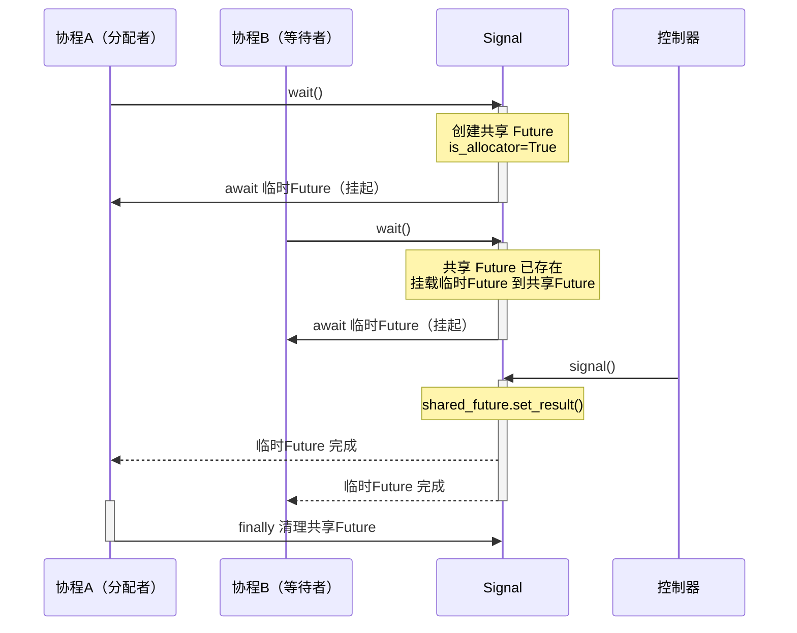
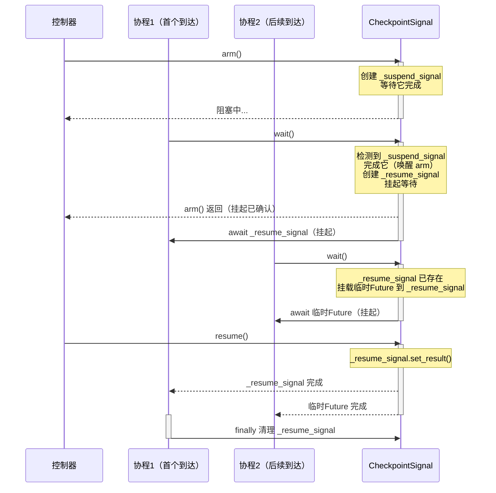

# CLCA 设计模式

在异步编程中，一个经典场景反复出现：多个协程需要同时等待同一个外部"信号"，然后一起恢复执行。这个信号可能来自用户点击按钮、一个网络请求终于返回，或者后台的工作流节点恰好完成了某个任务。

解决这类问题通常有两条路径：要么引入现成的消息队列（过于笨重），要么用 `asyncio.Event` 或共享 `Future` 手写一个简易通知机制。然而简易方案往往存在致命缺陷：直接使用共享 `Future`，每次只能有一个协程取走结果；改用 `Event` 虽然能同时唤醒多个等待者，却很难安全地跨事件循环传递。真正确保一个信号同时、可靠地唤醒多个协程——甚至在多个事件循环之间复用——常见的妥协是让等待者轮询，或各自维护独立的 `Future`，这给外部管理者带来了不小的复杂度。

本文提出一种在实践中提炼出的轻量级信号分配模式——**CLCA（Cross Loop Callback‑Allocate）**。它将"挂起"和"恢复"这对基础操作从复杂的流控逻辑中解耦出来，构建为一个独立、高度可复用的跨事件循环通信原语。

## 它不是什么：不是队列

首先需要明确：CLCA 模式不是"队列"。队列是 FIFO 管道，承载的是数据流，关心"谁拿到这个元素"。CLCA 关心的是"信号"——一个单纯的"可以继续了"的通知。它的核心职责是**分配**：从一个信号源出发，精确地唤醒所有正在等待该信号的协程。

这正是"Callback‑Allocate"的含义：通过回调机制（Callback），将信号分配（Allocate）给所有注册的等待者。

## CLCA 的核心机制

CLCA 由三个基础组件协同构成：

### **共享 `Future`（信号源）**

一个可通过 `set_result()` 完成的 `asyncio.Future`。它不承载业务数据，只传递"唤醒"这一信号。

### **临时 `Future` + `add_done_callback`（分配通道）**

这是 CLCA 的精髓。等待者通过 `add_done_callback`，将各自的"临时 `Future`"挂载到共享 `Future` 上。当信号源被激活，所有挂载的临时 `Future` 自动完成，从而一次性唤醒全部等待者。更关键的是，这一机制天然支持跨事件循环：每个协程最终等待的是自己所在循环内的 `Future`，避免了直接跨循环 `await` 造成的兼容性问题。

### **`aiologic.Lock`（状态同步）**

在多线程、多事件循环环境中，保证对共享 `Future` 及等待者状态的修改是原子且跨循环可见的。

## 两种形态：主动让出与检查点挂起

依照"挂起由谁发起"，CLCA 在实际使用中可呈现为两种典型形态：

- **内部主动让出（主动式）**：协程自行决定在某个时刻挂起，等待外部信号恢复。这是一对多通知最直接的场景，对应本文的 **`Signal`** 类。
- **外部检查点挂起（被动式）**：外部控制器预先设置"检查点"，协程执行到指定位置时被动检测并挂起，直至外部显式恢复。当系统需要从外部精细控制协程执行节奏时，这种形态尤为适用，对应本文的 **`CheckpointSignal`** 类。

两种形态共享同一套 CLCA 内核，区别仅在于挂起的触发方向。

## 实践一：Signal —— 内部主动让出

时序图：



协程主动调用 `wait()` 交出执行权，等待外部发送信号。这是前面介绍的经典场景，实现如下（保持原始设计不变）：

```python
import asyncio

import aiologic


class Signal:
    """可复用的信号，作用是让工作者主动让出状态，并挂起，等待外部信号恢复。"""

    def __init__(self):
        self._shared_future: asyncio.Future | None = None  # 共享信号源
        self._lock = aiologic.Lock()

    async def wait(self) -> None:
        """挂起当前协程，等待信号。可在任意循环中调用。"""
        async with self._lock:
            # 判断自己是否是分配者或等待者，如果是则分配一个信号源
            if self._shared_future is None or self._shared_future.done():
                self._shared_future = asyncio.Future()
                shared_fut = self._shared_future
                is_allocator = True
            else:
                shared_fut = self._shared_future
                is_allocator = False

            await asyncio.sleep(0)  # 短暂让出执行权

            if is_allocator:
                fut: asyncio.Future[None] = asyncio.Future()
                shared_fut.add_done_callback(lambda _: fut.set_result(None))
            else:
                fut = shared_fut

        try:
            await fut
        finally:
            if is_allocator:
                async with self._lock:  # 醒来后，在锁内安全地清理现场
                    if (
                        self._shared_future is shared_fut
                    ):  # 防止清理下一个挂起周期的 Future
                        self._shared_future = None

    async def signal(self) -> None:
        """发送信号，唤醒所有等待者。可在任意循环中调用。"""
        async with self._lock:
            if self._shared_future and not self._shared_future.done():
                self._shared_future.set_result(True)
```

### 关键点解析

- **分配者与等待者**：首个调用 `wait()` 的协程创建共享 `Future` 并在唤醒后负责清理现场；后续协程通过 `add_done_callback` 绑定到同一个共享 `Future`。锁内的 `await asyncio.sleep(0)` 确保回调在退出锁之后安全挂载。
- **一次唤醒全部**：`signal()` 完成共享 `Future`，触发所有已注册的回调，全部等待者同时被唤醒。
- **跨循环安全**：`aiologic.Lock` 保护所有共享状态的读写，每个协程最终 `await` 的是自己所在事件循环内的 `Future`，天然避免了跨循环等待问题。

## 实践二：CheckpointSignal —— 外部式检查点挂起

时序图：



当控制权在外部时，需要的是"检查点"机制：外部设置悬挂点，内部协程到达该点时自动挂起，等待外部恢复。从实际项目 `SuspendObjectStream` 中剥离业务逻辑（队列、标签过滤、回调等），即可提炼出纯粹的 **`CheckpointSignal`**。

### 设计思路

`CheckpointSignal` 提供三个核心操作：

- `arm()`：外部调用，设置检查点并阻塞，直到有协程真实到达检查点并挂起。这使外部能确认协程已暂停。
- `wait()`：内部协程调用。如果外部已设置检查点，则挂起当前协程，直到 `resume()` 被调用；否则立即返回。
- `resume()`：外部调用，唤醒所有在检查点等待的协程。

这一机制完全基于 CLCA 模式：使用两个 `Future` 实现双向握手。`_suspend_signal` 负责“挂起确认”（外部等待协程到达），`_resume_signal` 负责“恢复通知”（协程等待外部恢复）。

### 实现代码

```python
import asyncio

import aiologic


class CheckpointSignal:
    """外部可设置的检查点：协程到达时自动挂起，等待外部恢复。"""

    def __init__(self):
        self._suspend_signal: asyncio.Future | None = None  # 外部等待“挂起确认”
        self._resume_signal: asyncio.Future | None = None   # 协程等待“恢复”
        self._lock = aiologic.Lock()

    async def arm(self) -> None:
        """设置检查点，并阻塞直到有协程实际到达并挂起。"""
        async with self._lock:
            if self._suspend_signal is not None and not self._suspend_signal.done():
                raise RuntimeError("Already armed")
            self._suspend_signal = asyncio.Future()
        await self._suspend_signal

    async def wait(self) -> None:
        """
        内部协程调用。若检查点已设置，则挂起直到 resume() 被调用；
        若未设置，则立即返回。
        """
        async with self._lock:
            if self._suspend_signal is None:
                return
            if self._resume_signal is not None and not self._resume_signal.done():
                # 已有其他协程在等待——挂载自己的临时 Future
                shared = self._resume_signal
                is_first = False
            else:
                # 第一个到达的协程：完成挂起确认，并创建恢复 Future
                if not self._suspend_signal.done():
                    self._suspend_signal.set_result(True)
                self._resume_signal = asyncio.Future()
                shared = self._resume_signal
                is_first = True

            await asyncio.sleep(0)

            if is_first:
                fut = shared
            else:
                fut = asyncio.Future()
                shared.add_done_callback(lambda _: fut.set_result(None))

        try:
            await fut
        finally:
            if is_first:
                async with self._lock:
                    if self._resume_signal is fut:
                        self._resume_signal = None

    def resume(self) -> None:
        """唤醒所有在检查点挂起的协程。"""
        with self._lock:
            if self._resume_signal is not None and not self._resume_signal.done():
                self._resume_signal.set_result(True)
```

### 关键点解析

- **双向握手**：`arm()` 创建 `_suspend_signal` 并阻塞等待。首个到达 `wait()` 的协程检测到 `_suspend_signal` 存在，将其完成以唤醒 `arm()`——这确保外部能确认协程已准确停在检查点。
- **CLCA 复用**：多个协程可能同时抵达同一检查点。首个协程创建共享的 `_resume_signal`，后续协程通过 `add_done_callback` 绑定各自的临时 `Future`。`resume()` 完成共享 `_resume_signal`，所有等待者同时被唤醒。
- **生命周期清理**：首个协程在恢复后负责清理 `_resume_signal`，避免残留状态影响下一轮周期。
- **幂等与防护**：重复 `arm()` 会抛出异常，防止状态混乱；`wait()` 在无检查点时立刻返回，确保协程在正常执行路径上不会被意外阻塞。

## 使用场景示例

### 1. Signal：多协程等待外部事件

```python
signal = Signal()

async def worker(name):
    print(f"Worker {name} 挂起...")
    await signal.wait()
    print(f"Worker {name} 收到信号，继续执行!")

async def controller():
    await asyncio.sleep(1)
    print("控制器发出信号!")
    await signal.signal()

async def main():
    await asyncio.gather(worker("A"), worker("B"), controller())
```

### 2. CheckpointSignal：外部控制协程执行节奏

```python
checkpoint = CheckpointSignal()

async def stage(name):
    print(f"Stage {name} 开始...")
    await asyncio.sleep(0.5)
    print(f"Stage {name} 到达检查点，等待外部指令...")
    await checkpoint.wait()
    print(f"Stage {name} 继续完成!")

async def controller():
    # 设置检查点并等待协程到达
    print("控制器：设置检查点...")
    await checkpoint.arm()
    print("控制器：检查点已激活，协程已暂停。现在可以执行其他工作...")
    await asyncio.sleep(1)
    print("控制器：恢复执行!")
    checkpoint.resume()

async def main():
    await asyncio.gather(stage("A"), controller())
```

### 3. 跨事件循环同步

`Signal` 和 `CheckpointSignal` 均基于相同的 CLCA 内核，天然支持跨线程、跨事件循环使用。以下为 `CheckpointSignal` 的跨循环示例（Python 3.14+）：

```python
import threading

checkpoint = CheckpointSignal()

async def worker_in_loop():
    print("另一个循环的协程到达检查点...")
    await checkpoint.wait()
    print("另一个循环的协程被唤醒!")

def run_loop():
    asyncio.run(worker_in_loop())

thread = threading.Thread(target=run_loop)
thread.start()

async def main():
    await asyncio.sleep(0.5)
    print("主循环：设置检查点并等待...")
    await checkpoint.arm()
    print("主循环：检查点已激活，发送恢复信号")
    checkpoint.resume()

asyncio.run(main())
thread.join()
```

## 总结

CLCA 模式将"挂起‑恢复"抽象为独立的信号分配原语，解决了多协程同步等待这一核心难题。在此基础上，可根据控制关系的不同衍生出两种实用形态：

- **`Signal`** —— 内部主动让出，适用于协程自愿等待外部事件；
- **`CheckpointSignal`** —— 外部检查点挂起，适用于外部精确控制协程执行步调。

两者共享同一套轻量级、跨事件循环的 CLCA 内核，仅用 `Future` + `Lock` 的组合即实现了高度灵活性和复用性。如果你的系统需要在复杂异步流中插入精确的同步点，这两种信号原语将是极为得力的工具。
