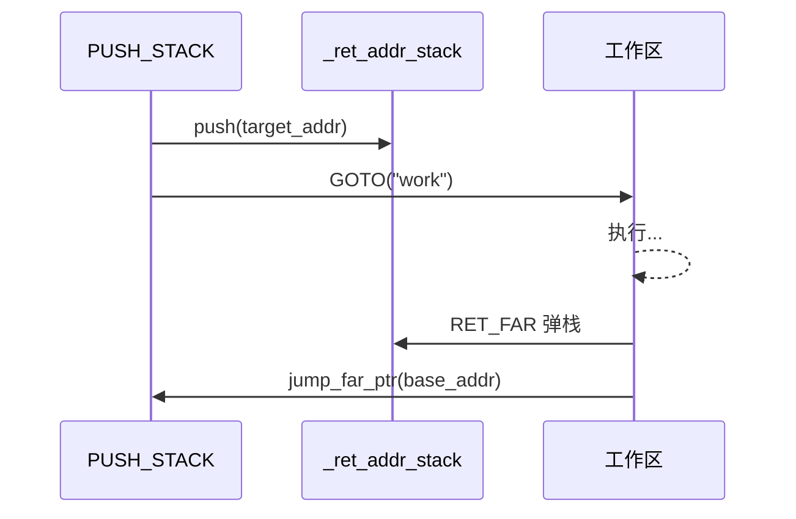

# 高级主题：手动栈空间管理分配

`CALL` 指令和 `call_sub` 方法会为你自动管理返回地址栈（`_ret_addr_stack`）：进入子程序前压入当前指针，`finally` 块在返回时弹出。对于大多数工作流，这已经足够。

然而，AmritaSense 也暴露了返回地址栈供**手动控制**，通过 `PUSH_STACK` 和 `RET_FAR` 实现。其使用模式为：

1. **PUSH_STACK**——将别名或地址压入 `_ret_addr_stack`
2. **GOTO 跳转**——跳转到工作流中的其他位置
3. **RET_FAR 返回**——弹出保存的地址并跳回

这让你可以实现不遵循 `CALL`/`call_sub` 固定规则的自定义调用/返回方案。

## 返回地址栈

`_ret_addr_stack` 是 `WorkflowInterpreter` 上的一个 `Stack[PointerVector]`。`CALL` 将当前指针压入其中；`call_sub` 的 `finally` 块弹出并恢复。通过 `PUSH_STACK`，你可以在编排链中直接将任意别名目标压栈，无需编写自定义节点。



## PUSH_STACK 与 RET_FAR

- **`PUSH_STACK(alias_or_idata)`**——将目标别名（或裸地址列表）解析后的地址压入 `_ret_addr_stack`。该指令返回的是一个 `NodeType[None]`（内联 `@Node` 装饰的可调用对象），直接放在 `>>` 链中。
- **`RET_FAR()`**——从 `_ret_addr_stack` 弹出栈顶条目，通过 `jump_far_ptr` 跳转到保存的地址。同样是一个内联 `@Node` 装饰的可调用对象，放在编排链中。

两个指令都**不能**从 `@Node()` 函数内部 `return`——直接放在 `>>` 链中。

## 示例：PUSH_STACK + GOTO + RET_FAR

```python
from amrita_sense import ALIAS, NOP, Node, WorkflowInterpreter
from amrita_sense.instructions import GOTO, PUSH_STACK, RET_FAR

@Node()
async def start() -> None:
    print("开始")

@Node()
async def doing_work() -> None:
    """GOTO 跳入的工作区。"""
    print("  执行工作")

@Node()
async def after_return() -> None:
    """RET_FAR 弹栈后跳回此处。"""
    print("回到这里（通过 RET_FAR）")

comp = (
    start
    >> PUSH_STACK("after")
    >> GOTO("work")
    >> ALIAS(after_return, "after")
    >> GOTO("end")
    >> ALIAS(doing_work, "work")
    >> RET_FAR()
    >> ALIAS(NOP, "end")
)
await WorkflowInterpreter(comp.render()).run()
```

**执行流程**：

1. `PUSH_STACK("after")` 将 `after_return` 的地址压入 `_ret_addr_stack`
2. `GOTO("work")` 跳转到 `doing_work` 节点
3. `doing_work` 执行完毕后，`RET_FAR` 弹出保存的地址并跳回 `after_return`

## PUSH_AND_GOTO（v0.3.0+）

**`PUSH_AND_GOTO(from_adr, to_adr)`** 是一个便捷指令，将 `PUSH_STACK` + `GOTO` 合并为一个节点。内部执行：

1. 将 `from_adr` 压入 `_ret_addr_stack`（与 `PUSH_STACK` 一致）
2. 跳转到 `to_adr`（与 `GOTO` 一致）

两个参数均接受别名字符串或裸地址列表。

```python
from amrita_sense.instructions import PUSH_AND_GOTO, RET_FAR

# 以下两种模式等价：

# 模式 A：显式两步
comp_a = (
    start
    >> PUSH_STACK("after")
    >> GOTO("work")
    >> ALIAS(after_return, "after")
    >> ALIAS(doing_work, "work")
    >> RET_FAR()
)

# 模式 B：PUSH_AND_GOTO 便捷写法
comp_b = (
    start
    >> PUSH_AND_GOTO("after", "work")
    >> ALIAS(after_return, "after")
    >> ALIAS(doing_work, "work")
    >> RET_FAR()
)
```

`PUSH_AND_GOTO` 在语义上与两步模式完全相同——选择在编排中读起来更自然的方式即可。

## 何时使用手动栈管理

| 场景                | 方案                              |
| ------------------- | --------------------------------- |
| 简单子程序调用/返回 | `CALL` + 自然的 `call_sub` 返回   |
| 自定义返回目标      | `PUSH_STACK` + `GOTO` + `RET_FAR` |
| 压栈跳转便捷方式    | `PUSH_AND_GOTO` + `RET_FAR`       |
| 多级栈展开          | 压入多个地址，每级一个 `RET_FAR`  |
| 非线性控制流        | 结合 `GOTO` 实现任意跳转模式      |

## 子图式调用：配合 ARCHIVED_NODES 使用

`PUSH_STACK` + `GOTO` + `RET_FAR` 可以与 `ARCHIVED_NODES` 结合，创建自包含的"子程序"——正常流跳过，通过 `GOTO` 进入：

```python
from amrita_sense import ALIAS, ARCHIVED_NODES, NOP, Node, WorkflowInterpreter
from amrita_sense.instructions import GOTO, PUSH_STACK, RET_FAR

@Node()
async def start() -> None:
    print("开始")

@Node()
async def step1() -> None:
    print("  步骤 1")

@Node()
async def step2() -> None:
    print("  步骤 2")

@Node()
async def after_return() -> None:
    print("回到这里（通过 RET_FAR）")

# 自包含子程序：正常流跳过，GOTO 进入。
# 内部执行: step1 >> step2 >> RET_FAR() -> 弹栈 -> 返回。
subroutine = ARCHIVED_NODES(
    ALIAS(NOP, "sub_entry"),  # 入口标记
    step1,
    step2,
    RET_FAR(),
)

comp = (
    start
    >> PUSH_STACK("after")
    >> GOTO("sub_entry")
    >> ALIAS(after_return, "after")
    >> subroutine
)
await WorkflowInterpreter(comp.render()).run()
```

**执行流程**：

1. `PUSH_STACK("after")` 保存返回目标
2. `GOTO("sub_entry")` 通过别名进入子程序入口（即 `NOP`）
3. `step1 >> step2` 顺序执行
4. `RET_FAR()` 弹出保存的地址，跳回 `after_return`

别名标记为 `"sub_entry"` 的 `NOP` 作为命名入口——`GOTO` 以别名定位，节点本身不执行任何操作。

## 注意事项

- **栈完整性**：`RET_FAR` 无条件从 `_ret_addr_stack` 弹出。如果栈为空，会引发 `IndexError`。始终确保在到达 `RET_FAR` 之前已压入对应地址（通过 `CALL` 或 `PUSH_STACK`）。
- **跳转标记**：`RET_FAR` 调用 `jump_far_ptr`，该方法被 `@markup` 装饰，会设置 `_jump_marked = True`。解释器在 `RET_FAR` 之后不会推进指针——执行会从跳转目标地址继续。
- **不是子程序指令**：`PUSH_STACK` 和 `RET_FAR` 是编排链中的独立节点。不要从 `@Node()` 函数内部调用它们——直接放在 `>>` 链中。
