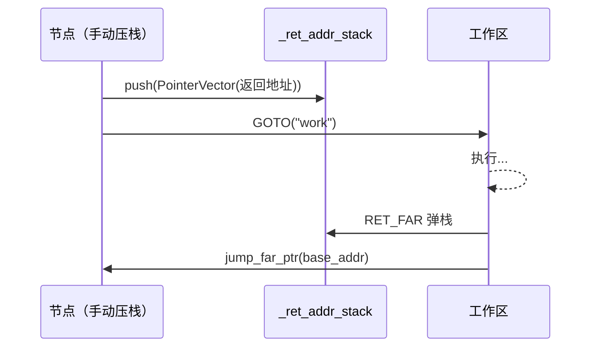

# 高级主题：手动栈空间管理分配

`CALL` 指令和 `call_sub` 方法会为你自动管理返回地址栈（`_ret_addr_stack`）：进入子程序前压入当前指针，`finally` 块在返回时弹出。对于大多数工作流，这已经足够。

然而，AmritaSense 也暴露了返回地址栈供**手动控制**，通过 `RET_FAR` 实现。其使用模式为：

1. **手动压栈**——节点显式地将 `PointerVector` 压入 `_ret_addr_stack`
2. **GOTO 跳转**——跳转到工作流中的其他位置
3. **RET_FAR 返回**——弹出保存的地址并跳回

这让你可以实现不遵循 `CALL`/`call_sub` 固定规则的自定义调用/返回方案。

## 返回地址栈

`_ret_addr_stack` 是 `WorkflowInterpreter` 上的一个 `Stack[PointerVector]`。`CALL` 将当前指针压入其中；`call_sub` 的 `finally` 块弹出并恢复。但你也可以通过 `POINTER_DEPENDS` 获取解释器引用，从任意节点直接压栈。



## RET_FAR

`RET_FAR` 是一个工厂函数，用于创建 `RetFarNode`。运行时，它只做一件事：

1. 从 `_ret_addr_stack` 弹出栈顶条目
2. 调用 `pc.jump_far_ptr(ptr.base_addr)` 跳转到保存的地址

`RetFarNode` 是一个普通的 `BaseNode`，直接放在工作流编排链中——**不能从另一个节点内部 `return` 出来**。

## 示例：手动压栈 + GOTO + RET_FAR

```python
from amrita_sense import ALIAS, NOP, Node, PointerVector, WorkflowInterpreter
from amrita_sense.instructions import RET_FAR, GOTO

@Node()
async def start() -> None:
    print("开始")

@Node()
async def save_ret_addr(pc: WorkflowInterpreter) -> None:
    """手动将返回目标地址压入 _ret_addr_stack。"""
    return_dest = PointerVector(pc.find_addr_alias("after"))
    pc._ret_addr_stack.push(return_dest)

@Node()
async def doing_work() -> None:
    """GOTO 跳入的工作区。"""
    print("  执行工作")

@Node()
async def after_return() -> None:
    """RET_FAR 弹栈后跳回此处。"""
    print("回到这里（通过 RET_FAR）")

comp = (
    start
    >> save_ret_addr
    >> GOTO("work")
    >> ALIAS(after_return, "after")
    >> GOTO("end")
    >> ALIAS(doing_work, "work")
    >> RET_FAR()
    >> ALIAS(NOP, "end")
)
await WorkflowInterpreter(comp.render()).run()
```

**执行流程**：

1. `save_ret_addr` 将 `"after"`（即 `after_return`）的地址压入 `_ret_addr_stack`
2. `GOTO("work")` 跳转到 `doing_work` 节点
3. `doing_work` 执行完毕后，`RET_FAR` 弹出保存的 `PointerVector` 并跳回 `after_return`

## 何时使用手动栈管理

| 场景                | 方案                             |
| ------------------- | -------------------------------- |
| 简单子程序调用/返回 | `CALL` + 自然的 `call_sub` 返回  |
| 自定义返回目标      | 手动压栈 + `GOTO` + `RET_FAR`    |
| 多级栈展开          | 压入多个地址，每级一个 `RET_FAR` |
| 非线性控制流        | 结合 `GOTO` 实现任意跳转模式     |

## 注意事项

- **栈完整性**：`RET_FAR` 无条件从 `_ret_addr_stack` 弹出。如果栈为空，会引发 `IndexError`。始终确保在到达 `RET_FAR` 之前已压入对应地址。
- **跳转标记**：`RET_FAR` 调用 `jump_far_ptr`，该方法被 `@markup` 装饰，会设置 `_jump_marked = True`。解释器在 `RET_FAR` 之后不会推进指针——执行会从跳转目标地址继续。
- **不是子程序指令**：`RET_FAR` 是编排链中的独立节点。不要从 `@Node()` 函数内部 `return RET_FAR()`——该返回值会被忽略。将 `RET_FAR()` 直接放在 `>>` 链中。
