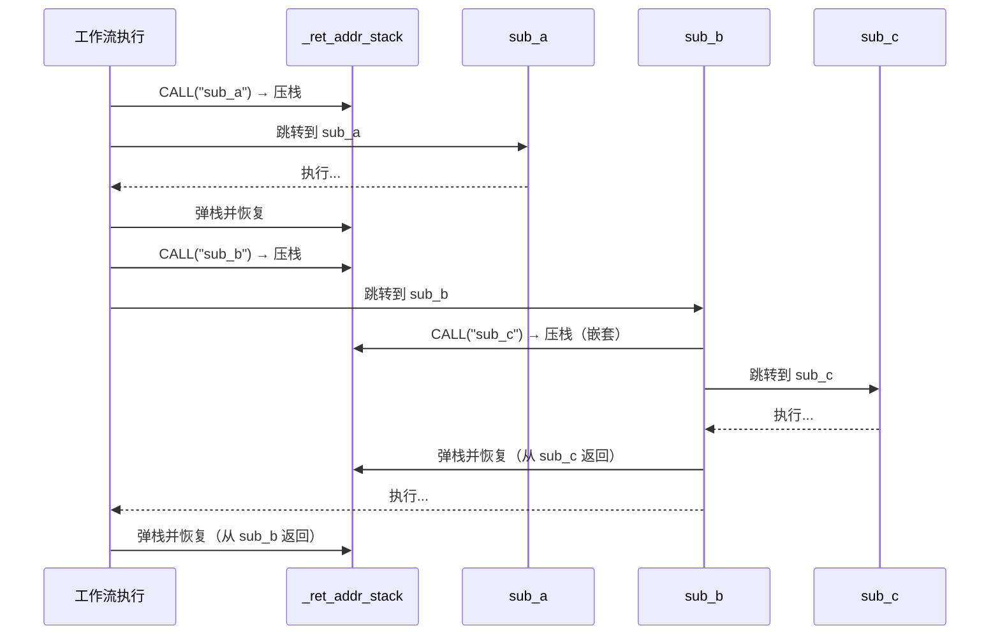

# 高级主题：手动栈空间管理分配

`CALL` 指令和 `call_sub` 方法会为你自动管理返回地址栈：进入子程序前压入当前指针，返回时弹出。在大多数工作流中，这已经足够。然而，当你需要**手动控制调用栈**时，AmritaSense 提供了 `RET_FAR`——一个让你显式弹出并跳转到已保存返回地址的指令。

## 返回地址栈

每次执行 `CALL` 或 `call_sub` 时，当前的 `PointerVector` 会被压入 `_ret_addr_stack`。子程序正常结束时，`call_sub` 的 `finally` 块弹出该地址并恢复指针。



## 当普通返回不够用时

普通子程序返回适用于执行到达被调用节点序列末尾的情况。但考虑以下场景：

1. **从嵌套作用域提前退出**——你正处于多层 `CALL` 链的深处，需要直接跳回最外层调用者，跳过中间返回。
2. **自定义栈展开**——你想手动弹出多个返回地址，实现一种非局部退出。
3. **跨越 Bubble 边界**——你需要跳出节点编排 Bubble，进入完全不同的作用域。

在这些情况下，可以使用 `RET_FAR` 手动控制。

## RET_FAR

`RET_FAR` 是一个工厂函数，用于创建 `RetFarNode`。运行时，它会：

1. 从 `_ret_addr_stack` 弹出栈顶条目——这是最近保存的返回地址
2. 调用 `pc.jump_far_ptr(ptr.base_addr)`——对弹出的指针执行多维绝对跳转

`RetFarNode` 是一个普通的 `BaseNode`，因此可以放置在工作流编排中的任意位置——包括嵌套的 `CALL` 链和 Bubble 内部。

## 示例：从嵌套作用域提前退出

```python
from amrita_sense.instructions import CALL, ALIAS, ARCHIVED_NODES, RET_FAR
from amrita_sense.instructions.workfl_ctrl import NOP
from amrita_sense.node.core import Node

@Node()
def deep_task():
    print("进入深层任务")
    # ... 复杂处理 ...
    print("检测到提前退出条件——立即返回")
    # RET_FAR 弹出返回地址并跳回最外层调用者
    return RET_FAR()  # <-- 手动弹栈并返回

@Node()
def finish():
    print("回到顶层")
    return "完成"

deep_subprogram = ARCHIVED_NODES(
    ALIAS(deep_task, "deep_work"),
    RET_FAR,  # 可选：作为显式出口放置在子程序内
)

workflow = (
    Node(lambda: print("开始"))
    >> CALL("deep_work")
    >> finish
    >> NOP
    >> deep_subprogram
)
```

## 与 CALL 的关系

| 方面           | 普通 CALL 返回                | RET_FAR                          |
| -------------- | ----------------------------- | -------------------------------- |
| 弹栈方式       | `call_sub.finally` 中自动完成 | 手动通过 `_ret_addr_stack.pop()` |
| 触发条件       | 到达子程序末尾                | `RetFarNode` 被执行时显式触发    |
| 嵌套处理       | 一次只返回一层                | 可放置在栈中任意位置             |
| 跳转方法       | `_pointer = saved_ptr`        | `pc.jump_far_ptr(ptr.base_addr)` |
| `_jump_marked` | 被检查，可能跳过恢复          | 通过 `@markup` 始终设置标记      |

`RET_FAR` 使用与 `GOTO` 和 `CALL` 相同的 `@markup` 保护跳转机制，但它显式控制弹出哪个返回地址。这让你能够细粒度地控制调用栈。

## 注意事项

- **栈完整性**：`RET_FAR` 无条件从 `_ret_addr_stack` 弹出。如果栈为空，会引发错误。使用 `RET_FAR` 前，始终确保有对应的 `CALL` 已压入地址。
- **不能替代普通返回**：对于直接子程序，让自然的 `call_sub` 返回来管理栈。`RET_FAR` 仅适用于高级场景。
- **与 GOTO 的交互**：如果子程序内的 `GOTO` 已经设置了 `_jump_marked`，`call_sub` 可能会跳过其正常的栈恢复。请注意，在同一子程序中混合使用 `GOTO`、`CALL` 和 `RET_FAR` 需要仔细的栈规划。
