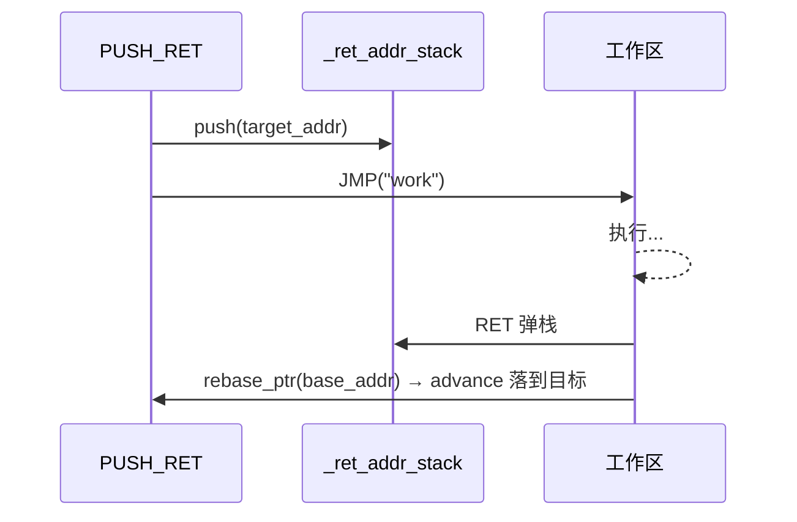

# 高级主题：手动栈空间管理分配

`INVOKE` 指令和 `call_sub` 方法会为你自动管理返回地址栈（`_ret_addr_stack`）：进入子程序前压入当前指针，`finally` 块在返回时弹出。对于大多数工作流，这已经足够。

然而，AmritaSense 也暴露了返回地址栈供**手动控制**，通过 `PUSH_RET` 和 `RET` 实现。其使用模式为：

1. **PUSH_RET**——将别名或地址压入 `_ret_addr_stack`
2. **JMP 跳转**——跳转到工作流中的其他位置
3. **RET 返回**——弹出保存的地址并跳回

这让你可以实现不遵循 `INVOKE`/`call_sub` 固定规则的自定义调用/返回方案。

## 返回地址栈

`_ret_addr_stack` 是 `WorkflowInterpreter` 上的一个 `Stack[PointerVector]`。`INVOKE` 将当前指针压入其中；`call_sub` 的 `finally` 块弹出并恢复。通过 `PUSH_RET`，你可以在编排链中直接将任意别名目标压栈，无需编写自定义节点。


```mermaid
sequenceDiagram
    participant N as PUSH_RET
    participant S as _ret_addr_stack
    participant W as 工作区

    N->>S: push(target_addr)
    N->>W: JMP("work")
    W-->>W: 执行...
    W->>S: RET 弹栈
    W->>N: rebase_ptr(base_addr) → advance 落到目标
```

## PUSH_RET 与 RET

- `PUSH_RET(alias_or_idata)`——将目标别名（或裸地址列表）解析后的地址压入 `_ret_addr_stack`。该指令返回的是一个 `NodeType[None]`（内联 `@Node` 装饰的可调用对象），直接放在 `>>` 链中。
- `RET()`——从 `_ret_addr_stack` 弹出栈顶条目，通过 `rebase_ptr` 恢复指针。与 `jump_to` / `jump_far_ptr` 不同，`rebase_ptr` **不会**设置跳转标记，解释器在返回后会自然**推进到下一指令**（`返回地址 + 1`）。调用方应压入 `目标 - 1`，使 advance 恰好落在目标节点上。

两个指令都**不能**从 `@Node()` 函数内部 `return`——直接放在 `>>` 链中。

## 示例：PUSH_RET + JMP + RET

```python
from amrita_sense import ALIAS, NOP, Node, WorkflowInterpreter
from amrita_sense.instructions import JMP, PUSH_RET, RET


@Node()
async def start() -> None:
    print("开始")


@Node()
async def doing_work() -> None:
    """JMP 跳入的工作区。"""
    print("  执行工作")


@Node()
async def after_return() -> None:
    """RET 弹栈后在此恢复执行。"""
    print("回到这里（通过 RET）")


comp = (
    start
    >> PUSH_RET("resume")  # 压入返回地址（after_return 前面的 NOP）
    >> JMP("work")  # 跳入工作区
    >> ALIAS(NOP, "resume")  # RET rebase 到这里；advance 落到 after_return
    >> after_return
    >> ALIAS(doing_work, "work")
    >> RET()
)
await WorkflowInterpreter(comp.render()).run()
```

**执行流程**（新 `RET` 语义）：

1. `PUSH_RET("resume")` 将别名为 `"resume"` 的 `NOP`（即 `after_return` **前一个**节点）的地址压入 `_ret_addr_stack`
2. `JMP("work")` 跳转到 `doing_work` 节点
3. `doing_work` 执行完毕后，`RET` 弹出保存的地址并 `rebase_ptr` 到那里，解释器随后推进到 `after_return`

> 因为 `RET` 不设置跳转标记，保存的地址必须是真正目标的**前驱**（`目标 - 1`）。这里的 `"resume"` NOP 就扮演这个角色。

## CALL（v0.3.0+）

`CALL(to_adr, from_adr=from_adr)` 是一个便捷指令，将 `PUSH_RET` + `JMP` 合并为一个节点。内部执行：

1. 将 `from_adr` 压入 `_ret_addr_stack`（与 `PUSH_RET` 一致）
2. 跳转到 `to_adr`（与 `JMP` 一致）

`from_adr` 接受别名字符串、裸地址列表，或 `None`。为 `None` 时：

- 在子程序调用内部（`pc.outer_interpreting` 为 `True`——即通过 `call_sub` 进入的执行），复用 `_ret_addr_stack` 栈顶（父级压入的返回地址）。
- 否则（主流程 `run()`），使用当前指针——`RET` 随后会推进到 `CALL` 之后的节点。

```python
from amrita_sense.instructions import CALL, RET
from amrita_sense.instructions.subprogram import ARCHIVED_SEGMENT

# 模式 A：显式两步（压入前驱 + JMP）
comp_a = (
    start
    >> PUSH_RET("resume")
    >> JMP("work")
    >> ALIAS(NOP, "resume")
    >> after_return
    >> ALIAS(doing_work, "work")
    >> RET()
)

# 模式 B：CALL 便捷写法——None = 当前指针
# RET rebase 到 CALL 自身，advance 落到 after_return。
# 函数体藏进 ARCHIVED_SEGMENT，正常流跳过。
comp_b = (
    start
    >> CALL("work")
    >> after_return
    >> ARCHIVED_SEGMENT(ALIAS(doing_work, "work") >> RET())
)
```

`CALL` 在语义上与两步模式等价（`None` 默认值覆盖了最常见的“返回到下一节点”场景）。注意：模式 B 中函数体必须归档（`ARCHIVED_SEGMENT`）——否则正常流在 `after_return` 之后会再次进入函数体。

## 何时使用手动栈管理

| 场景                | 方案                              |
| ------------------- | --------------------------------- |
| 简单子程序调用/返回 | `INVOKE` + 自然的 `call_sub` 返回 |
| 自定义返回目标      | `PUSH_RET` + `JMP` + `RET`        |
| 压栈跳转便捷方式    | `CALL` + `RET`                    |
| 多级栈展开          | 压入多个地址，每级一个 `RET`      |
| 非线性控制流        | 结合 `JMP` 实现任意跳转模式       |

## 子图式调用：配合 FN 使用

v0.6.0 起，编写自包含"子程序"的现代方式是 **`FN(entrypoint, block)`**——它内嵌跳过机制（`_fn_escape`）并自动追加 `RET()`。用 `CALL(entrypoint)` 调用即可，无需手动 `PUSH_RET` / `JMP` / `RET` 管线：

```python
from amrita_sense import Node, WorkflowInterpreter
from amrita_sense.instructions import FN, CALL


@Node()
async def start() -> None:
    print("开始")


@Node()
async def step1() -> None:
    print("  步骤 1")


@Node()
async def step2() -> None:
    print("  步骤 2")


@Node()
async def after_return() -> None:
    print("回到这里（通过 FN）")


# 自包含子程序：正常流经 _fn_escape 跳过，
# CALL 进入；FN 自动在末尾追加 RET()。
subroutine = FN("sub_entry", step1 >> step2)

comp = (
    start
    >> CALL("sub_entry")  # None = 返回本节点之后
    >> after_return  # RET rebase 到调用点 -> advance 落到这里
    >> subroutine
)
await WorkflowInterpreter(comp.render()).run()
```

**执行流程**（新 `RET` 语义）：

1. `CALL("sub_entry")` 压入当前指针并跳入子程序
2. `step1 >> step2` 顺序执行
3. 自动追加的 `RET()` 弹出保存的地址，`rebase_ptr` 到调用点，解释器随后推进到 `after_return`

> **FN 与手动栈操作**：`PUSH_RET` / `JMP` / `RET` 仍可用于完全手动栈控制（非线性流、多级展开）。普通"调用例程并返回"场景推荐 `FN` + `CALL`——更不易出错。

> 对于完整函数体或中断服务例程，优先使用 `ARCHIVED_SEGMENT`（配合 `FN` / `INTER_FN` 或在末尾显式 `RET`），而不是 `ARCHIVED_NODES`——后者面向归档单个节点或很短序列。

## 注意事项

- **栈完整性**：`RET` 无条件从 `_ret_addr_stack` 弹出。如果栈为空，会引发 `IndexError`。始终确保在到达 `RET` 之前已压入对应地址（通过 `INVOKE` 或 `PUSH_RET`）。
- **返回地址 + 1**：`RET` 使用 `rebase_ptr`（不设跳转标记），执行在保存地址的**下一个节点**恢复。请压入 `目标 - 1`（或依赖 `CALL` 的 `None` 默认值——它指向指令自身）。
- **不是子程序指令**：`PUSH_RET` 和 `RET` 是编排链中的独立节点。不要从 `@Node()` 函数内部调用它们——直接放在 `>>` 链中。
