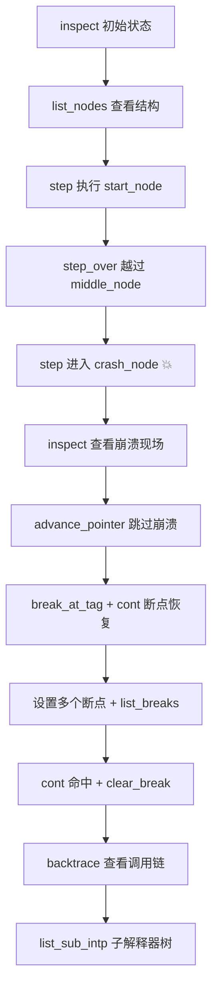

# REPL 调试

AmritaSense v0.5.0 引入了一个专用的调试器模块 `amrita_sense.debugger`，提供纯函数式的 REPL 优先调试工具包。它利用解释器内置的 Panic/Recover 机制、中间件注入和步进执行，让你在 Python REPL 中像调试本地程序一样调试工作流——无需额外工具、无需 IDE 插件。

> **前置阅读**
> 建议先了解 [执行与中断](/zh/guide/concepts/exec_and_interrupt) 中的步进执行和挂起机制，以及 [外部中断调用](/zh/guide/advanced/external_interrupt) 中的 `call_sub(interrupt=True)` 原理。本文依赖这些基础设施构建完整的调试体验。

## 设计哲学

调试器遵循三个核心原则：

1. **REPL 优先** — 所有函数都是同步的（`step(inter)`，不用 `await`），可直接在 `python`、`ipython` 或 VS Code 原生 REPL 中输入
2. **纯函数式** — 无包装类、无状态封装。每个函数接收 `WorkflowInterpreter` 作为第一参数：`from amrita_sense.debugger import *`
3. **非侵入** — 断点通过组合式中间件注入，不修改核心运行时。调试代码不与业务逻辑耦合

```python
>>> from amrita_sense.debugger import *
>>> inspect(inter)       # 查看状态
>>> step(inter)          # 执行一个节点
>>> break_at_tag(inter, "my_node")
>>> cont(inter)          # 继续到断点
```

## 状态检查

调试的第一步永远是"看清楚现在在哪"。调试器提供了一套完整的状态检查工具。

### `where(inter)` — 当前位置

一行摘要，快速确认当前停在哪：

```
📍 [0, 2]  crash_here  stack_depth=0
```

显示：当前地址、节点标签、返回地址栈深度。

### `inspect(inter)` — 完整状态

美化打印解释器的全部内部状态：

- 🆔 解释器 ID、父关系和根节点
- 📍 当前指针位置和节点信息（tag、函数名）
- 🏃 运行状态和终止标记
- 📚 返回地址栈（深度 + 全部内容）
- 📦 上下文栈（深度 + 每个上下文的指针和异常）
- ⚠️ Panic 异常（如果有崩溃）
- 👶 子解释器树（每个子解释器的状态和指针）

```python
>>> inspect(inter)
══════════════════════════════════════════════════════════
🆔  Interpreter: a1b2c3d4e5f6…
📍 Pointer:      [0, 2]
🔍 Node:         crash_here
   Function:     crash_node
🏃 Running:      no
🚩 Pending stop: no
📚 Return stack: depth=0
📦 Context stack: depth=0
⚠️  Panic:        RuntimeError: planned crash for demo
👶 Sub-interpreters: 0
══════════════════════════════════════════════════════════
```

### `backtrace(inter)` — 调用链

展开完整调用链：解释器树（Root → … → Current）、返回地址栈、上下文栈、当前节点。

```python
>>> backtrace(inter)
Interpreter → a1b2c3d4e5f6… [Root] [Current] at 0x7f8a1c00d000

Returning Stack:
    0. [0, 2] (Current)

Context Stack:
    (EMPTY_STACK)

Current node: crash_here -> crash_node
```

### `list_nodes(inter)` — 节点清单

遍历编译图的 `_graph` 树，打印所有节点的地址、tag 和函数名。类似标准库的 `dis.dis()`，用于了解工作流的整体结构：

```
   [0, 0]  start             start_node
   [0, 1]  middle            middle_node
   [0, 2]  crash_here        crash_node
   [0, 3]  never_reached     never_reached
```

### `list_sub_intp(inter)` — 子解释器树

递归展开整个解释器树，显示每个子解释器的运行状态、当前指针和异常：

```
🟢 a1b2c3...  ptr=[0, 1]
  ⏸️ d4e5f6...  ptr=[0, 1]  exc=RuntimeError
  🟢 g7h8i9...  ptr=[1, 2]
```

## 步进控制

步进控制允许你精确控制每次执行一个节点。提供了两种 API 风格：

| 风格     | 函数                                                                 | 适用场景                    |
| -------- | -------------------------------------------------------------------- | --------------------------- |
| **同步** | `step()` `step_over()` `step_out()` `cont()`                         | Python REPL（无需 `await`） |
| **异步** | `step_async()` `step_over_async()` `step_out_async()` `cont_async()` | 已有事件循环的程序中        |

### `step(inter)` — 单步执行

执行**恰好一个**节点然后停住。是最核心的原语：

```python
>>> step(inter)
  [start] running…
>>> where(inter)
📍 [0, 1]  middle  stack_depth=0
```

内部原理：`step()` 在步进期间将 `stepping` 标志置为 `True`，断点检查被跳过——所以单步调试时不会触发断点。

### `step_over(inter)` — 单步越过

执行节点，但**不进入**子程序调用（`call_sub` / `CALL`）。内部监控 `_ret_addr_stack` 的深度——只要深度大于起始值就继续执行，直到回到同一栈帧。

```python
>>> step_over(inter)  # 如果当前节点调用了 call_sub，
                       # 子程序也会执行完，但不会在子程序里停住
```

### `step_out(inter)` — 跳出当前帧

执行直到返回地址栈变浅——即跳出当前子程序调用帧：

```python
>>> step_out(inter)   # 从 call_sub 深处一层层执行，直到返回调用方
```

### `cont(inter)` — 继续执行

继续执行直到遇到断点或工作流结束。清除 `stepping` 标志，断点检查恢复生效：

```python
>>> cont(inter)
⏸️  Hit breakpoint: tag='my_node' hits=1
```

### 异常处理

所有步进函数都优雅处理三类可预见场景：

| 场景                   | 行为                                                     |
| ---------------------- | -------------------------------------------------------- |
| 命中 `BreakpointHit`   | 打印 `⏸️  Hit breakpoint: ...`                           |
| 键盘按下 `Ctrl+C`      | 打印 `⏸️  Stop at: [addr]`                               |
| 节点内抛出异常（崩溃） | 打印 `⚠️  Node crashed: ... Panic saved, use inspect().` |

崩溃后执行不会丢失——`_panic_exc`、`_pointer`、`_ret_addr_stack` 全部保留，可以用 `inspect()` 查看完整现场。

## 断点系统

断点通过**组合式中间件**注入到解释器。核心设计：

```text
debug_middleware(pc):
    1. 检查断点 → 命中则抛出 BreakpointHit
    2. 调用用户原始中间件（如果存在）
    3. 否则直接调用 pc._call()
```

::: details 中间件注入细节
设置第一个断点时，调试器会：

1. 保存 `inter._middleware` 当前值（用户的原始中间件，如有）
2. 构造组合中间件：`断点检查 → 用户中间件 → _call()`
3. 将 `inter._middleware` 替换为组合中间件

用户原有中间件始终被尊重，断点检查作为前置步骤插入。清除所有断点不会移除组合中间件——如需恢复原始状态，重新创建解释器即可。
:::

### `break_at_tag(inter, tag, *, condition=None)` — 按标签设置断点

在**所有** `tag` 匹配的节点上设置断点。`tag` 是 `@Node(tag="...")` 中指定的标签：

```python
>>> break_at_tag(inter, "crash_here")
🔴 Breakpoint: tag='crash_here' hits=0
```

### `break_at_addr(inter, addr, *, condition=None)` — 按地址设置断点

在精确地址上设置断点。`addr` 可以是：

- **别名**（`str`）：通过 `AddressCalculator.resolve_alias()` 解析
- **原始地址**（`list[int]`）：如 `[0, 2]`

```python
>>> break_at_addr(inter, [0, 1])
🔴 Breakpoint: addr=[0, 1] hits=0

>>> break_at_addr(inter, "my_alias")
🔴 Breakpoint: addr=[2, 0] hits=0
```

### 条件断点

`condition` 参数接收一个 `(WorkflowInterpreter) -> bool` 的可调用对象：

```python
>>> break_at_tag(inter, "middle", condition=lambda pc: len(pc._ret_addr_stack) > 0)
🔴 Breakpoint: tag='middle' hits=0 cond
```

只有当条件返回 `True` 时断点才会触发。条件求值异常时静默跳过（不触发断点）。

### 管理断点

```python
>>> list_breaks(inter)                  # 列出所有断点
  1. TAG  'crash_here'  hits=1
  2. ADDR  [0, 1]  hits=0

>>> clear_break_tag(inter, "crash_here")  # 按标签清除
✖  Removed: tag='crash_here' hits=1

>>> clear_break_addr(inter, [0, 1])       # 按地址清除
✖  Removed: addr=[0, 1] hits=0
```

### `BreakpointHit` — 断点异常

`BreakpointHit` 继承自 `BaseException`（不是 `Exception`），因此**永远不会**被 Panic/Recover 机制捕获，不会将解释器置为 panic 状态。

```python
>>> bp = Breakpoint(target="test", kind="tag")
>>> isinstance(BreakpointHit(bp), BaseException)  # True
>>> isinstance(BreakpointHit(bp), Exception)      # False
```

## 崩溃恢复

AmritaSense 的 Panic/Recover 机制是调试器的核心能力之一。当节点抛出未处理异常时，解释器不会丢失状态。

### 典型流程

```python
# 1. 执行到会崩溃的节点
>>> step(inter)
  [crash_here] about to explode 💥
⚠️  Node crashed: RuntimeError('planned crash for demo'). Panic saved, use inspect().

# 2. 查看崩溃现场
>>> inspect(inter)  # 显示完整状态：_panic_exc = RuntimeError,
                     # _pointer 停在 crash_here, 栈完整保留

# 3. 手动跳过崩溃节点
>>> inter.advance_pointer()

# 4. 设置断点在恢复后的节点
>>> break_at_tag(inter, "never_reached")

# 5. 继续执行（内部从 panic 恢复）
>>> cont(inter)
  [never_reached] recovered successfully! 🎉
```

**恢复原理**：`step()` / `cont()` 的内部 `_step_one()` 在每次执行前检查 `_panic_exc`，如果非 `None` 则清除（recover），然后正常执行当前指针指向的节点。由于你已手动 `advance_pointer()` 跳过了崩溃节点，恢复后执行的是下一个节点。

## 完整示例

项目中的 `demos/21_debug_repl.py` 提供了一个端到端的 REPL 调试演示，覆盖了上述所有功能：

```bash
python demos/21_debug_repl.py
```

演示流程：



你也可以在 REPL 中手动操作：

```python
>>> from amrita_sense.debugger import *
>>> from demos.21_debug_repl import inter
>>> inspect(inter)
>>> step(inter)     # 不需 await！
```

## 安全注意事项

### REMOVE_DEBUGGER — 生产环境自毁

调试器模块包含对解释器内部状态的深度访问能力，在生产环境中可能被 SSTI（服务端模板注入）等攻击利用。通过设置环境变量可以**物理销毁**该模块：

```bash
export REMOVE_DEBUGGER=true
```

设置后，任何对 `amrita_sense.debugger` 的导入或访问都会抛出 `AttributeError`：

```python
>>> import amrita_sense.debugger
>>> amrita_sense.debugger.inspect
AttributeError: Debugger is disabled. ...
>>> dir(amrita_sense.debugger)
[]
```

实现原理：模块在 `import` 时检测环境变量，若启用则将 `sys.modules[__name__]` 替换为一个 `types.ModuleType` 代理对象，该代理的 `__getattr__` 对所有访问抛出异常，`__dir__` 返回空列表。

### 解释器 ID 泄露

`inspect()` 和 `list_sub_intp()` 默认截断显示解释器 UUID（`inter.id[:12]…`），避免完整 UUID 泄露到日志或终端。
