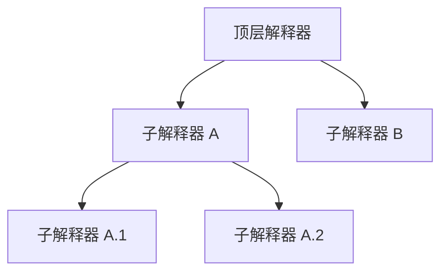

# 高级实践：子图隔离调用

AmritaSense v0.3.0 引入了 **`FUN_BLOCK`** 指令和完整的**解释器树模型**，使工作流能够启动隔离的子工作流，拥有独立的生命周期、中间件和错误边界。

## 概念

子图隔离调用将一个已编译的 `NodeComposeRendered` 图放入一个**子 `WorkflowInterpreter`** 中执行。父解释器挂起等待子解释器完成。这类似于传统语言中的函数调用，但具有完全的运行时隔离——独立的执行上下文、独立的中间件、独立的挂起/恢复生命周期。

与 `CALL`/`call_sub` 的关键区别在于：`FUN_BLOCK` 将子工作流作为树中的**独立解释器**启动，而非复用当前解释器的指针栈。

## 解释器树

每个解释器都属于一棵树。根节点是你直接创建的**顶层解释器**；子节点通过 `fork_interpreter()` 创建（`FUN_BLOCK` 内部使用）。



关键属性：

| 属性                               | 描述                                 |
| ---------------------------------- | ------------------------------------ |
| `interpreter.id`                   | 标识该解释器的唯一 UUID 字符串       |
| `interpreter.parent`               | 父解释器，顶层为 `None`              |
| `interpreter.top_interpreter`      | 树的根节点                           |
| `interpreter.sub_interpreters`     | 直接子节点字典 (`{id: interpreter}`) |
| `interpreter.all_sub_interpreters` | （仅顶层）树中所有后代节点的字典     |

## `FUN_BLOCK` 指令

```python
from amrita_sense.instructions import FUN_BLOCK

FUN_BLOCK(
    sub_comp,              # NodeComposeRendered — 子工作流图
    middleware=UNSET,      # Callable | None | UNSET — 子解释器的中间件
    object_io=None,        # SuspendObjectStream | None — 子解释器的 I/O 流
    one_time_interp=False, # bool — 是否每次调用创建新解释器？
)
```

### 参数

- **`sub_comp`**（`NodeComposeRendered`）：要在隔离环境中执行的已编译工作流图。对任意 `NodeCompose` 调用 `.render()` 即可获得。
- **`middleware`**（`Callable | None | UNSET`）：控制中间件继承：
  - `UNSET`（默认）：继承父中间件，除非 `__flags__.NO_SHARED_MIDDLEWARE` 为 `True`。
  - `None`：子解释器不使用中间件。
  - 一个可调用对象：仅该子解释器使用此自定义中间件。
- **`object_io`**（`SuspendObjectStream | None`）：子解释器的 I/O 流。默认 `None` 会创建一个新的 `SuspendObjectStream`。注意：object_io **不会**在解释器间共享——每个解释器获取自己的流以保证线程安全。
- **`one_time_interp`**（`bool`）：若为 `True`，每次调用都创建新的 `WorkflowInterpreter`，完成后销毁。若为 `False`（默认），解释器在多次调用间复用（状态被重置但不会重建）。

### 返回值

返回一个 `FuncBlock` 节点，像其他节点一样直接放在 `>>` 编排链中。

## 一次性 vs 复用解释器

| 方面       | `one_time_interp=False`（默认） | `one_time_interp=True`     |
| ---------- | ------------------------------- | -------------------------- |
| 解释器创建 | 首次调用时创建一次              | 每次调用都创建             |
| 调用间状态 | 重置（指针、栈、跳转标志）      | 完全销毁                   |
| 性能       | 重复调用开销更低                | 开销更高                   |
| 适用场景   | 重复调用的子工作流              | 一次性或少量调用的子工作流 |
| 内存       | 解释器持续驻留内存              | 解释器被 GC 回收           |

## 生命周期管理

当你拥有解释器树时，需要协调它们的生命周期。顶层解释器提供了以下方法：

### 等待

```python
# 等待该特定解释器完成
await interpreter.wait

# 等待所有直接子节点
await interpreter.wait_all_forks()

# 等待整棵树（仅顶层可用！）
await top_interpreter.wait_all()
```

### 终止

```python
# 标记该解释器优雅停止
await interpreter.terminate(eol=True)

# 终止所有直接子节点
await interpreter.terminate_all_forks(eol=True)

# 终止整棵树（仅顶层可用！）
await top_interpreter.terminate_all(eol=True)
```

- `eol=True` 会在终止后将解释器从树中移除。设为 `eol=False` 可保留其注册。
- `terminate()` 设置 `pending_stop = True` 并等待解释器的 `_waiter_fut`。
- 在非顶层解释器上调用 `terminate_all()` 会抛出 `IllegalState`。

### 状态

```python
interpreter.is_running    # 当前是否正在执行
interpreter.pending_stop  # 是否已被调用 terminate()
```

## 中间件隔离

树中的每个解释器都可以拥有自己的中间件。默认情况下，fork 出的解释器会继承父中间件。你可以：

- 向 `FUN_BLOCK` 传入 `middleware=None` 来创建无中间件的子解释器。
- 传入自定义可调用对象作为子解释器专属中间件。
- 设置 `__flags__.NO_SHARED_MIDDLEWARE = True` 使 `UNSET` 行为等同于 `None`。

## 完整示例

```python
import asyncio
from amrita_sense import ALIAS, NOP, Node, NodeCompose, WorkflowInterpreter
from amrita_sense.instructions import FUN_BLOCK

# --- 定义子工作流 ---
@Node()
async def sub_start() -> None:
    print("  [子] 开始")

@Node()
async def sub_work() -> None:
    print("  [子] 工作中...")

sub_comp = (sub_start >> sub_work >> ALIAS(NOP, "done")).render()

# --- 定义主工作流 ---
@Node()
async def main_start() -> None:
    print("[主] 开始")

@Node()
async def main_after() -> None:
    print("[主] 子工作流已完成")

main_comp = (
    main_start
    >> FUN_BLOCK(sub_comp, one_time_interp=True)
    >> main_after
    >> ALIAS(NOP, "done")
)

# --- 执行 ---
async def main():
    interpreter = WorkflowInterpreter(main_comp.render())
    await interpreter.run()

asyncio.run(main())
```

输出：

```
[主] 开始
  [子] 开始
  [子] 工作中...
[主] 子工作流已完成
```

## 错误处理

如果子工作流抛出异常，`FUN_BLOCK` 会通过 `search_exceptions()` 收集所有异常（包括嵌套子解释器中的异常），并将它们作为 `BaseExceptionGroup` 重新抛出。这意味着你可以用 `TRY/CATCH` 包裹 `FUN_BLOCK` 来处理子工作流失败：

```python
from amrita_sense.instructions import Try

comp = (
    main_start
    >> Try(
        FUN_BLOCK(sub_comp),
        CATCH=(ValueError, handle_value_error)
    )
    >> ALIAS(NOP, "done")
)
```

## 何时使用子图隔离

| 场景                           | 推荐方案                                  |
| ------------------------------ | ----------------------------------------- |
| 同状态下的简单子程序调用/返回  | `CALL` / `call_sub`                       |
| 需要错误隔离的独立子工作流     | `FUN_BLOCK`                               |
| 多个子工作流的并行执行         | `fork_interpreter()` + `asyncio.gather()` |
| 需要自定义中间件的子工作流     | `FUN_BLOCK(middleware=...)`               |
| 重复调用的子工作流（性能敏感） | `FUN_BLOCK(one_time_interp=False)`        |
