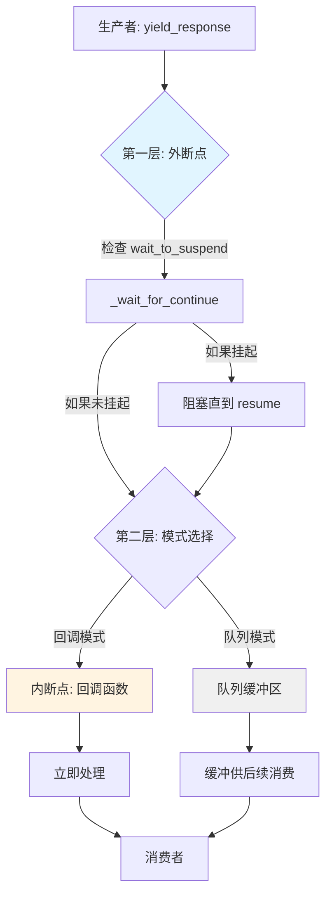
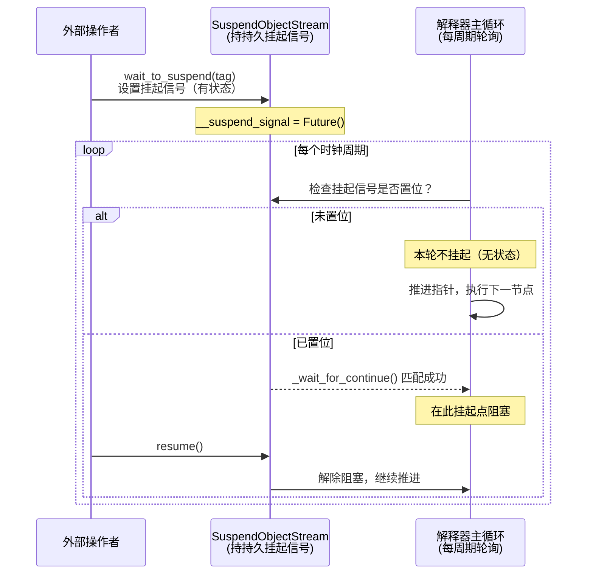
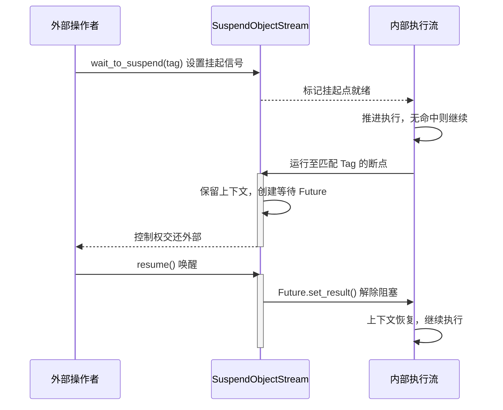

# SuspendObjectStream

`SuspendObjectStream` 是一个泛型异步双工流工具，为协作式挂起/恢复控制流程提供完整基础设施。它是 AmritaSense `WorkflowInterpreter` 的 `object_io` 核心组件。

## 概述

`SuspendObjectStream[ObjectTypeT]` 在内部组合了四层机制：

| 层级       | 组件                                       | 作用                                            |
| ---------- | ------------------------------------------ | ----------------------------------------------- |
| **传输层** | `anyio` 内存对象流（两对独立单向通道）     | 生产者→消费者 和 消费者→生产者 双向独立数据传输 |
| **控制层** | 挂起信号 + 恢复信号（`asyncio.Future` 对） | 外部操作者与内部执行流之间的协作式暂停/继续     |
| **拦截层** | 回调函数（双重锁保护）                     | 在数据路径上插入自定义处理逻辑，不影响控制流    |
| **反向流** | 反向发送/接收通道 + 完成标记               | 消费者可主动向生产者回传数据，形成完整双向对话  |

核心能力：

- **协作式挂起**：通过 `wait_to_suspend()` / `_wait_for_continue()` 在可配置标签（Tag）处让执行流主动交出控制权
- **精确恢复**：使用 `resume()` 解除内部阻塞，执行流从挂起点精确继续
- **双向数据传输**：`yield_response()` / `push_object()` 生产者→消费者，`send_to_producer()` 消费者→生产者
- **Tag 断点过滤**：支持多标签匹配，实现细粒度的断点选择
- **回调拦截**：可在两条数据路径上分别注入异步回调，实时处理每条产出

### 两层中断架构

`SuspendObjectStream` 的中断机制在两个不同层级运作，二者正交且可组合使用：



#### 1. 外断点（Outer Suspend）—— 控制流中断

由 `@SuspendObjectStream.suspend` 装饰器和 `wait_to_suspend()/resume()` 对实现：

- **外部驱动**：外部调用方通过 `wait_to_suspend()` 主动请求挂起
- **流程控制**：暂停整个协程的执行，交出控制权
- **标签过滤**：支持按 Tag 筛选特定断点，实现精确控制
- **双向通信**：必须显式调用 `resume()` 才能解除阻塞

> 🚦 **比喻**：交通信号灯——完全停止，等待绿灯（`resume()`）才能继续前行。

#### 2. 内断点（Inner Suspend / Callback）—— 数据流拦截

通过 `callback` 机制实现：

- **内部驱动**：每次 `yield_response()` 自动触发
- **数据拦截**：在数据传输路径上插入异步处理逻辑
- **实时响应**：无需外部 `resume()`，回调执行完毕后自动继续
- **单向流动**：数据流过后即被处理，不阻塞生产端

> 🛂 **比喻**：海关检查站——每件货物都经过检查，但检查完立即放行，不会长时间滞留。

::: warning 回调模式与迭代器互斥
**重要限制**：`callback` 与 `async for` 迭代消费是**互斥的**。同一个 `SuspendObjectStream` 实例只能选择其中一种方式处理响应流。同时设置回调并使用迭代器将导致 `StreamStateError`。
:::

### 挂起点 vs 时钟中断：有状态与无状态

理解 `SuspendObjectStream` 在 AmritaSense 体系中的角色，必须区分两个层次的不同语义：

| 层次           | 术语                                     | 状态特征   | 说明                                                                                                                                                        |
| -------------- | ---------------------------------------- | ---------- | ----------------------------------------------------------------------------------------------------------------------------------------------------------- |
| **SoS 内部**   | **挂起点**（Suspend Point / Breakpoint） | **有状态** | `wait_to_suspend()` 设置的挂起信号会**持续存在**，直到内部执行流抵达匹配的断点并将其消费。`__suspend_signal` Future 是 SoS 实例上的持久状态字段。           |
| **解释器时钟** | **中断**（Interrupt）                    | **无状态** | 工作流解释器在每个时钟周期（节点边界）**轮询检查** SoS 是否已置位挂起信号。每个周期的检查是独立瞬时的——本轮未命中则推进到下一节点，状态不留存于解释器本身。 |



**关键结论**：

- **SoS 记住了"是否需要挂起"**（有状态信号），而**解释器只负责在每个周期检查一次**（无状态轮询）。
- 这意味着 `wait_to_suspend()` 可以在解释器启动**之前**或**之后**调用——只要信号在 SoS 上置位，解释器在下一个时钟周期就会命中。
- 解释器的挂起是在节点间的**间隙**发生的，而不是在节点执行过程中。因此它是"协作式"的——节点必须完整执行到边界，解释器才能响应挂起。

### 并发安全（v0.3.2+）

`SuspendObjectStream` 具备完整的并发安全性。多个协程和线程可以安全地共享同一个实例——并发的 `wait_to_suspend()`、`resume()`、`yield_response()`、`push_object()` 调用均受 **CLCA（Cross Loop Callback-Allocate）信号设计模式** 保护。详见 [CLCA 设计模式](/zh/guide/practice/clca-design-pattern)。

内部实现中，所有关键状态变更均受 `_state_lock`（`aiologic.Lock`）保护，回调执行分别由 `_callback_lock` 和 `_callback_sending_lock` 序列化。多个等待者通过 `add_done_callback` 共享同一个 `__resume_signal` Future，避免单等待者限制。

### 交互模型

挂起逻辑将交互双方分为两种角色：



- **等待者（内部执行流）**：监听外部下发的挂起指令，在抵达标记点时主动挂起，交出控制权。
- **操作者（外部调用方）**：主动发起挂起请求，等待执行流在指定标记点暂停，完成干预后通过 `resume()` 唤醒执行流继续运行。

---

## 构造函数

### `__init__(queue_size=45, queue_timeout=10.0, callback=None, receive_callback=None)`

创建一个新的 `SuspendObjectStream` 实例。

| 参数               | 类型                    | 默认值 | 说明                                                                |
| ------------------ | ----------------------- | ------ | ------------------------------------------------------------------- |
| `queue_size`       | `int`                   | `45`   | 内部内存对象流的最大缓冲区大小                                      |
| `queue_timeout`    | `float \| None`         | `10.0` | 队列放入操作的超时时间（秒），`None` 表示无限等待                   |
| `callback`         | `CALLBACK_TYPE \| None` | `None` | 生产端响应回调函数，每次 `yield_response()` 时调用                  |
| `receive_callback` | `CALLBACK_TYPE \| None` | `None` | 发送端响应回调函数，每次 `push_object()` 时调用（设置后对象不入队） |

```python
from amrita_sense.streaming import SuspendObjectStream

# 默认配置
stream = SuspendObjectStream[str]()

# 自定义缓冲区大小和超时
stream = SuspendObjectStream[str](queue_size=100, queue_timeout=30.0)

# 预配置回调
async def my_callback(response: str):
    print(f"收到: {response}")

stream = SuspendObjectStream[str](callback=my_callback)
```

---

## 静态方法（装饰器）

### `static suspend(func, tag=None)`

用于协程函数的装饰器，在执行前自动插入挂起点。

| 参数   | 类型                 | 说明                                |
| ------ | -------------------- | ----------------------------------- |
| `func` | `Callable[..., Any]` | 被装饰的协程函数                    |
| `tag`  | `str \| None`        | 挂起点标签，`None` 表示无条件挂起点 |

| 返回值               | 说明             |
| -------------------- | ---------------- |
| `Callable[..., Any]` | 包装后的协程函数 |

| 异常        | 触发条件                                            |
| ----------- | --------------------------------------------------- |
| `TypeError` | `func` 不是协程函数                                 |
| `TypeError` | 被装饰函数的参数中找不到 `SuspendObjectStream` 实例 |

**工作原理**：装饰器会在函数参数中自动搜寻第一个 `SuspendObjectStream` 类型的参数，并在执行原函数体之前调用 `await chat_object._wait_for_continue(tag)`。

```python
from amrita_sense.streaming import SuspendObjectStream

class MyProcessor:
    @SuspendObjectStream.suspend
    async def process(self, stream: SuspendObjectStream, data: str):
        # 如果外部调用了 stream.wait_to_suspend()，
        # 执行会在此处（函数体之前）挂起
        print(f"处理: {data}")

    @SuspendObjectStream.suspend_with_tag("before_validate")
    async def validate(self, stream: SuspendObjectStream, data: str):
        # 仅当外部调用 stream.wait_to_suspend("before_validate") 时挂起
        return len(data) > 0
```

### `static suspend_with_tag(tag)`

返回一个固定标签的 `suspend` 装饰器工厂。

| 参数  | 类型  | 说明       |
| ----- | ----- | ---------- |
| `tag` | `str` | 挂起点标签 |

| 返回值     | 说明                                 |
| ---------- | ------------------------------------ |
| `Callable` | 接受协程函数并返回包装后函数的装饰器 |

```python
# 等价写法
@SuspendObjectStream.suspend_with_tag("my_tag")
async def foo(self, stream, x): ...

# 等价于
@SuspendObjectStream.suspend(tag="my_tag")
async def foo(self, stream, x): ...
```

---

## 挂起/恢复控制方法

### `async wait_to_suspend(*tags, timeout=None)`

**外部操作者入口**。请求在下一个匹配的挂起点暂停执行流，并阻塞等待直到该断点被触发。

| 参数      | 类型            | 默认值 | 说明                                 |
| --------- | --------------- | ------ | ------------------------------------ |
| `*tags`   | `str`           | —      | 零个或多个挂起标签，用于筛选目标断点 |
| `timeout` | `float \| None` | `None` | 超时时间（秒），`None` 表示无限等待  |

| 异常                   | 触发条件                                  |
| ---------------------- | ----------------------------------------- |
| `StreamStateError`     | 已经有一个 `wait_to_suspend()` 正在等待中 |
| `asyncio.TimeoutError` | 在 `timeout` 秒内未到达匹配的断点         |

**标签匹配规则**：

| `wait_to_suspend()` 调用            | 匹配的断点                                                     |
| ----------------------------------- | -------------------------------------------------------------- |
| `wait_to_suspend()` （无参数）      | 匹配**所有** `@suspend` 或 `@suspend_with_tag(...)` 装饰的断点 |
| `wait_to_suspend("tag_a")`          | 仅匹配 `@suspend_with_tag("tag_a")` 的断点                     |
| `wait_to_suspend("tag_a", "tag_b")` | 匹配标签为 `"tag_a"` **或** `"tag_b"` 的断点                   |

```python
# 外部控制器在独立的异步任务中运行
async def controller(stream: SuspendObjectStream):
    # 等待任意挂起点，最多等 5 秒
    await stream.wait_to_suspend(timeout=5.0)
    print("执行流已挂起！")
    # 在此检查状态、修改变量……
    stream.resume()
```

### `resume()`

**外部操作者入口**。恢复被挂起的执行流。此方法是同步的（非协程），可在任何上下文中调用。

如果当前没有等待中的执行流（`__resume_signal` 为空或已完成），调用无副作用。

```python
stream.resume()  # 解除内部阻塞，执行流继续
```

### `async _wait_for_continue(tag=None)`

**内部执行流入口**（以 `_` 前缀标记为内部 API）。在自定义协程逻辑中手动植入挂起点。

| 参数  | 类型          | 默认值 | 说明                                                     |
| ----- | ------------- | ------ | -------------------------------------------------------- |
| `tag` | `str \| None` | `None` | 当前断点的标签，用于与外部 `wait_to_suspend(*tags)` 匹配 |

| 返回值 | 说明                                                                          |
| ------ | ----------------------------------------------------------------------------- |
| `bool` | `True` 表示实际发生了等待（被挂起），`False` 表示立即返回（无匹配的挂起请求） |

**关键行为**：

- 如果外部未调用 `wait_to_suspend()` 或标签不匹配，方法**立即返回 `False`**，不阻塞
- 如果标签匹配，创建一个等待 Future 并阻塞，直到外部调用 `resume()`
- 多个并发等待者通过 `add_done_callback` 共享同一个恢复信号，避免单等待者限制

```python
async def custom_step(self, stream: SuspendObjectStream):
    print("步骤 1：预处理...")
    # 手动挂起点——仅当外部请求挂起时才阻塞
    was_suspended = await stream._wait_for_continue(tag="custom_step")
    if was_suspended:
        print("在 custom_step 处被挂起后恢复")
    print("步骤 2：继续...")
```

::: tip
所有被 `@SuspendObjectStream.suspend` 装饰的方法都会自动调用 `_wait_for_continue()`。只有在需要自定义挂起逻辑时才手动调用此方法。
:::

---

## 数据发送方法（生产者端）

### `async push_object(obj)`

将对象推入流的发送队列，或通过回调直接处理。此方法会先经过 `SUSPEND_ON_PUSH` 标签的挂起点检查。

**执行路径**：

1. 先经过 `_wait_for_continue(SUSPEND_ON_PUSH)` 检查（外断点）
2. 如果已配置 `receive_callback` → 在 `_callback_sending_lock` 保护下执行回调，**不入队**
3. 如果未配置 `receive_callback` → 将对象放入内部发送队列

| 参数  | 类型          | 说明             |
| ----- | ------------- | ---------------- |
| `obj` | `ObjectTypeT` | 要推入队列的对象 |

| 异常               | 触发条件                                           |
| ------------------ | -------------------------------------------------- |
| `StreamStateError` | 未配置回调且队列已关闭（`queue_closed() == True`） |
| `TimeoutError`     | 队列满且在 `queue_timeout` 秒内无法放入            |

```python
# 默认模式——推入队列
await stream.push_object("用户输入数据")

# 回调模式——对象由回调直接处理
async def handle_input(obj: str):
    print(f"收到输入: {obj}")
stream.set_callback_fun_sending(handle_input)
await stream.push_object("这条不会进入队列")
```

### `async yield_response(response)`

将响应对象发送给消费者。**这是生产者的主要数据出口**。

| 参数       | 类型          | 说明             |
| ---------- | ------------- | ---------------- |
| `response` | `ObjectTypeT` | 要发送的响应对象 |

| 异常               | 触发条件               |
| ------------------ | ---------------------- |
| `StreamStateError` | 未配置回调且队列已关闭 |
| `TimeoutError`     | 队列模式且队列满时超时 |

**执行路径**：

1. 先经过 `_wait_for_continue(SUSPEND_ON_YIELD)` 检查（外断点）
2. 如果已配置 `callback` -> 在 `_callback_lock` 保护下执行回调（内断点），**不入队**
3. 如果未配置 `callback` -> 将对象放入内部发送队列，供消费者通过 `get_response_generator()` 读取

```python
# 队列模式——对象进入缓冲区
await stream.yield_response("Hello, World!")

# 回调模式——对象由回调直接处理
async def handle(response: str):
    print(f"回调收到: {response}")
stream.set_callback_func(handle)
await stream.yield_response("这条不会进入队列")
```

### `async yield_response_iteration(iterator)`

遍历异步生成器，并将每个产出项通过 `yield_response()` 发送。

| 参数       | 类型                                | 说明                     |
| ---------- | ----------------------------------- | ------------------------ |
| `iterator` | `AsyncGenerator[ObjectTypeT, None]` | 异步生成器，产出响应对象 |

```python
async def my_generator():
    for i in range(5):
        yield f"块 {i}"
        await asyncio.sleep(0.1)

await stream.yield_response_iteration(my_generator())
# 等价于：
# async for chunk in my_generator():
#     await stream.yield_response(chunk)
```

---

## 回调配置方法

### `set_callback_func(func)`

设置生产端响应回调函数。设置后，所有 `yield_response()` 调用将直接调用此回调而**不经过队列**。

| 参数   | 类型            | 说明                                           |
| ------ | --------------- | ---------------------------------------------- |
| `func` | `CALLBACK_TYPE` | 签名为 `async (ObjectTypeT) -> Any` 的协程函数 |

| 异常               | 触发条件                             |
| ------------------ | ------------------------------------ |
| `StreamStateError` | 回调已被设置（每个实例只能设置一次） |

```python
async def monitor(response: str):
    if "error" in response.lower():
        await send_alert(response)
    print(response, end="", flush=True)

stream.set_callback_func(monitor)
# 此后所有 yield_response() 都由 monitor 处理
```

### `set_callback_fun_sending(func)`

设置发送端响应回调函数（用于 `push_object()` 路径的拦截）。

| 参数   | 类型            | 说明                                           |
| ------ | --------------- | ---------------------------------------------- |
| `func` | `CALLBACK_TYPE` | 签名为 `async (ObjectTypeT) -> Any` 的协程函数 |

| 异常               | 触发条件     |
| ------------------ | ------------ |
| `StreamStateError` | 回调已被设置 |

---

## 数据消费方法（消费者端）

### `get_response_generator()`

返回一个异步生成器，用于迭代消费响应对象，直到遇到完成标记（done marker）。

| 返回值                              | 说明                         |
| ----------------------------------- | ---------------------------- |
| `AsyncGenerator[ObjectTypeT, None]` | 迭代产出响应对象的异步生成器 |

| 异常               | 触发条件                                                           |
| ------------------ | ------------------------------------------------------------------ |
| `StreamStateError` | 已有消费者在迭代（`_has_consumer == True`）**或**已设置 `callback` |

**生成器生命周期**：

- 迭代过程中持续从内部接收流读取对象
- 遇到内部完成标记（EOF marker）时生成器自然终止
- 生成器终止时自动关闭接收流（`_receive_stream.aclose()`）

```python
async for response in stream.get_response_generator():
    content = response if isinstance(response, str) else response.get_content()
    print(content, end="", flush=True)
# 迭代自然耗尽后，流自动关闭
```

::: warning
`get_response_generator()` 只能调用**一次**。同时存在多个消费者或与回调混用将抛出 `StreamStateError`。
:::

---

## 反向数据流（消费者→生产者）

`SuspendObjectStream` 内置第二对独立通道，支持消费者主动向生产者回传数据，实现真正的双向对话。

### `async send_to_producer(obj)`

消费者向生产者回传对象。通过反向通道（consumer→producer）发送，不受主流方向的挂起信号影响。

| 参数  | 类型          | 说明                 |
| ----- | ------------- | -------------------- |
| `obj` | `ObjectTypeT` | 要回传给生产者的对象 |

| 异常               | 触发条件                       |
| ------------------ | ------------------------------ |
| `StreamStateError` | 反向通道已关闭（`_peer_done`） |

```python
# 消费者在处理响应时回传数据
async def consumer(stream: SuspendObjectStream[str]):
    async for response in stream.get_response_generator():
        print(response, end="")
        if "需要更多信息" in response:
            await stream.send_to_producer("补充数据：...")
```

### `async send_done_to_producer()`

消费者向生产者发送流结束标记，通知反向通道不再有新数据。

- 幂等操作：重复调用不产生副作用
- 调用后生产者的 `get_producer_input_generator()` 将停止产出

```python
# 消费者完成所有回传后
await stream.send_done_to_producer()
```

### `get_producer_input_generator()`

返回一个异步生成器，迭代消费消费者回传给生产者的所有对象。

| 返回值                              | 说明                               |
| ----------------------------------- | ---------------------------------- |
| `AsyncGenerator[ObjectTypeT, None]` | 迭代产出消费者回传对象的异步生成器 |

| 异常               | 触发条件                   |
| ------------------ | -------------------------- |
| `StreamStateError` | 已有其他生成器在消费反向流 |

```python
# 生产者在发送数据的同时，轮询消费者回传
async def producer(stream: SuspendObjectStream[str]):
    # 启动反向流消费者
    async def listen_input():
        async for msg in stream.get_producer_input_generator():
            print(f"消费者回传: {msg}")

    asyncio.create_task(listen_input())

    # 继续正常发送数据
    for i in range(10):
        await stream.yield_response(f"数据 {i}\n")
    await stream.set_queue_done()
```

## 队列状态方法

### `queue_closed()`

检查响应队列是否已关闭。

| 返回值 | 说明                                  |
| ------ | ------------------------------------- |
| `bool` | `True` 表示队列已关闭，不再接受新响应 |

### `async set_queue_done()`

将完成标记（done marker）推入队列，通知消费者流已结束。调用后不能再发送新的响应。

- 幂等操作：重复调用不会产生副作用
- 如果流已断开（`BrokenResourceError`），静默忽略

```python
# 生产者完成所有数据发送后
await stream.set_queue_done()
```

---

## 使用模式

### 模式一：迭代器模式（推荐用于流式输出）

最常用的消费模式，适合逐块输出到终端或 WebSocket。

```python
import asyncio
from amrita_sense.streaming import SuspendObjectStream

async def producer(stream: SuspendObjectStream[str]):
    for i in range(5):
        await stream.yield_response(f"数据块 {i}\n")
        await asyncio.sleep(0.5)
    await stream.set_queue_done()

async def consumer(stream: SuspendObjectStream[str]):
    async for chunk in stream.get_response_generator():
        print(chunk, end="", flush=True)

async def controller(stream: SuspendObjectStream[str]):
    # 外部控制：在第二个数据块后暂停
    await stream.wait_to_suspend(timeout=3.0)
    print("\n[已挂起]")
    await asyncio.sleep(1)
    stream.resume()
    print("[已恢复]")

async def main():
    stream = SuspendObjectStream[str]()
    prod = asyncio.create_task(producer(stream))
    ctrl = asyncio.create_task(controller(stream))
    await consumer(stream)
    await prod

asyncio.run(main())
```

### 模式二：回调模式

适合需要拦截每条数据但不想手动写循环的场景。

```python
async def handle_chunk(chunk: str):
    print(chunk, end="", flush=True)

stream = SuspendObjectStream[str](callback=handle_chunk)

# 生产者正常发送
async def producer():
    for i in range(5):
        await stream.yield_response(f"块 {i}\n")
    await stream.set_queue_done()

# 等待生产者完成
await producer()
```

### 模式三：组合使用外断点 + 回调

两种中断机制正交，可以同时使用。

```python
async def monitor(response: str):
    """内断点：实时监控"""
    if "error" in response.lower():
        print("[告警] 检测到错误！")

stream = SuspendObjectStream[str](callback=monitor)

async def controller():
    """外断点：在关键点暂停"""
    await stream.wait_to_suspend("before_llm_call", timeout=10.0)
    print("\n即将调用 LLM，是否继续？")
    stream.resume()

# 启动生产者和控制器
asyncio.create_task(producer(stream))
asyncio.create_task(controller())
# 生产者会通过 callback 输出，外断点独立工作
```

### 模式四：双向对话（反向流）

利用第二对独立通道，消费者在处理响应时可主动回传数据给生产者。

```python
import asyncio
from amrita_sense.streaming import SuspendObjectStream

async def producer(stream: SuspendObjectStream[str]):
    # 启动反向流监听
    async def handle_input():
        async for msg in stream.get_producer_input_generator():
            print(f"[生产者收到] {msg}")
            await stream.yield_response(f"已处理: {msg}\n")

    asyncio.create_task(handle_input())

    for i in range(5):
        await stream.yield_response(f"数据 {i}\n")
        await asyncio.sleep(0.3)
    await stream.set_queue_done()

async def consumer(stream: SuspendObjectStream[str]):
    async for response in stream.get_response_generator():
        print(response, end="")
        if "数据 2" in response:
            # 在处理到特定响应时回传
            await stream.send_to_producer("需要更多上下文")
    await stream.send_done_to_producer()

async def main():
    stream = SuspendObjectStream[str]()
    prod = asyncio.create_task(producer(stream))
    await consumer(stream)
    await prod

asyncio.run(main())
```

---

## 内部常量

### `SUSPEND_ON_YIELD`

- **值**：`"SuspendObjectStream::yield_response"`
- **用途**：`yield_response()` 内部使用的挂起标签。当外部通过 `wait_to_suspend(SUSPEND_ON_YIELD)` 监听时，每次 `yield_response()` 调用前都会触发挂起检查。

### `SUSPEND_ON_PUSH`

- **值**：`"SuspendObjectStream::push_response"`
- **用途**：`push_object()` 内部使用的挂起标签。当外部通过 `wait_to_suspend(SUSPEND_ON_PUSH)` 监听时，每次 `push_object()` 调用前都会触发挂起检查。

```python
from amrita_sense.streaming import SUSPEND_ON_YIELD, SUSPEND_ON_PUSH

# 在每次 yield_response 前挂起
await stream.wait_to_suspend(SUSPEND_ON_YIELD)

# 在每次 push_object 前挂起
await stream.wait_to_suspend(SUSPEND_ON_PUSH)
```

---

## 重要说明

### 生命周期管理

- 生产者在完成所有数据发送后**必须**调用 `set_queue_done()`，否则消费者将永远阻塞
- 消费者完成回传后**应该**调用 `send_done_to_producer()`，通知生产者反向流已结束
- `get_response_generator()` / `get_producer_input_generator()` 在遇到各自通道的 EOF marker 时自动终止并清理资源
- 同一实例的每个通道方向只能有一个活跃的生成器

### 回调与迭代器互斥

::: danger
每个通道方向只能选一种消费方式：**回调** 或 **迭代器**，不可同时使用。

- 主流方向：`callback` 与 `get_response_generator()` 互斥
- 反向通道：`receive_callback` 与 `get_producer_input_generator()` 互斥
- 混用将导致 `StreamStateError`
  :::

### 线程/协程安全

- 所有关键状态变更均受 `_state_lock` 保护
- 多个协程可以安全地并发调用 `wait_to_suspend()`、`resume()`、`yield_response()`
- 但 `wait_to_suspend()` 本身不可重入——同一时刻只能有一个外部等待者

### Tag 使用建议

- 在复杂工作流中使用有意义的 Tag 名称（如 `"before_llm_call"`、`"after_validation"`），提高可读性
- 无参 `wait_to_suspend()` 匹配所有断点，适合全局调试场景
- 带标签的 `wait_to_suspend("xxx")` 精确匹配，适合生产环境中的定向控制

---

## 相关文档

- [执行与中断](/zh/guide/concepts/exec_and_interrupt) — AmritaSense 中基于 `SuspendObjectStream` 的流程中断体系
- [外部中断](/zh/guide/advanced/external_interrupt) — 外部调用方如何与解释器交互
- [CLCA 设计模式](/zh/guide/practice/clca-design-pattern) — 并发安全性的底层设计原理
